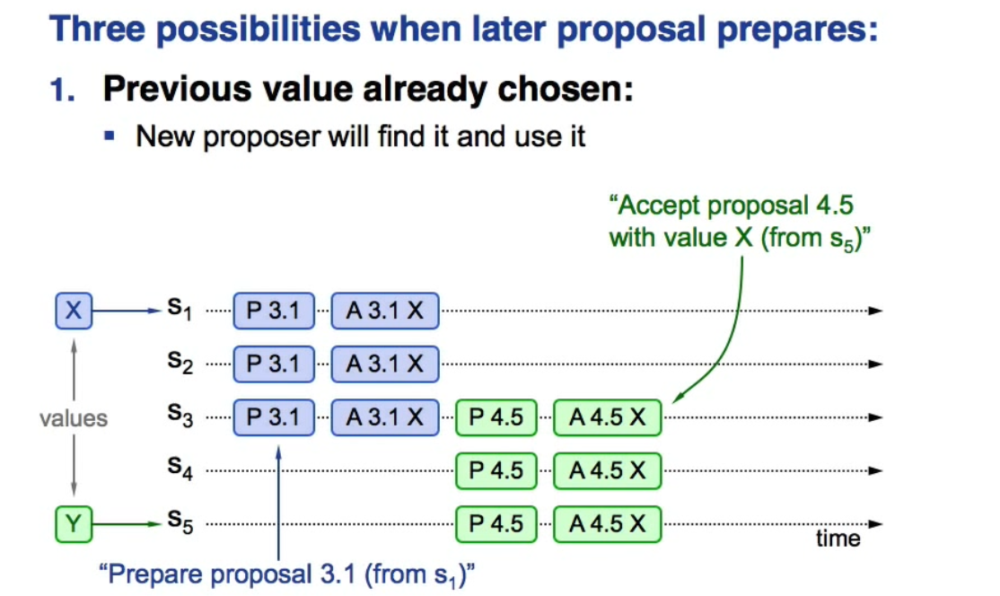
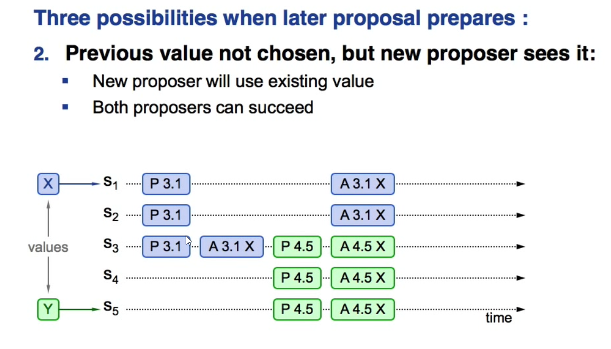
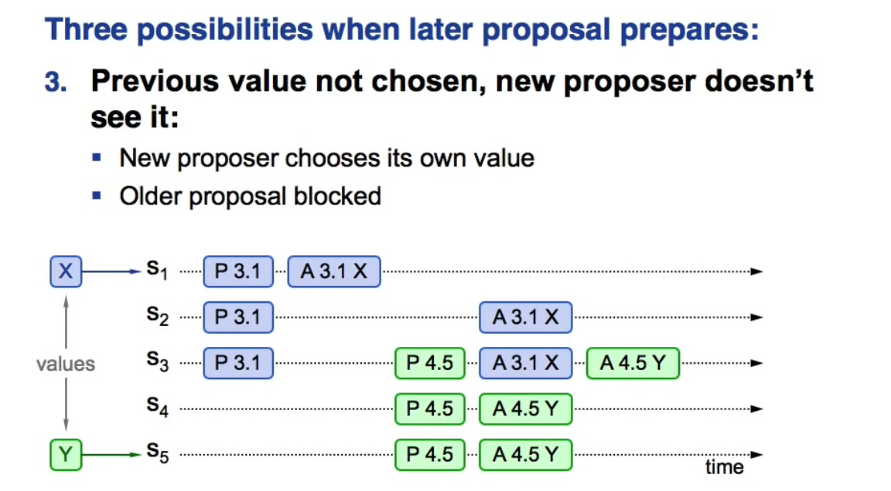

# 目的

解决在不可靠的异步通信网络中的所有参与者对某个结果达成一致性问题，比如写入三个值到三个节点，保证最终是三个节点的最终值是同一个。不可靠网络环境是指消息在网络传输过程中，可能发生丢失，延迟，乱序现象。这里暂不考虑拜占庭问题。

# 算法概要
Paxos协议保证在多节点中多数派接受对某个结果达成一致情况下，保证最终写入结果一致性。
假如有n个人，其中有m(m<=n)个人提出提议，一致性是保证n个人最终一致达成对某个提议的认同。

## 算法提出
proposers提出提案，提案信息包括提案编号和提议的value；acceptor收到提案后可以接受（accept）提案，若提案获得多数acceptors的接受，则称该提案被批准（chosen）；learners只能“学习”被批准的提案。划分角色后，就可以更精确的定义问题：

1. 决议（value）只有在被proposers提出后才能被批准（未经批准的决议称为“提案（proposal）”）；
2. 在一次Paxos算法的执行实例中，只批准（chosen）一个value；
3. learners只能获得被批准（chosen）的value。

P2c：如果一个编号为n的提案具有value v，那么存在一个多数派，要么他们中所有人都没有接受（accept）编号小于n 的任何提案，要么他们已经接受（accept）的所有编号小于n的提案中编号最大的那个提案具有value v。

P1a：当且仅当acceptor没有回应过编号大于n的prepare请求时，acceptor接受（accept）编号为n的提案。

在一个paxos实例中，每个提案需要有不同的编号，且编号间要存在顺序关系。

## 算法
### 第一阶段（Prepare阶段）

#### Proposer：
- 选取提案编号n，并向大多数Acceptor发送携带编号n的prepare请求。

#### Acceptor：

- 如果收到的提案编号n比自己已经收到的编号都要大，则向Proposer承诺不再接收编号小于n的提案，如果之前接受过提案，则同时将接受的提案中编号最大的提案及其编号发给Proposer。
- 如果收到的提案编号n小于自己已经收到提案编号的最大值，则拒绝。

### 第二阶段（Accept阶段）
#### Proposer
- 首先，对接收到响应，逐条处理：
- 如果接收到拒绝，则暂不处理。
如果接收到同意，同时还接收到Acceptor已经接受的提案，则记下该提案及编号。
- 处理完响应后，统计拒绝和同意个数：
- 如果大多数拒绝，则准备下次提案。
- 如果大多数同意，从这些Acceptor已经接受的提案中选取提案编号最大的提案作为自己的提案，没有则使用自己的提案，逐个向Acceptor发送Accept消息。

#### Acceptor：
- 如果收到的提案编号n小于自己已经收到最大提案编号，则拒绝。
- 如果收到的提案编号n大于等于自己已经收到最大提案编号，则接受该提案。
- 如果超过半数，接受该提案，被Learner获知，则形成共识（与Prepare&Accept阶段并行）。
#### Acceptor
- 每当接受一个提案，则将该提案及编号发给Learner。

#### Learner：
- 记录每一个Acceptor当前接受的提案，一个Acceptor先后发来多个提案，则保留编号最大的提案。
- 统计每个提案被接受的Acceptor个数，如果超过半数，则形成共识。

# 工程实现 
- 选取Leader，Leader作为唯一的Proposer与Learner，目的是为了解决性能问题。
- 请求与响应是普通的消息。
- 一个Aceptor必须要在发送回复之前记录响应到持久化存储。
- 保证每次生成Proposal序号的唯一性与递增性。

# Paxos流程

## 1. Previous value already chosen

## 2. Previous value not chosen, but new proposer sees it

## 3. Previous value not chosen, but new proposer doesn't see it

# 参考博客

微信PaxosStore：深入浅出Paxos算法协议
http://www.infoq.com/cn/articles/wechat-paxosstore-paxos-algorithm-protocol
