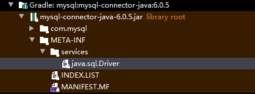

# 内存区域

## 线程独占区域

### 程序计数器

较小的内存空间，可以看做是当前线程所指向字节码行号指示器。字节码解释器工作时就是通过改变这个计数器来选择需要执行的下一条字节码指令，分支、循环、跳转、异常处理、线程恢复等基础功能都需要依赖这个计数器。

### Java虚拟机栈

生命周期与线程相同。描述的是Java方法执行的内存模型。每个方法执行过程中会创建一个栈帧用于存储局部变量表、操作数栈、方法等信息。每个方法的执行与结束都是一个栈帧入栈出栈的过程。

### 本地方法栈

为虚拟机使用到的Native方法服务。

## 线程共享区域

### 堆

在虚拟机启动时创建。此内存区域唯一目的就是存放对象实例，比如普通对象和数组。

是垃圾收集器管理的主要区域。由于现在收集器基本都采用分代收集算法，所以Java堆中可以细分为新生代（Eden, From Survivor, To Survivor）与老年代。

Java堆可以处于物理上不连续的内存空间中，只要逻辑连续即可。堆内存大小由-Xms（初始分配的堆内存），-Xmx(最大可分配内存)控制。

### 方法区

用于存储已被虚拟机加载的类信息、常量、静态变量、即时编译器编译后的代码等数据。

## 直接内存

直接内存不是虚拟机运行时的一部分，也不是虚拟机规范定义的内存区域。通过NIO中的基于通道（Channel）与缓冲区（Buffer）方式，用Native函数直接分配堆外内存，然后通过存储在Java堆中的DirectByteBuffer来操作这块内存，避免了在Java堆与Native堆中来回复制数据。

此块内存分配不受Java堆大小限制，当然是内存会受到本机内存大小限制。

### NIO与IO例子

#### IO

```
Socket: public void write(byte b[])
```

操作系统IO操作要求使用的数据内存地址不变，并且由于存在GC移动内存地址原因，故JVM操作写IO时，把JVM内存复制到堆外内存（操作系统自己管理），然后再由操作系统IO模块操作这块内存，进行写IO操作。

#### NIO

```
SocketChannel: public abstract int write(ByteBuffer src)

AsynchronousSocketChannel: public final <A> void write(ByteBuffer src, A attachment, CompletionHandler<Integer,? super A> handler)
```

Java NIO的IO读写如果不是DirectBuffer就把数据复制到临时的DirectBuffer中再做IO读写。

#### 对比

用DirectBuffer进行IO操作相比普通IO函数或HeapByteBuffer减少一次JVM堆内内存与堆外内存的一次复制。

# JVM内存模型

定义了一种Java内存模型来屏蔽掉各种硬件和操作系统的内存访问差异，以实现让Java程序在各个平台达到同样的效果。

## 主内存与工作内存

规定所有变量都存储在主内存中。每个线程还有自己的工作内存，线程的工作内存中保留了被该线程使用的变量的主内存副本拷贝，线程所有对变量的操作必须在工作内存中进行，而不能直接操作主内存的变量。不同线程之间也无法直接访问对方工作内存中的变量，线程间变量值的传递必须通过主内存来完成。

主内存与工作内存相当于堆与虚拟机栈。

### 堆与虚拟机栈

所有**原始类型的本地变量都存放在线程栈上**，因此对其它线程不可见。一个线程可能向另一个线程传递一个原始类型变量的拷贝，但是它不能共享这个原始类型变量自身。

**堆上包含在Java程序中创建的所有对象**，无论是哪一个对象创建的。这包括原始类型的对象版本。如果一个对象被创建然后赋值给一个局部变量，或者用来作为另一个对象的成员变量，这个对象任然是存放在堆上。 

堆可以对应于硬件中的内存，虚拟机栈则相当于寄存器和高速缓存。


## 参考文献

[java内存模型深度解读](https://www.cnblogs.com/wxd0108/p/5488290.html)

## Java基本数据类型及其默认内存占用

| 关键字     | 占用空间字节)                                  | 取值范围               |
| ------- | ---------------------------------------- | ------------------ |
| byte    | 1                                        | -2^7—2^7-1         |
| short   | 2                                        | -2^15—2^15-1       |
| int     | 4                                        | -2^31—2^31-1       |
| long    | 8                                        | -2^63—2^63-1       |
| float   | 4                                        | -3.4E+38—3.4E+38   |
| double  | 8                                        | -1.7E+308—1.7E+308 |
| char    | 2                                        | 0—2^16-1           |
| boolean | 布尔型占用的空间取决于Java虚拟机(JVM)的实现，可能是1位也可能是1个字节 | true或false         |

# JVM垃圾回收机制

## 回收算法

### 标记清除

先暂停整个程序的全部运行线程，让回收线程以单线程进行扫描标记，并进行直接清除回收，然后回收完成后，恢复运行线程。这样会导致大量零碎的空闲空间碎片，和使大容量对象不容易获得连续的内存空间，而造成空间浪费。

#### 优缺点概述

优点实现简单，缺点容易造成内存碎片，分配内存时需要遍历找到足够大块内存。

### 复制算法

需要程序将所拥有的内存空间分成两个部分。程序运行所需的存储对象先存储在其中一个分区（定义为“分区0”）。同样暂停整个程序的全部运行线程后，进行标记后，回收期间将将保留的存储对象搬运汇集到另一个分区（定义为“分区1”），完成回收，程序在本次回收后将接下来产生的存储对象会存储到“分区1”。在下一次回收时，两个分区的角色对调。

#### 优缺点概述

优点：优秀的吞吐量，因为 GC复制算法只搜索并复制活动对象。不会发生碎片化，活动对象被集中安排在From 空间的开头。
缺点：堆使用效率低下，浪费一半空间。

### 标记整理（标记－压缩）

和“标记－清除”相似，不同的是，回收期间同时会将保留的存储对象搬运汇集到连续的内存空间，也就是让所有存活的对象都向一端移动，然后直接清理掉边界意外的内存。从而集成空闲空间。
优点：可有效利用堆，压缩算法中会执行压缩。
缺点：压缩花费计算成本。

### 增量回收器

需要程序将所拥有的内存空间分成若干分区。程序运行所需的存储对象会分布在这些分区中，每次只对其中一个分区进行回收操作，从而避免程序全部运行线程暂停来进行回收，允许部分线程在不影响回收行为而保持运行，并且降低回收时间，增加程序响应速度。

### 分代回收

由于“复制”算法对于存活时间长，大容量的储存对象需要耗费更多的移动时间，和存在储存对象的存活时间的差异。需要程序将所拥有的内存空间分成若干分区，并标记为年轻代空间和年老代空间。程序运行所需的存储对象会先存放在年轻代分区，年轻代分区会较为频密进行较为激进垃圾回收行为，每次回收完成幸存的存储对象内的寿命计数器加一。当年轻代分区存储对象的寿命计数器达到一定阈值或存储对象的占用空间超过一定阈值时，则被移动到年老代空间，年老代空间会较少运行垃圾回收行为。一般情况下，还有永久代的空间，用于涉及程序整个运行生命周期的对象存储，例如运行代码、数据常量等，该空间通常不进行垃圾回收的操作。 通过分代，存活在局限域，小容量，寿命短的存储对象会被快速回收；存活在全局域，大容量，寿命长的存储对象就较少被回收行为处理干扰。

## 回收器

The following list stands true for Java 8, for older Java versions the available combinations might differ a bit:

| Young             | Tenured      | JVM options                              |
| ----------------- | ------------ | ---------------------------------------- |
| Incremental       | Incremental  | -Xincgc                                  |
| Serial            | Serial       | -XX:+UseSerialGC                         |
| Parallel Scavenge | Serial       | -XX:+UseParallelGC                       |
| Parallel New      | Serial       | N/A                                      |
| Parallel Scavenge | Parallel Old | -XX:+UseParallelGC -XX:+UseParallelOldGC |
| Serial            | CMS          | -XX:-UseParNewGC -XX:+UseConcMarkSweepGC |
| Parallel New      | CMS          | -XX:+UseParNewGC -XX:+UseConcMarkSweepGC |
| G1                |              | -XX:+UseG1GC                             |


## JVM日志参数

-XX:+PrintGCDetails -XX:+PrintGCDateStamps -XX:+PrintGCTimeStamps

### GC root

GC root节点主要在全局性的引用（例如常量或类静态属性）与执行上下文（例如栈帧中的本地变量表）。

在Java语言里，可作为GC Roots对象的包括如下几种： 

1. 虚拟机栈(栈桢中的本地变量表)中的引用的对象 
2. 方法区中的类静态属性引用的对象 
3. 方法区中的常量引用的对象 
4. 本地方法栈中JNI的引用的对象

### Serial GC

This collection of garbage collectors uses **mark-copy for the Young Generation** and **mark-sweep-compact for the Old Generation**. As the name implies – both of these collectors are single-threaded collectors, incapable of parallelizing the task at hand. **Both collectors also trigger stop-the-world pauses**, stopping all application threads.

This option makes sense and is recommended only for the JVM with a couple of hundreds megabytes heap size, running in an environment with a single CPU.

### ParNew

A parallel **mark-copy stop-the-world** garbage collector used in the Young Generation.

### Parallel GC & paralle Old GC

This combination of Garbage Collectors uses **mark-copy in the Young Generation** and **mark-sweep-compact in the Old Generation**.

**Both Young and Old collections trigger stop-the-world events**, stopping all application threads to perform garbage collection.

The number of threads used during garbage collection is configurable via the command line parameter **-XX:ParallelGCThreads=NNN** . The default value is equal to the number of cores in your machine.

Parrelle GC和ParNew相比，主要关注吞吐量的调节。Parallel Scavenge收集器提供了两个参数用于精确控制吞吐量，分别是控制最大垃圾收集停顿时间的-XX:MaxGCPauseMillis参数以及直接设置吞吐量大小的-XX:GCTimeRatio参数。

#### usage scenario

Parallel Garbage Collector is suitable on multi-core machines in cases where your primary goal is to increase throughput. Higher throughput is achieved due to more efficient usage of system resources.

> - during collection, all cores are cleaning the garbage in parallel, resulting in shorter pauses 
> - between garbage collection cycles neither of the collectors is consuming any resources

### Concurrent Mark Sweep

It uses the parallel **stop-the-world mark-copy algorithm in the Young Generation** and the **mostly concurrent mark-sweep algorithm in the Old Generation**.

#### usage scenario

This combination is a good choice on multi-core machines if your primary target is latency. Decreasing the duration of an individual GC pause directly affects the way your application is perceived by end-users, giving them a feel of a more responsive application.

#### Phase 1: Initial Mark.

This is one of the two **stop-the-world** events during CMS. The goal of this phase is to mark all the objects in the Old Generation that are either **direct GC roots** or are **referenced from some live object** in the Young Generation. Note that not all the live objects in the Old Generation may be marked, since the application is mutating references during the marking.

#### Phase 2: Concurrent Mark.

During this phase the Garbage Collector traverses the Old Generation and marks all live objects, **starting from the roots** found in the previous phase of “Initial Mark”. The “Concurrent Mark” phase, as its name suggests, **runs concurrently with your application** and does not stop the application threads. 

#### Phase 3: Concurrent Preclean.

This is again a concurrent phase, **running in parallel with the application threads**, not stopping them. While the previous phase was running concurrently with the application, some references were changed. Whenever that happens, the JVM marks the area of the heap (called “Card”) that contains the mutated object as “dirty” (this is known as Card Marking). In the pre-cleaning phase, these dirty objects are accounted for, and the **objects reachable from them are also marked**.


#### Phase 4: Concurrent Abortable Preclean.

Again, a concurrent phase that **is not stopping the application’s threads**. This one attempts to take as much work off the shoulders of the stop-the-world Final Remark as possible. 

#### Phase 5: Final Remark.

This is the second and **last stop-the-world phase during the event**. The goal of this stop-the-world phase is to **finalize marking all live objects in the Old Generation**. Since the previous preclean phases were concurrent, they may have been unable to keep up with the application’s mutating speeds. A stop-the-world pause is required to finish the ordeal.

#### Phase 6: Concurrent Sweep.

**Performed concurrently with the application**, without the need for the stop-the-world pauses. The purpose of the phase is to remove unused objects and to reclaim the space occupied by them for future use.

#### Phase 7: Concurrent Reset.

Concurrently executed phase, resetting inner data structures of the CMS algorithm and preparing them for the next cycle.

All in all, the CMS garbage collector does a great job at **reducing the pause durations** by offloading a great deal of the work to concurrent threads that do not require the application to stop. However, it, too, has some drawbacks, the most notable of them being the **Old Generation fragmentation** and **the lack of predictability in pause duration**s in some cases, especially on large heaps.

当老年代无法容纳新生代GC晋升的对象时发生并发模式失败，并发模式失败意味着CMS退化成完全STW的Full GC，也就是Serial GC。

### G1

One of the key design goals of G1 was to make **the duration and distribution of stop-the-world pauses** due to garbage collection **predictable and configurable.**

To achieve this, G1 builds upon a number of insights. First, the heap does not have to be split into contiguous Young and Old generation. Instead, the heap is split into a number (typically about 2048) smaller heap regions that can house objects. Each region may be an Eden region, a Survivor region or an Old region. **The logical union of all Eden and Survivor regions is the Young Generation, and all the Old regions put together is the Old Generation**:


**This allows the GC to avoid collecting the entire heap at once, and instead approach the problem incrementally: only a subset of the regions, called the collection set will be considered at a time.** All the Young regions are collected during each pause, but some Old regions may be included as well:


Another novelty of G1 is that during the concurrent phase it estimates the amount of live data that each region contains. This is used in building the collection set: **the regions that contain the most garbage are collected first.** Hence the name: **garbage-first** collection.

### Evacuation Pause: Fully Young

In the beginning of the application's lifecycle, G1 does not have any additional information from the not-yet-executed concurrent phases, so it initially functions in the fully-young mode. When the Young Generation fills up, the application threads are stopped, and the **live data** inside the Young regions is **copied to Survivor regions, or any free regions that thereby become Survivor**.

The process of copying these is called Evacuation, and it works in pretty much the same way as the other Young collectors we have seen before. 

### Phase 1: Initial Mark.

This phase marks all the objects directly reachable from the GC roots.

### Phase 2: Root Region Scan.

This phase marks all the live objects reachable from the so-called root regions, i.e. the ones that are not empty and that we might end up having to collect in the middle of the marking cycle. In the current implementation, the root regions are the survivor regions: they are the bits of Young Generation that will definitely be collected in the next Evacuation Pause.

### Phase 3. Concurrent Mark.

This phase is very much similar to that of CMS: it simply walks the object graph and marks the visited objects in a special bitmap. 

### Phase 4. Remark.

This is a **stop-the-world** pause that, like previously seen in CMS, completes the marking process. For G1, it briefly stops the application threads to stop the inflow of the concurrent update logs and processes the little amount of them that is left over, and marks whatever still-unmarked objects that were live when the concurrent marking cycle was initiated. 

### Phase 5. Cleanup.

This final phase prepares the ground for the upcoming evacuation phase, counting all the live objects in the heap regions, and sorting these regions by expected GC efficiency. It also performs all the house-keeping activities required to maintain the internal state for the next iteration of concurrent marking.

### Evacuation Pause: Mixed

After Concurrent Marking has successfully completed, G1 will schedule a mixed collection that will not only get the garbage away from the young regions, but also throw in a bunch of Old regions to the collection set.

**Remembered sets are what allows the independent collection of different heap regions**. For instance, when collecting region A,B and C, we have to know whether or not there are references to them from regions D and E to determine their liveness. But traversing the whole heap graph would take quite a while and ruin the whole point of incremental collection, therefore an optimization is employed. Much like we have the Card Table for independently collecting Young regions in other GC algorithms, we have Remembered Sets in G1.

As shown in the illustration below, each region has **a remembered set that lists the references pointing to this region from the outside**. These references will then be **regarded as additional GC roots**. Note that objects in Old regions that were determined to be garbage during concurrent marking will be ignored even if there are outside references to them: the referents are also garbage in that case.


What happens next is the same as what other collectors do: multiple parallel GC threads figure out what objects are live and which ones are garbage:


And, finally, the live objects are moved to survivor regions, creating new if necessary. The now empty regions are freed and can be used for storing objects in again.


### Conclusion and Comparation

 G1 addressed a wide range of problems that CMS has, **starting from pause predictability and ending with heap fragmentation.** Given an application not constrained by CPU utilization, but **very sensitive to the latency of individual operations, G1 is very likely to be the best available choice for HotSpot users, especially when running the latest versions of Java**. However, these latency improvements do not come for free: throughput overhead of G1 is larger thanks to the additional write barriers and more active background threads. So, if the application is throughput-bound or is consuming 100% of CPU, and does not care as much about individual pause durations, then CMS or even Parallel may be better choices.

### 参考文献

[GC Algorithms: Implementations](https://plumbr.io/handbook/garbage-collection-algorithms-implementations)

[Java HotSpot VM Options](https://www.oracle.com/technetwork/java/javase/tech/vmoptions-jsp-140102.html)

[深入剖析JVM：G1收集器+回收流程+推荐用例](https://zhuanlan.zhihu.com/p/59861022)

[G1 垃圾收集器介绍
](https://juejin.cn/post/6844903603103072263)

### G1 vs CMS

G1收集器的设计目标是取代CMS收集器，它同CMS相比，在以下方面表现的更出色：

1. **局部两个Region看是“标记-复制”算法**，**整体上看是标记-整理算法**故不会产生内存碎片，分配大对象时不会无法得到连续的空间而提前触发一次FULL，而CMS基于“标记-清除”算法会产生内存碎片。

2. G1的Stop The World(STW)更可控，**G1在停顿时间上添加了预测机制，用户可以指定期望停顿时间,**G1可以通过设置预期停顿时间（Pause Time）来控制垃圾收集时间避免应用雪崩现象。

3. 并行与并发的能力，G1能更充分的利用CPU，多核环境下的硬件优势来缩短stop the world的停顿时间。

## 过期对象判断

通过可达性分析算法来判定对象是否存活的，使用GC Roots作为起点，从这些节点开始向下搜索，搜索走过的路径称为引用链，当一个对象到GC roots没有任何引用链相连时，则证明这个对象不可用。

## GC回收时对象的生存状态

发现对象没有被GC roots相关联，会进行第一次标记并筛选，如果对象对finalized进行覆盖，并且没有执行过finalized方法，虚拟机将会对finalized进行执行。执行finalized方法的是一个低优先级线程，不承诺会等待finalized执行结束，因为有可能finalized的实现是个死循环。如果在finalized里实现this指针被GC roots关联，比如类的静态变量，那么改对象将不会被回收。

建议跟踪对象回收事件采用软应用，弱应用和虚引用。

# 双亲委派模型（Parents Delegation Model）

有两种不同的类加载器：一种是启动类加载器（Bootstrap ClassLoader，C++语言实现），虚拟机自身的一部分，另外一种是其所有其他的类加载器，Java语言实现，独立于虚拟机外部，全部继承抽象类java.lang.ClassLoader。

绝大部分Java程序会使用下述三种类加载器：

1. 启动类加载器（Bootstrap ClassLoader），负责加载存放在<JAVA_HOME>/lib目录中的，或被-Xbootclasspath参数制定路径的，并且是虚拟机识别的文件名的文件。
2. 扩张类加载器（Extension ClassLoader），负责加载<JAVA_HOME>/lib/ext目录中，或被java.ext.dirs系统变量制定路径。
3. 应用程序类加载器（Application ClassLoader），由sun.misc.Launcher$AppClassLoader实现，由于这个类加载器是ClassLoader.getSystemClassLoader()的返回值，所以一般称之为系统类加载器，它负责加载用户类路径（ClassPath）上所指定的类库。

双亲委派模型要求除了启动类加载器外，其他加载器都需要有自己父类加载器，一般是通过组合的方式来复用父类加载器。其工作模式有，如果一个类加载器收到类加载请求，那么它先把加载请求委派给父类加载器去完成，只有当更高层级的父类加载器无法加载，才会给子加载器自己去尝试加载。

### 为什么需要双亲委派模型

自下而上的委派，又自上而下的加载，保证每一个类在各个加载器中都是同一个类。

一个非常明显的目的是保证Java官方的类库<JAVA_HOME>\lib和扩展类库<JAVA_HOME>\lib\ext的加载安全性，不会被开发者覆盖。

如果开发者自己开发开元框架，也可以利用双亲委派模型，保护自己框架需要加载的类不被应用程序覆盖。

```java
public static void main(String[] args) throws Exception {
    System.out.println("-----------------------------------");
    System.out.println("ClassLoaderMain class loader parents : ");
    ClassLoader cl = ClassLoaderMain.class.getClassLoader();
    recursiveCallParentCL(cl);
}

public static void recursiveCallParentCL(ClassLoader cl){
    if(cl == null){
        return;
    }
    recursiveCallParentCL(cl.getParent());
    System.out.println(cl);
}

/**
* -----------------------------------
* ClassLoaderMain class loader parents : 
* null indicates Bootstrap ClassLoader
* sun.misc.Launcher$ExtClassLoader@2ff4acd0
* sun.misc.Launcher$AppClassLoader@18b4aac2
*/
```

[我竟然被”双亲委派”给虐了！](https://www.hollischuang.com/archives/6055)

### 破坏双亲委派模型

// todo

# SPI

SPI全称Service Provider Interface，是Java提供的一套用来被第三方实现或者扩展的API，它可以用来启用框架扩展和替换组件。


Java SPI 实际上是“**基于接口的编程＋策略模式＋配置文件**”组合实现的动态加载机制。SPI采用的是桥接模式。桥接模式采用关联关系取代继承关系，即在对 Client 提供 API 的中组合一个实际上提供接口功能的实例（Implementor），在接口的 operation 方法中，调用该实例的相应方法，为 Client 提供功能。Implementor 接口作为对外 API 接口和其功能实现类之间的桥。

Java SPI就是提供这样的一个机制：为某个接口寻找服务实现的机制。有点类似IOC的思想，就是将装配的控制权移到程序之外，在模块化设计中这个机制尤其重要。所以SPI的核心思想就是**解耦**。

## 使用场景

概括地说，适用于：**调用者根据实际使用需要，启用、扩展、或者替换框架的实现策略**

比较常见的例子：

- 数据库驱动加载接口实现类的加载  
  
  JDBC加载不同类型数据库的驱动
  
  

- 日志门面接口实现类加载  
  
  SLF4J加载不同提供商的日志实现类

- Spring  
  
  Spring中大量使用了SPI，比如：对servlet3.0规范对ServletContainerInitializer的实现、自动类型转换Type Conversion SPI(Converter SPI、Formatter SPI)等

- Dubbo  
  
  Dubbo中也大量使用SPI的方式实现框架的扩展, 不过它对Java提供的原生SPI做了封装，允许用户扩展实现Filter接口

## 使用介绍

要使用Java SPI，需要遵循如下约定：

1. 当服务提供者提供了接口的一种具体实现后，在jar包的META-INF/services目录下创建一个以“接口全限定名”为命名的文件，内容为实现类的全限定名；

2. 接口实现类所在的jar包放在主程序的classpath中；

3. 主程序通过java.util.ServiceLoder动态装载实现模块，它通过扫描META-INF/services目录下的配置文件找到实现类的全限定名，把类加载到JVM；

4. SPI的实现类必须携带一个不带参数的构造方法；

### 例子

```java
/**建立一个文件到如下目录，这个文件包含需要被SPI加载的实现类
classpath:/META-INF/services/com.keepthinker.example.general.spi.MoveAction
文件内容例子如：
com.keepthinker.example.general.spi.Dog
com.keepthinker.example.general.spi.Bird
*/
package com.keepthinker.example.general.spi;

public interface MoveAction {
    void move();
}

public class Bird implements MoveAction{
    private static final Logger logger = LoggerFactory.getLogger(Bird.class);
    public Bird(){
        logger.info("initialized");
    }
    @Override
    public void move() {
        logger.info("I am flying");
    }
}

public class Dog implements MoveAction{
    private static final Logger logger = LoggerFactory.getLogger(Dog.class);
    public Dog(){
        logger.info("initialized");
    }
    @Override
    public void move() {
        logger.info("I am running");
    }
}

public class SPIMain {
    private static final Logger logger = LoggerFactory.getLogger(SPIMain.class);
    public static void main(String[] args) {
        ServiceLoader<MoveAction> shouts = ServiceLoader.load(MoveAction.class);
        Iterator<MoveAction> it = shouts.iterator();
        while (it.hasNext()) {
            logger.info("before Iterator.next()");
            MoveAction action = it.next();
            logger.info("after Iterator.next()");
            action.move();
        }
    }
}

/**
* main输出：
* [0] 2022-02-13 22:30:30,319 INFO  [com.keepthinker.example.general.spi.SPIMain]: before Iterator.next()
* [0] 2022-02-13 22:30:30,319 INFO  [com.keepthinker.example.general.spi.Dog]: initialized
* [0] 2022-02-13 22:30:30,319 INFO  [com.keepthinker.example.general.spi.SPIMain]: after Iterator.next()
* [0] 2022-02-13 22:30:30,319 INFO  [com.keepthinker.example.general.spi.Dog]: I am running
* [0] 2022-02-13 22:30:30,319 INFO  [com.keepthinker.example.general.spi.SPIMain]: before Iterator.next()
* [0] 2022-02-13 22:30:30,319 INFO  [com.keepthinker.example.general.spi.Bird]: initialized
* [0] 2022-02-13 22:30:30,319 INFO  [com.keepthinker.example.general.spi.SPIMain]: after Iterator.next()
* [0] 2022-02-13 22:30:30,319 INFO  [com.keepthinker.example.general.spi.Bird]: I am flying
*/
```

### 参考

[高级开发必须理解的Java中SPI机制 - 简书](https://www.jianshu.com/p/46b42f7f593c)

# JVM工具使用

## 定位线程问题

在Linux上用**top -H -p {processId}**，找到问题线程（比如cpu占比高），比如线程ID为11164，通过命令**echo 'ibase=10;obase=16;11164' | bc**来把线程ID 11164转化成16进制数字2B9C。 然后通过jstack命令找到该问题线程的线程栈日志，如**jstack {processId} | grep -A 100 -i 2B9C**

## 查看JVM内存GC情况

例子：jstat -gcutil 4507 100

具体内容见官方文档[jstat - Java Virtual Machine Statistics Monitoring](https://docs.oracle.com/javase/7/docs/technotes/tools/share/jstat.html)

## 查看JVM参数情况

查看系统参数：jinfo -sysprops ${jvmPid}

查看JVM启动参数：jinfo -flags ${jvmPid}

### JDK 8 配置默认值

-Xmx 的默认值为你当前机器最大内存的 1/4
-Xms 的默认值为你当前机器最大内存的 1/64 （这个值要反复测试并通过监控调整一个合适的值，是因为当Heap不够用时，会发生内存抖动，影响程序运行稳定性）
-Xss 的默认值好像和平台有关（不同平台默认值不同），我们最常用的Linux64位服务器默认值好像是1024k（这个我不确定）。在相同物理内存下，减小这个值能生成更多的线程，这个参数在高并发的情况下对性能影响比较明显，需要花比较长的时间进行严格的测试来定义一个合适的值（如果栈不深128k够用的，大的应用建议使用256k）。

堆的初始值和最大值，使用如下命令查看

```bash
在Windows里：
java -XX:+PrintFlagsFinal -version | findstr /i "HeapSize PermSize ThreadStackSize"
在Linux里：
java -XX:+PrintFlagsFinal -version | grep -iE 'HeapSize|PermSize|ThreadStackSize'
```

## 解析class文件

javap -p -c AbstractClient.class

## s分析工具

命令行查看对象内存分布情况：jmap -histo ${jvmPid}

导出内存dmp文件：jmap -dump:live,format=b,file=heap.dump ${jvmPid}

## 危险命令

最主要的危险操作是下面这三种：

1. jmap -dump
   这个命令执行，JVM会将整个heap的信息dump写入到一个文件，heap如果比较大的话，就会导致这个过程比较耗时，并且执行的过程中为了保证dump的信息是可靠的，所以会暂停应用。

2. jmap -permstat
   这个命令执行，JVM会去统计perm区的状况，这整个过程也会比较的耗时，并且同样也会暂停应用。

3. jmap -histo:live
   这个命令执行，JVM会先触发gc，然后再统计信息。

### jstack，jstat，jmap分析经验

同一行代码大量Runnable并且cpu使用率非常高，表明代码可能存在大量循环执行情况。

如果程序CPU负载非常高，并且JVM老年代内存消耗过多，频繁FulGC，此时程序里计算的时间戳没什么参考意义面，主要观察哪些对象在jmap里出现异常增多。

## JDWP

The JavaTM Debug Wire Protocol (JDWP) is the protocol used for communication between a debugger and the Java virtual machine (VM) which it debugs (hereafter called the target VM). JDWP is optional; it might not be available in some implementations of the Java(TM) 2 SDK. The existence of JDWP can allow the same debugger to work

```bash
java -Xdebug -Xrunjdwp:server=y,transport=dt_socket,address=8000,suspend=n \
       -jar target/myapplication-0.0.1-SNAPSHOT.jar
```

# 引用类型


## 强引用

强引用是使用最普遍的引用。如果一个对象具有强引用，那垃圾回收器绝不会回收它。

## 软引用（SoftReference）

 如果一个对象只具有软引用，则内存空间足够，垃圾回收器就不会回收它；如果内存空间不足了，就会回收这些对象的内存。软引用和弱引用差别不大，JVM都是先将其referent字段设置成null，之后将软引用或弱引用，加入到关联的引用队列中。我们可以认为JVM先回收堆对象占用的内存，然后才将软引用或弱引用加入到引用队列。

1. 可以保证所有的SoftReferences将在OutOfMemoryError抛出之前被清除，所以理论上它们不会导致OOME。
   2. 软引用对象占用了一大堆内存，更糟糕的是它们都会进入 Old-Gen。这样你的进程会频繁触发 Full GC，但即使这样，JVM 也不一定会清理 SoftReference 占用的内存。
   3. 因为 Old-Gen 现在是满负荷工作，你会发现一次 FullGC 的时间变得异常的长。

All soft references to softly-reachable objects are guaranteed to have been cleared before the virtual machine throws an OutOfMemoryError. Otherwise no constraints are placed upon the time at which a soft reference will be cleared or the order in which a set of such references to different objects will be cleared. Virtual machine implementations are, however, encouraged to bias against clearing recently-created or recently-used soft references.

## 弱引用（WeakReference）

弱引用与软引用的区别在于：只具有弱引用的对象拥有更短暂的生命周期。在垃圾回收器线程扫描它所管辖的内存区域的过程中，一旦发现了只具有弱引用的对象，不管当前内存空间足够与否，都会回收它的内存。 

Garbage collects when no Strong or Soft refs.

 When the weak reference gets cleared, it gets enqueued in a reference queue that your code polls somewhere, and it discards the associated objects as well.

## 虚引用（PhantomReference）

“虚引用”顾名思义，就是形同虚设，与其他几种引用都不同，虚引用并不会决定对象的生命周期。如果一个对象仅持有虚引用，那么它就和没有任何引用一样，在任何时候都可能被垃圾回收器回收。

虚引用主要用来跟踪对象被垃圾回收器回收的活动。虚引用与软引用和弱引用的一个区别在于：虚引用必须和引用队列（ReferenceQueue）联合使用。当垃圾回收器准备回收一个对象时，如果发现它还有虚引用，就会在回收对象的内存之前，把这个虚引用加入到与之关联的引用队列中。

JVM不会自动将虚引用的referent字段设置成null，而是先保留堆对象的内存空间，直接将PhantomReference加入到关联的引用队列，也就是说如果我们不手动调用PhantomReference.clear()，虚引用指向的堆对象内存是不会被释放的。**虚引用有潜在的内存泄露风险**，因为JVM不会自动帮助我们释放，我们必须要保证它指向的堆对象是不可达的。**从这点来看，虚引用其实就是强引用，当内存不足的时候，JVM不会自动释放堆对象占用的内存**。

## Reference抽象类

## 代码例子

### 代码

```java
public class ReferenceTypeMain {
    public static void main(String[] args){
        strongReference();
        softReference();
        weakReference();
        phantomReference();
    }
    /**
    * strongReference start^^^^^^^^^^^^^^^^^
    * value after gc: StrongReference
    * strongReference end________________    **/
    public static void strongReference(){
        System.out.println("strongReference start^^^^^^^^^^^^^^^^^");
        String str =  new String("StrongReference");
        System.gc();
        sleep(1);
        System.out.println("value after gc: " + str);
        System.out.println("strongReference end________________");
    }
    /**
    * softReference start^^^^^^^^^^^^^^^^^
    * softReference.isEnqueued() before gc: false
    * softReference.isEnqueued() after gc: false
    * value after gc: StringObject{str='SoftReference'}
    * sleep for 1s
    * sleep for 1s
    * sleep for 1s
    * softReference end________________
    */
    public static void softReference(){
        System.out.println("softReference start^^^^^^^^^^^^^^^^^");
        final ReferenceQueue<StringObject> referenceQueue = new ReferenceQueue<>();
        StringObject str =  new StringObject("SoftReference");
        SoftReference<StringObject> softReference = new SoftReference<>(str);
        str = null;
        System.out.println("softReference.isEnqueued() before gc: " + softReference.isEnqueued());;
        System.gc();
        sleep(1);
        System.out.println("softReference.isEnqueued() after gc: " + softReference.isEnqueued());;
        System.out.println("value after gc: " + softReference.get());
        new ReferenceQueueConsumer(referenceQueue).run();
        System.out.println("softReference end________________");
    }
    /**
    * weakReference start^^^^^^^^^^^^^^^^^
    * weakReference.isEnqueued() before gc: false
    * weakReference.isEnqueued() after gc: true
    * value after gc: null
    * StringWeakReference.name: StringWeakReference  |  
    * ReferenceQueueConsumer|Reference's referent value:null
    * sleep for 1s
    * sleep for 1s
    * weakReference end________________
    */
    public static void weakReference(){
        System.out.println("weakReference start^^^^^^^^^^^^^^^^^");
        final ReferenceQueue<StringObject> referenceQueue = new ReferenceQueue<>();
        StringObject str =  new StringObject("WeakReference");
        StringWeakReference weakReference = new StringWeakReference(str, referenceQueue);
        weakReference.setName("StringWeakReference");
        str = null;
        System.out.println("weakReference.isEnqueued() before gc: " + weakReference.isEnqueued());
        System.gc();
        sleep(1);
        System.out.println("weakReference.isEnqueued() after gc: " + weakReference.isEnqueued());
        System.out.println("value after gc: " + weakReference.get());
        new ReferenceQueueConsumer(referenceQueue).run();
        System.out.println("weakReference end________________");
    }
    /**
    * PhantomReference start^^^^^^^^^^^^^^^^
    * phantomReference.isEnqueued() before gc: false
    * phantomReference.isEnqueued() after gc: true
    * value after gc: null
    * ReferenceQueueConsumer|Reference's referent value:StringObject{str='phantomReference'}
    * sleep for 1s
    * sleep for 1s
    * phantomReference end________________
    */
    public static void phantomReference(){
        System.out.println("phantomReference start^^^^^^^^^^^^^^^^");
        StringObject str = new StringObject("phantomReference");
        final ReferenceQueue<StringObject> referenceQueue = new ReferenceQueue<>();
        final StringPhantomReference phantomReference = new StringPhantomReference(str, referenceQueue);
        str = null;
        System.out.println("phantomReference.isEnqueued() before gc: " + phantomReference.isEnqueued());
        System.gc();
        System.out.println("phantomReference.isEnqueued() after gc: " + phantomReference.isEnqueued());
        System.out.println("value after gc: " + phantomReference.get());
        new ReferenceQueueConsumer(referenceQueue).run();
        System.out.println("phantomReference end________________");
    }
    private static class ReferenceQueueConsumer extends Thread{
        ReferenceQueue referenceQueue = new ReferenceQueue<>();
        ReferenceQueueConsumer (ReferenceQueue referenceQueue ){
            this.referenceQueue = referenceQueue;
        }
        public void run(){
            for(int i = 0; i < 3; i++){
                Reference reference = referenceQueue.poll();
                if(reference == null){
                    try {
                        Thread.sleep(1000);
                        System.out.println("sleep for 1s");
                    } catch (InterruptedException e) {
                        e.printStackTrace();
                    }
                } else {
                    try {
                        Field field = Reference.class.getDeclaredField("referent");
                        field.setAccessible(true);
                        StringObject value = (StringObject) field.get(reference);
                        if (reference instanceof StringWeakReference) {
                            StringWeakReference stringWeakReference = (StringWeakReference)(reference);
                            System.out.println("StringWeakReference.name: " + stringWeakReference.getName() + "  |  ");
                        }
                        System.out.println("ReferenceQueueConsumer|Reference's referent value:" + value);
                    } catch (NoSuchFieldException e) {
                        e.printStackTrace();
                    } catch (IllegalAccessException e) {
                        e.printStackTrace();
                    }
                    reference.clear(); // 如果被从队列取出，再也没有被引用，无需调用此方法。
                }
            }}
    }

    private static class StringPhantomReference extends PhantomReference<StringObject>{

        public StringPhantomReference(StringObject referent, ReferenceQueue<? super StringObject> q) {
            super(referent, q);
        }
    }

    private static void sleep(int seconds) {
        try {
            Thread.sleep(seconds * 1000);
        } catch (InterruptedException e) {
            e.printStackTrace();
        }
    }

    private static class StringObject{
        private String str;
        public StringObject(String str) {
            this.str = str;
        }
        public String getStr() {
            return str;
        }
        public void setStr(String str) {
            this.str = str;
        }
        @Override
        public String toString() {
            final StringBuilder sb = new StringBuilder("StringObject{");
            sb.append("str='").append(str).append('\'');
            sb.append('}');
            return sb.toString();
        }
    }

    private static class StringWeakReference extends WeakReference{
        private String name;
        public StringWeakReference(Object referent) {
            super(referent);
        }
        public StringWeakReference(Object referent, ReferenceQueue queue) {
            super(referent, queue);
        }
        public String getName() {
            return name;
        }
        public void setName(String name) {
            this.name = name;
        }
    }
}
```

# 加锁机制

## synchronized

synchronized字节码中包含"monitorenter"和"monitorexit"指令，基于上述两个指令实现了锁的获取和释放过程。

### 基础

#### Java对象头

锁存在Java对象头里。如果对象是数组类型，则虚拟机用3个Word（字宽）存储对象头，如果对象是非数组类型，则用2字宽存储对象头。在32位虚拟机中，一字宽等于四字节，即32bit。

##### 对象头格式

Mark Word(32 bit), Class Metadata Address(32), Array Length(32)

**Mark Word**: 存储对象的hashCode或锁信息等。

**Class Metadata Address**: 存储到对象类型数据的指针。

**Array Length**:     
数组的长度（如果当前对象是数组）

##### Mark Word默认格式

对象的Hashcode(25 bit), 对象分代年龄(4), 是否偏向(1), 锁标志位(2)[值为00]

##### 偏向锁格式

线程ID(23 bit), Epoch(2), 对象分代年龄(4), 是否偏(1)[值为1], 锁标志位(2)[值为01]

##### 轻量级锁格式

指向栈中锁记录的指针(30 bit), 锁标志位(2)[值为00]

##### 重量级锁格式

指向互斥量（重量级锁）的指针(30 bit), 锁标志位(2)[值为10]

##### GC标记格式

空(30 bit), 锁标志位(2)[值为11]

在运行期间Mark Word里存储的数据会随着锁标志位的变化而变化。Mark Word可能变化为存储以下4种数据：

### 偏向锁

Hotspot的作者经过以往的研究发现**大多数情况下锁不仅不存在多线程竞争，而且总是由同一线程多次获得**，为了让线程获得锁的代价更低而引入了偏向锁。当一个线程访问同步块并获取锁时，会在对象头和栈帧中的锁记录里存储**锁偏向的线程ID**，以后该线程在进入和退出同步块时不需要花费CAS操作来加锁和解锁，而只需简单的**测试一下对象头的Mark Word里是否存储着指向当前线程的偏向锁**，如果测试成功，表示线程已经获得了锁，如果测试失败，则需要再测试下MarkWord中偏向锁的标识是否设置成1（表示当前是偏向锁），如果没有设置，则使用CAS竞争锁，如果设置了，则尝试使用CAS将对象头的偏向锁指向当前线程。

Since most objects are locked by at most one thread during their lifetime, we allow that thread to bias an object toward itself. Once biased, that thread can subsequently lock and unlock the object without resorting to expensive atomic instructions. Obviously, an object can be biased toward at most one thread at any given time. 

### 轻量级锁

引入轻量级锁的目的：在多线程交替执行同步块的情况下，尽量避免重量级锁引起的性能消耗，但是如果多个线程在同一时刻进入临界区，会导致轻量级锁膨胀升级重量级锁，所以轻量级锁的出现并非是要替代重量级锁。核心逻辑是把Mark Word保存到BasicLock对象的_displaced_header字段；通过CAS尝试将Mark Word更新为指向线程栈帧上的BasicLock对象的指针，如果更新成功，表示竞争到锁，则执行同步代码.

### 重量级锁

重量级锁通过对象内部的监视器（monitor）实现，其中monitor的本质是依赖于**底层操作系统的Mutex Lock实现，操作系统实现线程之间的切换需要从用户态到内核态的切换，切换成本非常高**。底层实现由ObjectMonitor完成。Objectwaiter是个双向链表结构的对象，其中结构有_EntryList队列，_WaitSet集合。ObjectMonitor进入enter方法里，还会进行一次CAS将当前线程设置到_owner来争抢锁，如果失败则还会进行自旋，如果都失败则将当前线程封装成ObjectWaiter进入队列，然后使用操作系统的mutex机制进行锁操作。

## AQS

线程并发框架抽象基类。

AQS中的stat是volatile。volatile为了保证可见性，会在机器指令中加入lock指令，lock强制把缓存（工作内存）写回到内存（主内存），并失效其他线程的缓存行（MESI）。

## volatile

- 保证被volatile修饰的共享变量对所有线程总数可见，也就是当一个线程修改了一个被volatile修饰共享变量的值，新值总是可以被其他线程立即得知。
- 禁止指令重排序优化。

##### Java单例双重检查使用volatile

```java
class Singleton{
    private volatile static Singleton singleton;   
    public static Singleton getInstance(){       

        if(singleton == null){
            synchronized(Singleton.class){
                if(singleton == null){
                    singleton = new Singleton();
                }
            }
        } 

        return singleton;           
    }
}
```

 Object obj=new Object()这行代码并不是一个原子指令。使用 javap -c指令，可以快速查看字节码。

0: new           #2                  // class java/lang/Object
3: dup
4: invokespecial #1                  // Method java/lang/Object."<init>":()V
7: astore_1

 从字节码可以看到创建一个对象实例，可以分为三步：

1. 分配对象内存

2. 调用构造器方法，执行初始化

3. 将对象引用赋值给变量。

虚拟机实际运行时，以上指令可能发生重排序。以上步骤2,3 可能发生重排序，但是并不会重排序 1 的顺序。也就是说 1 这个步骤都需要先执行，因为 2,3 步骤需要依托 1 步骤执行结果。

Java 语言规规定了线程执行程序时需要遵守 intra-thread semantics。**intra-thread semantics ** 保证重排序不会改变单线程内的程序执行结果。这个重排序在没有改变单线程程序的执行结果的前提下，可以提高程序的执行性能。

如果不对singleton加上volatile语句，那么步骤2,3顺序被重排使得对象未初始化就被复制给变量，那么会导致getInstance函数返回的是个未初始化的单例。

由于 volatile禁止对象创建时指令之间重排序，所以其他线程不会访问到一个未初始化的对象，从而保证安全性。

参考：[双重检查锁单例模式为什么要用volatile关键字？](https://developer.aliyun.com/article/714497)

Volatile通过内存屏障来实现，不同硬件内存屏障实现的手段不一样，Java统一用JVM来生成内存屏障指令。

### 加锁作用

数据变更并发操作正确性。

保证可见性。

# Java线程

## 线程状态

- **NEW**: Thread state for a thread which **has not yet started**.

- **RUNNABLE**: Thread state for a runnable thread.  A thread in the runnable state **is executing** in the Java virtual machine but it may be waiting for other resources from the operating system such as processor.

- **BLOCKED**: Thread state for a thread blocked waiting for a monitor lock. A thread in the blocked state is **waiting for a monitor lock** to enter a synchronized block/method or reenter a synchronized block/method after calling Thread state for a thread blocked waiting for a monitor lock. A thread in the blocked state is waiting for a monitor lock to enter a synchronized block/method or reenter a synchronized block/method after calling Object#wait.

- **WAITING**: Thread state for a waiting thread. A thread is in the waiting state due to calling one of the following methods:  **Object.wait() with no timeout**,  **Thread.join no timeout**, **LockSupport.park** A thread in the waiting state is waiting for another thread to perform a particular action. For example, a thread that has called Object.wait() on an object is waiting for another thread to call Object.notify() or Object.notifyAll() on that object. A thread that has called Thread.join() is waiting for a specified thread to terminate.

- **TIMED_WAITING**: Thread state for a waiting thread with a specified waiting time. A thread is in the timed waiting state due to calling one of the following methods **with a specified positive waiting time: Thread.sleep  Object.wait, Thread.join with timeout LockSupport.parkNanos, LockSupport.parkUntil.**

- **TERMINATED**:Thread state for a terminated thread. The thread has completed execution.

## 线程状态变化


# 类加载机制

# 动态代理

## JDK动态代理

在java的类库中，java.util.reflect.Proxy类就是其用来实现动态代理的顶层类。可以通过Proxy类的静态方法Proxy.newProxyInstance()方法动态的创建一个类的代理类，并实例化。由它创建的代理类都是Proxy类的子类。

从类的结构可以看出，JDK动态生成代理类，一定要被代理类实现了某个接口，否则就无法生成代理类。

```java
public class JdkProxy implements InvocationHandler {
    private MessageService messageService;
    public JdkProxy(MessageService messageService) {
        this.messageService = messageService;
    }
    @Override
    public Object invoke(Object proxy, Method method, Object[] args) {
        System.out.println("print log before: " + method.getName());
        if("sendMessage".equals(method.getName())) {
            messageService.sendMessage((String)args[0], (String)args[1]);
        } else if("receiveMessage".equals(method.getName())) {
            messageService.sendMessage((String)args[0], (String)args[1]);
        }
        System.out.println("print log after: " + method.getName());
        return null;
    }
}
public class JdkProxyMain {
    public static void main(String[] args) {
        MessageService messageService = (MessageService)Proxy.newProxyInstance(ClassLoader.getSystemClassLoader(), MessageServiceImpl.class.getInterfaces(), new JdkProxy(new MessageServiceImpl()));
        messageService.sendMessage("hello", "Jane");
        messageService.receiveMessage("hello", "kate");
    }
}
public interface MessageService {
    void sendMessage(String message, String target);
    void receiveMessage(String message, String target);
}
public class MessageServiceImpl implements MessageService{
    public void sendMessage(String message, String target){
        System.out.println("send message " + message + " to " + target);
    }
    public void receiveMessage(String message, String target){
        System.out.println("receive message " + message + " from " + target);
    }
}
```

## CGLIB实现动态代理

CGLIB是一个高性能的代码生成类库，被Spring广泛应用。其底层是通过ASM字节码框架生成类的字节码，达到动态创建类的目的。

那么从CGLIB实现的动态代理是通过继承父类的方式进行实现的。这样在父类可以代替子类，代理子类可以直接调用父类的方法进行访问。

代码例子：

```java
public class CglibProxyMain {
    public static void main(String[] args) {
        Enhancer enhancer = new Enhancer();
        enhancer.setSuperclass(MessageServiceImpl.class); //设置被代理的类
        enhancer.setCallbacks(new Callback[]{new CglibProxy(), NoOp.INSTANCE}); //根据SubClass中的实现对方法进行增强
        enhancer.setCallbackFilter(new ProxyFilter()); //使用过滤器
        MessageServiceImpl messageService = (MessageServiceImpl)enhancer.create();
        messageService.sendMessage("Hello", "ken");
        //使用enhancer产生的代理类不需要修改SuperClass类中的代码，就可以对bye()进行增强
        messageService.receiveMessage("Howdy", "Mary");
    }
}
public class CglibProxy implements MethodInterceptor {
    @Override
    public Object intercept(Object o, Method method, Object[] objects, MethodProxy methodProxy) throws Throwable {
        System.out.println("---------------------------print log before invoke method--------------------------");
        methodProxy.invokeSuper(o, objects);
        System.out.println("---------------------------print log after invoke method---------------------------");
        return null;
    }
}
public class ProxyFilter implements CallbackFilter {
    @Override
    public int accept(Method arg0) {
        if("receiveMessage".equalsIgnoreCase(arg0.getName())) {
            return 0;
        } else if("sendMessage".equals(arg0.getName())) {
            return 0;
        } else {
            return 1;
        }
    }
}
```

## JDK动态代理 VS CGLIB 对比

字节码创建方式：JDK动态代理通过JVM实现代理类字节码的创建，cglib通过ASM创建字节码。JDK动态代理强制要求目标类必须实现了某一接口，否则无法进行代理。而CGLIB则要求目标类和目标方法不能是final的，因为CGLIB通过继承的方式实现代理。**CGLib不能对声明为final的方法进行代理**，因为是通过继承父类的方式实现，如果父类是final的，那么无法继承父类。

[设计模式（11）动态代理 JDK VS CGLIB面试必问](https://www.jianshu.com/p/3caa0c23a157)

# 字节码处理工具

### ASM

### Javassist

//todo

### AspectJ

[原生AspectJ用法分析以及Spring-AOP原理分析](https://blog.mythsman.com/post/5d301cf2976abc05b34546be/)

## 泛型

| 术语  |	中文含义 | 	举例  |	反射接口  |	备注 |
| --- | --- | --- | --- | --- | 
Generic type  |	泛型  |	List<E>	  |ParameterizedType	
Parameterized type  |	参数化类型  |	List<String>  |	ParameterizedType	
Raw type  |	原始类型  |	List  |	ParameterizedType#getRawType  |	该方法虽然返回 Type 类型，但实际类型是 Class，可以强转使用：(Class<?>) type。
Unbounded wildcard type  |	无限制通配符类型  |		List<?>	  |	ParameterizedType	
Bounded wildcard type   |		有限制通配符类型（上限）  |		List<? extends Number>  |		ParameterizedType	
Bounded wildcard type  |		有限制通配符类型（下限）  |		List<? super Number>	  |	ParameterizedType	
wildcard type  |	通配符类型	  |	?  |		WildcardType	
Formal type parameter  |	形式类型参数  |		E  |		TypeVariable	
Actual type parameter  |	实际类型参数  |		String  |		ParameterizedType#getActualTypeArguments  |	该方法虽然返回 Type[] 类型，但各元素实际类型是 Class，可以强转使用：(Class<?>) type。
Bounded type parameter  |	有限制类型参数  |		<E extends Number>	  |		
Recursive type bound  |	递归类型限制  |		<T extends Comparable<T>>  |			
Generic method  |	泛型方法  |		static <E> List<E> asList(E[] a)	  |		
Type token  |	类型令牌  |		String.class	  |	

参考： https://qidawu.github.io/posts/java-reflection-generic-type/