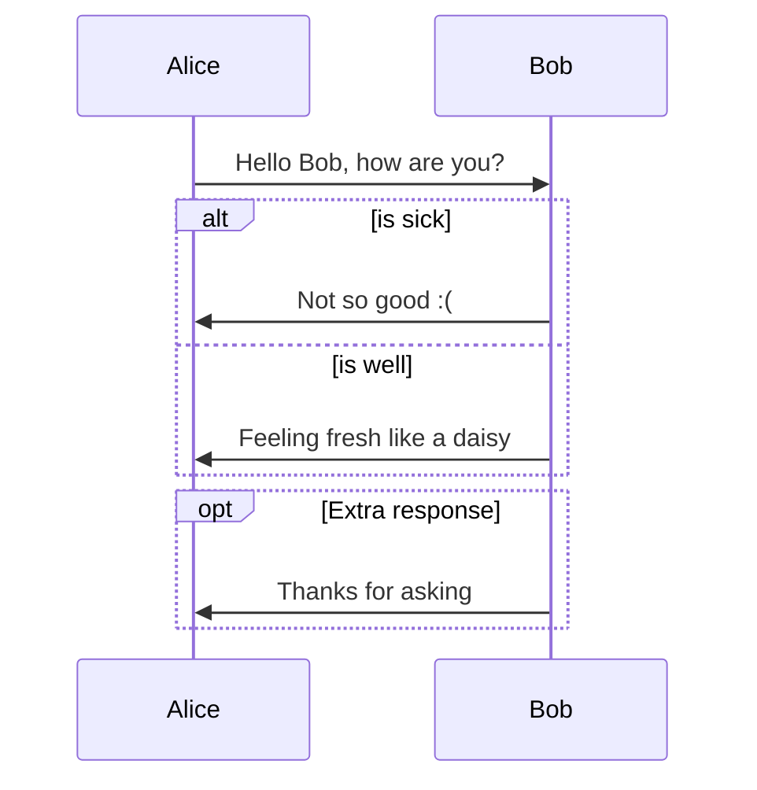
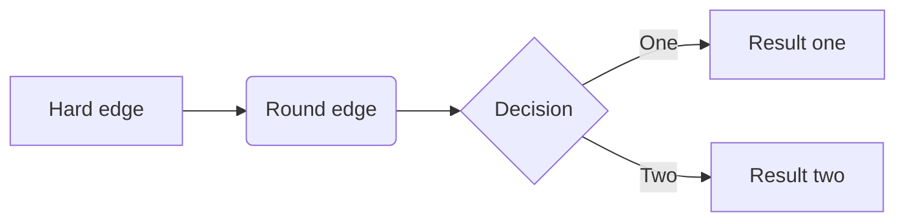

## 流程图

```mermaid
%% Example of sequence diagram
 sequenceDiagram
 Alice->>Bob: Hello Bob, how are you?
 alt is sick
 Bob->>Alice: Not so good :(
 else is well
 Bob->>Alice: Feeling fresh like a daisy
 end
 opt Extra response
 Bob->>Alice: Thanks for asking
 end
```

## 活动图

```mermaid
graph LR
A[Hard edge] -->B(Round edge)
 B --> C{Decision}
 C -->|One| D[Result one]
 C -->|Two| E[Result two]
```

## 参考

[用Markdown绘制图表 - 掘金](https://juejin.cn/post/6893436635476819982)

[Mermaid | Diagramming and charting tool](http://mermaid-js.github.io/mermaid/#/)
