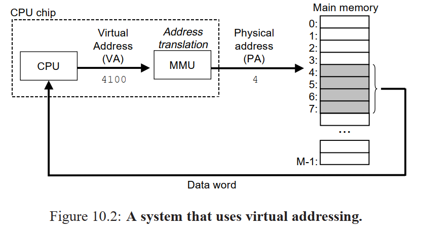
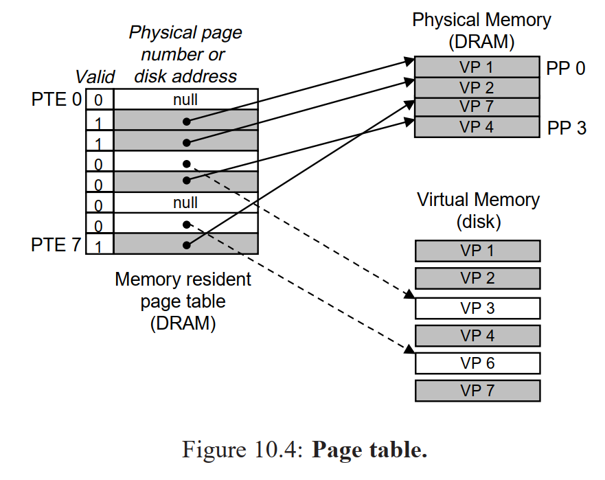
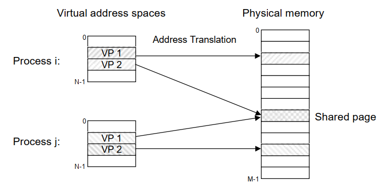
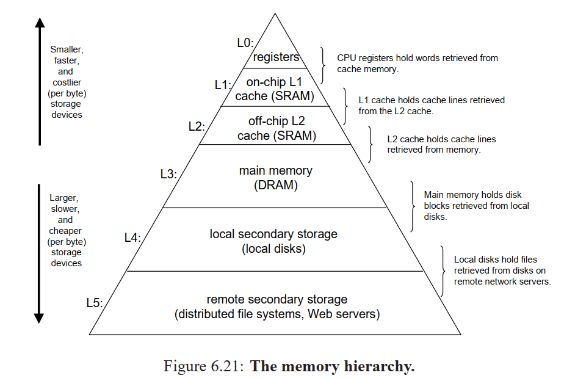

## 用户态和内核态

- 内核态：控制计算机的硬件资源，并提供上层应用程序运行的环境。
- 用户态：上层应用程序的活动空间，应用程序的执行必须依托于内核提供的资源。
- 系统调用：为了使上层应用能够访问到这些资源，内核为上层应用提供访问的接口。

操作系统的主要功能是为管理硬件资源和为应用程序开发人员提供良好的环境，但是计算机系统的各种硬件资源是有限的，因此为了保证每一个进程都能安全的执行。处理器设有两种模式：**用户模式** 与 **内核模式**。一些容易发生安全问题的操作都被限制在只有内核模式下才可以执行，例如 I/O 操作，修改基址寄存器内容等。

当我们处在用户态但是却不得不调用内核态下一些操作的时候这时候可以利用Linux提供的一些转换接口唤起操作，而连接用户模式和内核模式的接口称之为 **系统调用**。

应用程序代码运行在用户模式下，当应用程序需要实现内核模式下的指令时，先向操作系统发送调用请求。操作系统收到请求后，执行系统调用接口，使处理器进入内核模式。当处理器处理完系统调用操作后，操作系统会让处理器返回用户模式，继续执行用户代码。

进程的虚拟地址空间可分为两部分，**内核空间** 和 **用户空间**。内核空间中存放的是内核代码和数据，而进程的用户空间中存放的是用户程序的代码和数据。不管是内核空间还是用户空间，它们都处于**虚拟空间中，都是对物理地址的映射**。

用户态切换为内核态的三种情况：

- 系统调用。系统调用是操作系统中的最小功能单位。
- 异常事件： 当CPU正在执行运行在用户态的程序时，突然发生某些预先不可知的异常事件，这个时候就会触发从当前用户态执行的进程转向内核态执行相关的异常事件，典型的如缺页异常。
- 外围设备的中断：当外围设备完成用户的请求操作后，会像CPU发出中断信号，此时，CPU就会暂停执行下一条即将要执行的指令，转而去执行中断信号对应的处理程序，如果先前执行的指令是在用户态下，则自然就发生从用户态到内核态的转换。

## Buffer and Cache

buffer 和 cache 是两个不同的概念：

cache 是高速缓存，用于 CPU 和内存之间的缓冲；

buffer是 I/O 缓存，用于内存和硬盘的缓冲。

简单的说，cache 是加速 **读**，而 buffer 是缓冲 **写**，前者解决读的问题，保存从磁盘上读出的数据，后者是解决写的问题，保存即将要写入到磁盘上的数据。

**1. Buffer :**
Buffer is a temporary storage area, usually a block in memory, in which items are placed while waiting to be transferred from an input device or to an output device. It is mostly used for input/output processes. As an example, if you were to print a long document, you would not want your CPU waiting around asking your printer “Are you ready for another paragraph?” Instead, the CPU will fill a memory buffer with the document’s data, instruct the printer to print the buffer contents, and go back to its other business.

**2. Cache：**
Cache is a smaller and fast memory component in the computer which is inserted between the CPU and the main memory. To make this arrangement effective. The cache needs to be much faster than main memory. This approach is more economical than the use of fast memory devices to implement the entire main memory.

**Difference between Buffer and Cache :**

| S.No. | BUFFER                                                                                                | CACHE                                                            |
|:----- |:----------------------------------------------------------------------------------------------------- |:---------------------------------------------------------------- |
| 1.    | Buffer is used to compensate for difference in speed between two processes that exchange or use data. | Cache is a smaller and fastest memory component in the computer. |
| 2.    | It is mostly used for input/output processes.                                                         | It is used during reading and writing processes from the disk.   |
| 3.    | It is a normal storage area on ram for temporary storage.                                             | It is a high-speed storage area for temporary storage.           |
| 4.    | It stores the original copy of data.                                                                  | It stores the copy of original data.                             |
| 5.    | It is always implemented in the main memory (RAM).                                                    | It is implemented in RAM as well as in Disk.                     |
| 6.    | It is made from dynamic ram.                                                                          | It is made from static ram.                                      |
| 7.    | It does not increase the accessing time.                                                              | It increase the accessing speed of CPU.                          |
| 8.    | It can be used in keyboards to edit typing mistakes .                                                 | It does not posses such feature.                                 |

参考：[Difference between Buffer and Cache](https://www.geeksforgeeks.org/difference-between-buffer-and-cache/)

# mmap

In computing, **`mmap(2)`** is a POSIX-compliant [Unix](https://en.wikipedia.org/wiki/Unix) system call that **maps files or devices into memory**. It is a method of [memory-mapped file](https://en.wikipedia.org/wiki/Memory-mapped_file) I/O. It implements demand paging because file contents are not read from disk directly and initially do not use physical RAM at all. The actual reads from disk are performed in a "lazy" manner, after a specific location is accessed. After the memory is no longer needed, it is important to `munmap(2)` the pointers to it.  [mmap-wikipedia](https://en.wikipedia.org/wiki/Mmap)

mmap将用户空间的一块地址和内核空间的一块地址同时映射到相同的一块物理内存地址（不管是用户空间还是内核空间都是虚拟地址，最终要通过地址映射映射到物理地址）。

### 优点

1. **减少了数据的拷贝次数**，用内存读写取代 I/O 读写，提高了文件读取效率。

2. **实现了用户空间和内核空间的高效交互（映射）方式**。各自的空间修改操作都会直接反映在共享（Shared）区域内，从而被对方空间及时捕捉到。

3. **提供不同进程间共享内存及相互通信的方式**。无论是父子进程，还是无亲缘关系的进程之间，都可以将自身的用户空间映射到同一个文件或匿名映射到同一片区域。从而通过各自对映射区域的改动，达到进程间通信和进程间共享的目的。例如：进程 A、B 都映射了区域 Z，当 A 第一次读取 C 时，通过缺页机制从磁盘中复制文件页到共享内存；当 B 再读 C 的相同页面时，虽然也会产生缺页异常，但是不再需要从磁盘中复制文件过来，而可直接使用已经保存在内存中的文件数据。

4. **可用于实现高效的大规模数据传输**。通常的，内存空间不足是制约大数据操作的一个方面，解决方案可以是借助硬盘空间协助操作，补充内存空间的不足。但是也会进一步的造成了大量的文件 I/O 操作，极大的影响了执行效率。这个问题可以通过 mmap 映射很好的解决，但凡需要用磁盘空间代替内存的时候，mmap 都可以发挥其功效。
   
   [[Linux 操作系统原理 — mmap() 进程虚拟内存映射](https://my.oschina.net/u/4276902/blog/4274694)](https://my.oschina.net/u/4276902/blog/4274694)

## 进程和线程区别

- 进程是具有一定功能的程序关于某个数据集合上的一次运行活动，进程是系统进行资源调度和分配的一个独立单位。
- 线程是进程的实体，是CPU调度和分派的基本单位，它是比进程更小的能独立运行的基本单位。
- 一个进程可以有多个线程，多个线程也可以并发执行

## 线程同步的方式有哪些(共享资源操作)

- 互斥量(mutex)：采用互斥对象机制，只有拥有互斥对象的线程才有访问公共资源的权限。因为互斥对象只有一个，所以可以保证公共资源不会被多个线程同时访问。
- 信号量(semaphore)：它允许同一时刻多个线程访问同一资源，但是需要控制同一时刻访问此资源的最大线程数量。
- 事件（信号）：通过通知操作的方式来保持多线程同步，还可以方便的实现多线程优先级的比较操作。

[Linux C线程同步的三种方法](https://blog.csdn.net/qq_19004627/article/details/79922382)

## 进程间通信方式

**进程间通信**（**IPC**，*Inter-Process Communication*），指至少两个进程或线程间传送数据或信号的一些技术或方法。

进程是计算机系统分配资源的最小单位（严格说来是线程）。每个进程都有自己的一部分独立的系统资源，彼此是隔离的。为了能使不同的进程互相访问资源并进行协调工作，才有了进程间通信。通常，使用进程间通信的两个应用可以被分为客户端和服务器，客户端进程请求数据，服务端响应客户端的数据请求。有一些应用本身既是服务器又是客户端，这在分布式计算，时常可以见到。这些进程可以运行在同一计算机上或网络连接的不同计算机上。

主要分为：管道、消息队列、信号量、共享存储、SOCKET

[进程间通信IPC (InterProcess Communication)](https://www.jianshu.com/p/c1015f5ffa74)

### **管道/匿名管道(pipe)**

- 管道是半双工的，数据只能向一个方向流动；需要双方通信时，需要建立起两个管道。
- 只能用于父子进程或者兄弟进程之间(具有亲缘关系的进程);
- 单独构成一种独立的文件系统：管道对于管道两端的进程而言，就是一个文件，但它不是普通的文件，它不属于某种文件系统，而是自立门户，单独构成一种文件系统，并且只存在与内存中。
- 数据的读出和写入：一个进程向管道中写的内容被管道另一端的进程读出。写入的内容每次都添加在管道缓冲区的末尾，并且每次都是从缓冲区的头部读出数据。

#### 管道的实质：

管道的实质是一个内核缓冲区，进程以先进先出的方式从缓冲区存取数据，管道一端的进程顺序的将数据写入缓冲区，另一端的进程则顺序的读出数据。

普通管道**PIPE** 、流管道（**s_pipe**）、命名管道（**name_pipe**）

### 有名管道(FIFO)

以有名管道的文件形式存在于文件系统中，这样，即使与有名管道的创建进程不存在亲缘关系的进程，只要可以访问该路径，就能够彼此通过有名管道相互通信。

### 信号(Signal)

在计算机科学中，信号（英语：Signals）是Unix、类Unix以及其他POSIX兼容的操作系统中进程间通讯的一种有限制的方式。它是一种异步的通知机制，用来提醒进程一个事件已经发生。当一个信号发送给一个进程，操作系统中断了进程正常的控制流程，此时，任何非原子操作都将被中断。如果进程定义了信号的处理函数，那么它将被执行，否则就执行默认的处理函数。

在一个运行的程序的控制终端键入特定的组合键可以向它发送某些信号：
Ctrl-C发送INT信号（SIGINT）；默认情况下，这会导致进程终止。
Ctrl-Z发送TSTP信号（SIGTSTP）；默认情况下，这会导致进程挂起。
Ctrl-\发送QUIT信号（SIGQUIT）；默认情况下，这会导致进程终止并且将内存中的信息转储到硬盘（核心转储）。
（这些组合键可以通过stty命令来修改。）
kill()系统调用会在权限允许的情况下向进程发送特定的信号，类似地，kill命令允许用户向进程发送信号。raise(3)库函数可以将特定信号发送给当前进程。
像除数为零、段错误这些异常也会产生信号（这里分别是SIGFPE和SIGSEGV，默认都会导致进程终止和核心转储).
内核可以向进程发送信号以告知它一个事件发生了。例如当进程将数据写入一个已经被关闭的管道是将会收到SIGPIPE信号，默认情况下会使进程关闭。

参考wiki：[Unix信号](https://zh.wikipedia.org/wiki/Unix%E4%BF%A1%E5%8F%B7)

信号是Linux系统中用于进程间互相通信或者操作的一种机制，信号可以在任何时候发给某一进程，而无需知道该进程的状态。

如果该进程当前并未处于执行状态，则该信号就有内核保存起来，知道该进程回复执行并传递给它为止。

如果一个信号被进程设置为阻塞，则该信号的传递被延迟，直到其阻塞被取消，才被传递给进程。

**Linux系统中常用信号：**
 （1）**SIGHUP：**用户从终端注销，所有已启动进程都将收到该进程。系统缺省状态下对该信号的处理是终止进程。
 （2）**SIGINT：**程序终止信号。程序运行过程中，按`Ctrl+C`键将产生该信号。
 （3）**SIGQUIT：**程序退出信号。程序运行过程中，按`Ctrl+\\`键将产生该信号。
 （4）**SIGBUS和SIGSEGV：**进程访问非法地址。
 （5）**SIGFPE：**运算中出现致命错误，如除零操作、数据溢出等。
 （6）**SIGKILL：**用户终止进程执行信号。shell下执行`kill -9`发送该信号。
 （7）**SIGTERM：**结束进程信号。shell下执行`kill 进程pid`发送该信号。
 （8）**SIGALRM：**定时器信号。
 （9）**SIGCLD：**子进程退出信号。如果其父进程没有忽略该信号也没有处理该信号，则子进程退出后将形成僵尸进程。

#### 信号来源

信号是软件层次上对中断机制的一种模拟，是一种异步通信方式，，信号可以在用户空间进程和内核之间直接交互，内核可以利用信号来通知用户空间的进程发生了哪些系统事件，信号事件主要有两个来源：

- 硬件来源：用户按键输入`Ctrl+C`退出、硬件异常如无效的存储访问等。
- 软件终止：终止进程信号、其他进程调用kill函数、软件异常产生信号。

### 消息(Message)队列

- 消息队列是存放在内核中的消息链表，每个消息队列由消息队列标识符表示。
- 与管道（无名管道：只存在于内存中的文件；命名管道：存在于实际的磁盘介质或者文件系统）不同的是消息队列存放在内核中，只有在内核重启(即，操作系统重启)或者显示地删除一个消息队列时，该消息队列才会被真正的删除。
- 另外与管道不同的是，消息队列在某个进程往一个队列写入消息之前，并不需要另外某个进程在该队列上等待消息的到达。

### 共享内存

使得多个进程可以可以直接读写同一块内存空间，是最快的可用IPC形式。是针对其他通信机制运行效率较低而设计的。

为了在多个进程间交换信息，内核专门留出了一块内存区，可以由需要访问的进程将其映射到自己的私有地址空间。进程就可以直接读写这一块内存而不需要进行数据的拷贝，从而大大提高效率。

由于多个进程共享一段内存，因此需要依靠某种同步机制（如信号量）来达到进程间的同步及互斥。

实现方式有mmap内存文件映射或system V共享内存。

### 信号量(semaphore)

信号量是一个计数器，用于多进程对共享数据的访问，信号量的意图在于进程间同步。
 为了获得共享资源，进程需要执行下列操作：
 （1）**创建一个信号量**：这要求调用者指定初始值，对于二值信号量来说，它通常是1，也可是0。
 （2）**等待一个信号量**：该操作会测试这个信号量的值，如果小于0，就阻塞。也称为P操作。
 （3）**挂出一个信号量**：该操作将信号量的值加1，也称为V操作。

### 套接字(socket)

套接字是一种通信机制，凭借这种机制，客户/服务器（即要进行通信的进程）系统的开发工作既可以在本地单机上进行，也可以跨网络进行。也就是说它可以让不在同一台计算机但通过网络连接计算机上的进程进行通信。

[延伸阅读：Linux支持的主要三种共享内存方式：mmap()系统调用、Posix共享内存，以及System V共享内存实践](https://link.jianshu.com/?t=http://www.cnblogs.com/linuxbug/p/4882776.html)

### 参考

[进程间8种通信方式详解](https://blog.csdn.net/violet_echo_0908/article/details/51201278)

[进程间8种通信方式详解](https://blog.csdn.net/violet_echo_0908/article/details/51201278)

## 虚拟内存

虚拟内存允许执行进程不必完全在内存中。虚拟内存的基本思想是：每个进程拥有独立的地址空间，这个空间被分为大小相等的**多个块，称为页(Page)**，每个页都是一段连续的地址。这些页被映射到物理内存，但并不是所有的页都必须在内存中才能运行程序。当程序引用到一部分在物理内存中的地址空间时，由硬件立刻进行必要的映射；当程序引用到一部分不在物理内存中的地址空间时，由操作系统负责将缺失的部分装入物理内存并重新执行失败的命令。这样，对于进程而言，逻辑上似乎有很大的内存空间，实际上其中一部分对应**物理内存上的一块(称为帧**，通常页和帧大小相等)，还有一些没加载在内存中的对应在硬盘上。
注意，请求分页系统、请求分段系统和请求段页式系统都是针对虚拟内存的，通过请求实现内存与外存的信息置换。

### Capabilities

1. It uses main memory efficiently by treating it as a cache for an address space stored on disk, keeping only the active areas in main memory, and transferring data back and forth between disk and memory as needed. 
2. It simplifies memory management by providing each process with a uniform address space. 
3. It protects the address space of each process from corruption by other processes.  

With virtual addressing, the CPU accesses main memory by generating a virtual address (VA), which is converted to the appropriate physical address before being sent to the memory. The task of converting a virtual address to a physical one is known as **address translation**.  Dedicated hardware on
the CPU chip called the **memory management unit (MMU)** translates virtual addresses on the fly, using a look-up table stored in main memory whose contents are managed by the operating system.  



If there is a miss, the system must determine where the virtual page is stored on disk, select a victim page in physical memory, and copy the virtual page from disk to DRAM, replacing the victim page.  



The activity of transferring a page between disk and memory is known as swapping or paging.  Pages are swapped in (paged in) from disk to DRAM, and swapped out (paged out) from DRAM to disk.  

In fact, operating systems provide a separate page table, and thus a separate virtual address space, for each process.



The operating system maintains a separate page table for each process in the system.

### 页面置换算法

进程运行时，若其访问的页面不在内存而需将其调入，但内存已无空闲空间时，就需要从内存中调出一页程序或数据，送入磁盘的对换区。

FIFO（First in First out）先进先出算法：在操作系统中经常被用到，比如作业调度（主要实现简单，很容易想到）；

LRU（Least recently use）最近最少使用算法：根据使用时间到现在的长短来判断；**Linux 操作系统采用LRU算法置换内存**。

LFU（Least frequently use）最少使用次数算法：根据使用次数来判断；

OPT（Optimal replacement）最优置换算法：理论的最优，实际不可能实现；就是要保证置换出去的是不再被使用的页，或者是在实际内存中最晚使用的算法。

[页面置换算法](https://houbb.github.io/2020/10/04/os-10-page-exchange)

[Linux内核页面置换算法](https://blog.eastonman.com/blog/2021/04/linux-multi-lru/)

### Linux Swapping or Paging

In computer operating systems, memory paging is a memory management scheme by which a computer **stores and retrieves data from secondary storage for use in main memory**. In this scheme, the operating system retrieves data from secondary storage in same-size blocks called pages. Paging is an important part of virtual memory implementations in modern operating systems, using secondary storage to let programs exceed the size of available physical memory.

Linux 会将物理的随机读取内存（Random Access Memory、RAM）按页分割成 4KB 大小的内存块，而今天要介绍的 *Swapping* 机制就与内存息息相关，它是操作系统将物理内存页中的内容拷贝到硬盘上交换空间（Swap Space）以释放内存的过程，物理内存和硬盘上的交换分区组成了操作系统上可用的虚拟内存，而这些交换空间都是系统管理员预先配置好的。

触发 Swapping 的进程可能会遇到性能损失，同一个页面的频繁换入换出会导致极其明显的性能抖动，如果没有相应的背景知识，遇到类似的问题可能会很难查到根本原因，例如 MySQL 在错误配置 NUMA 时就会出现内存页频繁换入换出，影响服务质量的问题。

[为什么 Linux 需要 Swapping](https://draveness.me/whys-the-design-linux-swapping/)

[Memory Paging --- Wikipedia](https://en.wikipedia.org/wiki/Memory_paging)

### 虚拟内存的应用与优点

虚拟内存很适合在多道程序设计系统中使用，许多程序的片段同时保存在内存中。当一个程序等待它的一部分读入内存时，可以把CPU交给另一个进程使用。虚拟内存的使用可以带来以下好处：

在内存中可以保留多个进程，系统并发度提高

解除了用户与内存之间的紧密约束，进程可以比内存的全部空间还大

### 参考

https://blog.csdn.net/justloveyou_/article/details/78304294

## Dynamic Memory Allocation

Explicit allocators require the application to explicitly free any allocated blocks.  

Implicit allocators, on the other hand, require the allocator to detect when an allocated block is no longer being used by the program and then free the block.  

### The malloc and free Functions

The malloc function returns a pointer to a block of memory of at least size bytes that is suitably aligned for any kind of data object that might be contained in the block. On the Unix systems that we are familiar with, malloc returns a block that is aligned to an 8-byte (double-word) boundary. The size t type is defined as an unsigned int. 

 Applications that want to change the size of a previously allocated block can use the realloc function.  

```c
#include <stdlib.h>
void *malloc(size t size);
```

Programs free allocated heap blocks by calling the free function.  

```c
#include <stdlib.h>
void free(void *ptr);
```

#### Fragmentation

**Internal fragmentation** occurs when an allocated block is larger than the payload. One reason: the implementation of an allocator might impose a minimum size on allocated blocks that is greater than some requested payload.   

**External fragmentation** occurs when there is enough aggregate free memory to satisfy an allocate request, but no single free block is large enough to handle the request.    

## 什么是缓冲区溢出？有什么危害？其原因是什么？

缓冲区溢出是指当计算机向缓冲区填充数据时超出了缓冲区本身的容量，溢出的数据覆盖在合法数据上。

危害有以下两点：

- 程序崩溃，导致拒绝服务
- 跳转并且执行一段恶意代码

造成缓冲区溢出的主要原因是程序中没有仔细检查用户输入。

## 什么是死锁？死锁产生的条件？

在两个或者多个并发进程中，如果每个进程持有某种资源而又等待其它进程释放它或它们现在保持着的资源，在未改变这种状态之前都不能向前推进，称这一组进程产生了死锁。通俗的讲就是两个或多个进程无限期的阻塞、相互等待的一种状态。

[常见面试题整理--操作系统篇](https://zhuanlan.zhihu.com/p/23755202)

[用户态与内核态](https://www.jianshu.com/p/85e931636f27)

[I/O多路复用之水平触发和边沿触发模式](https://blog.csdn.net/fengxinlinux/article/details/75331567)

## 进程调度算法

### 1、先来先服务调度算法

先来先服务(FCFS)调度算法是一种最简单的调度算法，该算法既可用于作业调度，也可用于进程调度。当在作业调度中采用该算法时，每次调度都是从后备作业队列中选择一个或多个最先进入该队列的作业，将它们调入内存，为它们分配资源、创建进程，然后放入就绪队列。在进程调度中采用FCFS算法时，则每次调度是从就绪队列中选择一个最先进入该队列的进程，为之分配处理机，使之投入运行。该进程一直运行到完成或发生某事件而阻塞后才放弃处理机。 

### 2、短作业(进程)优先调度算法

短作业(进程)优先调度算法，是指对短作业或短进程优先调度的算法。它们可以分别用于作业调度和进程调度。短作业优先(SJF)的调度算法是从后备队列中选择一个或若干个估计运行时间最短的作业，将它们调入内存运行。而短进程优先(SPF)调度算法则是从就绪队列中选出一个估计运行时间最短的进程，将处理机分配给它，使它立即执行并一直执行到完成，或发生某事件而被阻塞放弃处理机时再重新调度。 

### 3、时间片轮转法

在早期的时间片轮转法中，系统将所有的就绪进程按先来先服务的原则排成一个队列，每次调度时，把CPU分配给队首进程，并令其执行一个时间片。时间片的大小从几ms到几百ms。当执行的时间片用完时，由一个计时器发出时钟中断请求，调度程序便据此信号来停止该进程的执行，并将它送往就绪队列的末尾；然后，再把处理机分配给就绪队列中新的队首进程，同时也让它执行一个时间片。这样就可以保证就绪队列中的所有进程在一给定的时间内均能获得一时间片的处理机执行时间。换言之，系统能在给定的时间内响应所有用户的请求。 

### 4、多级反馈队列调度算法

前面介绍的各种用作进程调度的算法都有一定的局限性。如短进程优先的调度算法，仅照顾了短进程而忽略了长进程，而且如果并未指明进程的长度，则短进程优先和基于进程长度的抢占式调度算法都将无法使用。而多级反馈队列调度算法则不必事先知道各种进程所需的执行时间，而且还可以满足各种类型进程的需要，因而它是目前被公认的一种较好的进程调度算法。在采用多级反馈队列调度算法的系统中，调度算法的实施过程如下所述：

1）应设置多个就绪队列，并为各个队列赋予不同的优先级。第一个队列的优先级最高，第二个队列次之，其余各队列的优先权逐个降低。该算法赋予各个队列中进程执行时间片的大小也各不相同，在优先权愈高的队列中，为每个进程所规定的执行时间片就愈小。例如，第二个队列的时间片要比第一个队列的时间片长一倍，第i+1个队列的时间片要比第i个队列的时间片长一倍。

2）当一个新进程进入内存后，首先将它放入第一队列的末尾，按FCFS原则排队等待调度。当轮到该进程执行时，如它能在该时间片内完成，便可准备撤离系统；如果它在一个时间片结束时尚未完成，调度程序便将该进程转入第二队列的末尾，再同样地按FCFS原则等待调度执行；如果它在第二队列中运行一个时间片后仍未完成，再依次将它放入第三队列，……，如此下去，当一个长作业(进程)从第一队列依次降到第n队列后，在第n队列便采取按时间片轮转的方式运行。

3）仅当第一队列空闲时，调度程序才调度第二队列中的进程运行；仅当第1～(i-1)队列均空时，才会调度第i队列中的进程运行。如果处理机正在第i队列中为某进程服务时，又有新进程进入优先权较高的队列(第1～(i-1)中的任何一个队列)，则此时新进程将抢占正在运行进程的处理机，即第i队列中某个正在运行的进程的时间片用完后，由调度程序选择优先权较高的队列中的那一个进程，把处理机分配给它。 

### 5、优先权调度算法

为了照顾紧迫型作业，使之在进入系统后便获得优先处理，引入了最高优先权优先(FPF)调度算法。此算法常被用于批处理系统中，作为作业调度算法，也作为多种操作系统中的进程调度算法，还可用于实时系统中。当把该算法用于作业调度时，系统将从后备队列中选择若干个优先权最高的作业装入内存。当用于进程调度时，该算法是把处理机分配给就绪队列中优先权最高的进程，这时，又可进一步把该算法分成如下两种。

1) 非抢占式优先权算法

在这种方式下，系统一旦把处理机分配给就绪队列中优先权最高的进程后，该进程便一直执行下去，直至完成；或因发生某事件使该进程放弃处理机时，系统方可再将处理机重新分配给另一优先权最高的进程。这种调度算法主要用于批处理系统中；也可用于某些对实时性要求不严的实时系统中。

2) 抢占式优先权调度算法

在这种方式下，系统同样是把处理机分配给优先权最高的进程，使之执行。但在其执行期间，只要又出现了另一个其优先权更高的进程，进程调度程序就立即停止当前进程(原优先权最高的进程)的执行，重新将处理机分配给新到的优先权最高的进程。因此，在采用这种调度算法时，是每当系统中出现一个新的就绪进程i时，就将其优先权Pi与正在执行的进程j的优先权Pj进行比较。如果Pi≤Pj，原进程Pj便继续执行；但如果是Pi>Pj，则立即停止Pj的执行，做进程切换，使i进程投入执行。显然，这种抢占式的优先权调度算法能更好地满足紧迫作业的要求，故而常用于要求比较严格的实时系统中，以及对性能要求较高的批处理和分时系统中。

## Cache

As we have noted, the essence of the memory hierarchy is that the storage device at each level is a cache for the next lower level.

The local disk serves as a cache for files (such as Web pages) retrieved from remote disks over the network, the main memory serves as a cache
for data on the local disks, and so on, until we get to the smallest cache of all, the set of CPU registers.  



At the operating system level, the principle of locality allows the system to use the **main memory** as a cache of the most **recently referenced chunks of the virtual address space**. Similarly, the operating system uses **main memory** to cache the most **recently used disk blocks in the disk file system**. The principle of locality also plays a crucial role in the design of application programs. For example, Web browsers exploit temporal locality by caching recently referenced documents on a local disk. High volume Web servers hold recently requested documents in front-end disk caches that satisfy requests for these documents without requiring any intervention from the server.  

## 参考文献

[操作系统中常用的进程调度算法](https://blog.csdn.net/fuzhongmin05/article/details/55802925)