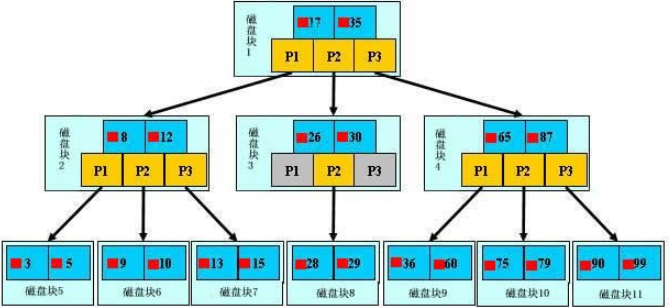
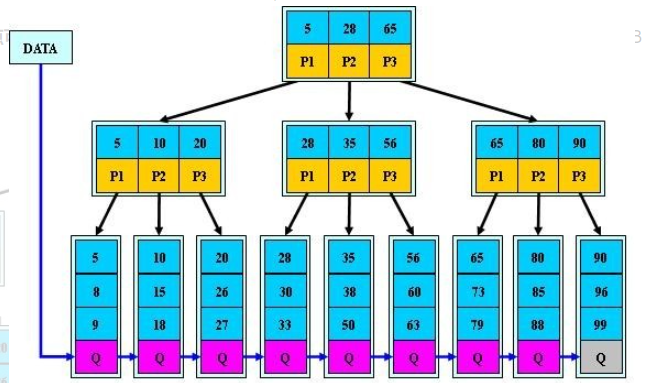
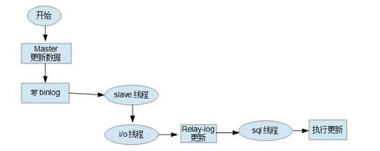
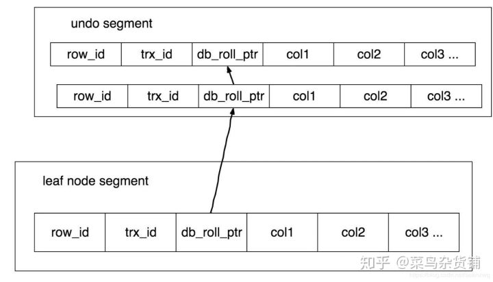

# MySQL

传统关系型数据库，InnoDB引擎支持事务操作。

## 迁移方案

1. 一主一从结构迁移从库，中间一段时间需要停服。
2. 一主一从结构迁移指定库。
3. 一主一从结构双边迁移。

[不同场景下 MySQL 的迁移方案]([https://cloud.tencent.com/developer/article/1054378)

## 为什么mysql用B+树做索引而不用B树或红黑树

### 前言

查询需要索引提高效率，但是又不想频繁进行磁盘IO操作，故减少树个深度，也就是采用多叉树。B树的各种操作能使B树保持较低的高度，从而达到有效避免磁盘过于频繁的查找存储操作，从而有效提高查找效率。



​ 聚簇B树

### 一、B+树做索引而不用B树

那么Mysql如何衡量查询效率呢？– 磁盘IO次数。
一般来说索引非常大，尤其是关系性数据库这种数据量大的索引能达到亿级别，所以为了减少内存的占用，索引也会被存储在磁盘上。B树/B+树 的特点就是每层节点数目非常多，层数很少，目的就是为了减少磁盘IO次数，但是B树的每个节点都有data域（指针），这无疑增大了节点大小，说白了增加了磁盘IO次数（磁盘IO一次读出的数据量大小是固定的，InnoDB 中页的默认大小是 16 KB，单个数据变大，每次读出的就少，IO次数增多，一次IO多耗时），而B+树除了叶子节点其它节点并不存储数据，节点小，磁盘IO次数就少。

优点一： B+树只有叶节点存放数据，其余节点用来索引，而B树是每个索引节点都会有Data域。

优点二： B+树所有的Data域在叶子节点，并且所有叶子节点之间都有一个链指针。 这样遍历叶子节点就能获得全部数据，使得范围查询效率高。在数据库中基于范围的查询是非常频繁的，而B树不支持这样的遍历操作。                                                                                                                                



​ B+树

### 二、B+树做索引而不用红黑树

AVL 树（平衡二叉树）和红黑树（二叉查找树）基本都是存储在内存中才会使用的数据结构。在大规模数据存储的时候，红黑树往往出现由于树的深度过大而造成磁盘IO读写过于频繁，进而导致效率低下的情况。为什么会出现这样的情况，我们知道要获取磁盘上数据，必须先通过磁盘移动臂移动到数据所在的柱面，然后找到指定盘面，接着旋转盘面找到数据所在的磁道，最后对数据进行读写。磁盘IO代价主要花费在查找所需的柱面上，树的深度过大会造成磁盘IO频繁读写。根据磁盘查找存取的次数往往由树的高度所决定，所以，只要我们通过某种较好的树结构减少树的结构尽量减少树的高度，B树可以有多个子女，从几十到上千，可以降低树的高度。

数据库系统的设计者巧妙利用了磁盘预读原理，将一个节点的大小设为等于一个页，这样每个节点只需要一次I/O就可以完全载入。为了达到这个目的，在实际实现B-Tree还需要使用如下技巧：每次新建节点时，直接申请一个页的空间，这样就保证一个节点物理上也存储在一个页里，加之计算机存储分配都是按页对齐的，就实现了一个node只需一次I/O。
[为什么mysql用B+树做索引而不用B-树或红黑树](https://blog.csdn.net/qq_35923749/article/details/88068659)

[从B树、B+树、B*树谈到R 树](https://blog.csdn.net/v_JULY_v/article/details/6530142)

### 建索引的几大原则

1.**最左前缀匹配原则**，非常重要的原则，mysql会一直向右匹配直到遇到范围查询(>、<、between、like)就停止匹配，比如a = 1 and b = 2 and c > 3 and d = 4 如果建立(a,b,c,d)顺序的索引，d是用不到索引的，如果建立(a,b,d,c)的索引则都可以用到，a,b,d的顺序可以任意调整。

2.=和in可以乱序，比如a = 1 and b = 2 and c = 3 建立(a,b,c)索引可以任意顺序，mysql的查询优化器会帮你优化成索引可以识别的形式。

3.尽量选择**区分度高的列作为索引**，区分度的公式是count(distinct col)/count(*)，表示字段不重复的比例，比例越大我们扫描的记录数越少，唯一键的区分度是1，而一些状态、性别字段可能在大数据面前区分度就是0，那可能有人会问，这个比例有什么经验值吗？使用场景不同，这个值也很难确定，一般需要join的字段我们都要求是0.1以上，即平均1条扫描10条记录。

4.**索引列不能参与计算**，保持列“干净”，比如from_unixtime(create_time) = ’2014-05-29’就不能使用到索引，原因很简单，b+树中存的都是数据表中的字段值，但进行检索时，需要把所有元素都应用函数才能比较，显然成本太大。所以语句应该写成create_time = unix_timestamp(’2014-05-29’)。

5.尽量的扩展索引，不要新建索引。比如表中已经有a的索引，现在要加(a,b)的索引，那么只需要修改原来的索引即可。

#### 索引范围查询右边失效原理

##### 举例

```sql
select * from testTable where a>1 and b=2
```

**分析如下**：

假设联合索引为(a,b)，首先a字段在B+树上是有序的，所以可以用二分查找法定位到1，然后将所有大于1的数据取出来，a可以用到索引。

b有序的前提是a是确定的值，那么现在a的值是取大于1的，可能有10个大于1的a，也可能有100个a。

大于1的a那部分的B+树里，b字段是无序的，所以b不能在无序的B+树里用二分查找来查询，b用不到索引。例子如下表所示。

| a   | b   |
| --- | --- |
| 2   | 1   |
| 2   | 2   |
| 2   | 3   |
| 3   | 2   |
| 3   | 3   |

### 查询优化神器 - explain命令

关于explain命令相信大家并不陌生，具体用法和字段含义可以参考官网[explain-output](http://dev.mysql.com/doc/refman/5.5/en/explain-output.html)，这里需要强调rows是核心指标，绝大部分rows小的语句执行一定很快（有例外，下面会讲到）。所以优化语句基本上都是在优化rows。

[[MySQL索引原理及慢查询优化](https://tech.meituan.com/2014/06/30/mysql-index.html)](https://tech.meituan.com/2014/06/30/mysql-index.html)

## 哈希索引

基于哈希表实现。

优点：速度快，除非有很多哈希冲突的情况。

缺点：

1. 不是按索引值顺序存储，故无法排序。

2. 不支持部分索引查找，比如建立(A,B)索引，如果查询语句只有A，那么无法使用索引。

3. 只支持等值比较查询，包括=、in()、!=、<=>、不支持任何范围查询。

### 使用场景

```sql
# 对url_crc使用哈希索引使得对"http://www.mysql.com"的等值查询非常快
# 比对url建立B-Tree索引的等值查询快，尤其是在url很大的情况下，不仅速度快而且节省空间。
select id from url where url="http://www.mysql.com" 
and url_crc = crc32("http://www.mysql.com");
```

### 索引合并

MySQL 5.0和更新的版本中，查询能够同时使用两个单列索引进行扫描，并将结果进行合并。

索引合并策略是一种优化的结果，但实际上更多时候说明了表上的索引建得很糟糕。如果需要多个索引进行合并，那么会消耗大量CPU和内存资源。有时候不如采用传统的union语句进行改造。

可以通过参数optimizer_switch来关掉索引合并功能。也可以使用IGNORE INDEX提示让优化器忽略掉某些索引。

```sql
 explain select id from user where age = 57 or name like "name15%" \G;
*************************** 1. row ***************************
           id: 1
  select_type: SIMPLE
        table: user
   partitions: NULL
         type: index_merge
possible_keys: age,name
          key: age,name
      key_len: 4,20
          ref: NULL
         rows: 105
     filtered: 100.00
        Extra: Using sort_union(age,name); Using where---+
```

## InnoDB二级索引

为非聚簇索引。

二级索引访问需要两次B-Tree查找。第一次找到二级索引对应的主键值，然后通过这个值去查找对应行。

### InnoDB和MyISAM

1. InnoDB 支持事务，MyISAM 不支持事务。这是 MySQL 将默认存储引擎从 MyISAM 变成 InnoDB 的重要原因之一；

2. InnoDB 支持外键，而 MyISAM 不支持。对一个包含外键的 InnoDB 表转为 MYISAM 会失败；

3. InnoDB 是聚集索引，MyISAM 是非聚集索引。聚簇索引的文件存放在主键索引的叶子节点上，因此 InnoDB 必须要有主键，通过主键索引效率很高。但是辅助索引需要两次查询，先查询到主键，然后再通过主键查询到数据。因此，主键不应该过大，因为主键太大，其他索引也都会很大。而 MyISAM 是非聚集索引，数据文件是分离的，索引保存的是数据文件的指针。主键索引和辅助索引是独立的。

4. InnoDB 不保存表的具体行数，执行 select count(*) from table 时需要全表扫描。而MyISAM 用一个变量保存了整个表的行数，执行上述语句时只需要读出该变量即可，速度很快；

5. InnoDB 最小的锁粒度是行锁，MyISAM 最小的锁粒度是表锁。一个更新语句会锁住整张表，导致其他查询和更新都会被阻塞，因此并发访问受限。这也是 MySQL 将默认存储引擎从 MyISAM 变成 InnoDB 的重要原因之一；

#### 如何选择：

1. 是否要支持事务，如果要请选择 InnoDB，如果不需要可以考虑 MyISAM；

2. 如果表中绝大多数都只是读查询，可以考虑 MyISAM，如果既有读写也挺频繁，请使用InnoDB。

3. 系统奔溃后，MyISAM恢复起来更困难，能否接受，不能接受就选 InnoDB；

4. MySQL5.5版本开始Innodb已经成为Mysql的默认引擎(之前是MyISAM)，说明其优势是有目共睹的。如果你不知道用什么存储引擎，那就用InnoDB，至少不会差。

[MySQL聚集索引和非聚集索引](https://zhuanlan.zhihu.com/p/39293940)

[Mysql 中 MyISAM 和 InnoDB 的区别有哪些？](https://www.zhihu.com/question/20596402)

//todo InnoDB的聚簇索引和MyISAM的非聚簇索引的区别

//todo 索引覆盖

### 覆盖索引

如果一个索引包含了所有需要查询的字段值，我们称之为覆盖索引。比如说对于InnoDB可以避免对主键索引的二次查询。覆盖索引必须要存储索引列的值，而哈希索引、空间索引和全文索引等都不存储索引列的值，所以MySQL只能使用B-Tree索引做覆盖索引。

```sql
# 对于limit大量值时，覆盖索引优化的例子, id是主键
select * from user inner join (select id from user u order by age asc 
limit 10000000,10) as user_order on user.id = user_order.id;

# 该语句需要找到所有的按age索引从大到小的排序的user行记录，然后
# 从1000000处开始找10个出来，等于之前已经取了1000000个无效行。
select name from user order by age desc limit 1000000, 10;
# result: ...
# 10 rows in set (0.62 sec)

# 该语句需要找到所有的按age索引从大到小的排序的主键id然后从1000000处取10个
# 主键，然后通过主键id找到行记录，也就是不需要取大量行记录，只需要提前过滤大量
# 无效主键ID。所以比上一条语句优化很多时间。
select name from user join (select id from user order by age desc
 limit 1000000, 10) as user_id on user.id = user_id.id;
# result: ...
# 10 rows in set (0.32 sec)
```

### 索引在排序中的原理

只有当索引的列顺序和ORDER BY字句的顺序完全一致，并且所有列的排序方向（倒序或正序）都一样时，MySQL才能够使用索引来对结果做排序。ORDER BY需要满足最左前缀要求，要么前面列为常量。等等，详情见《高性能MySQL》

### 索引和锁

索引有一定可能性让查询锁定的行更少。如果你的查询不访问那些不需要的行，那么就会锁定更少的行。

1. 虽然InnoDB的行锁效率很高，内存使用也很少，但是锁定行时仍然会带来额外的开销。

2. 锁定超过需要的行会增加锁竞争而减少并发性。

## MySQL同步原理

### 概念

MySQL 主从复制是指数据可以从一个MySQL数据库服务器主节点复制到一个或多个从节点。MySQL 默认采用异步复制方式，这样从节点不用一直访问主服务器来更新自己的数据，数据的更新可以在远程连接上进行，从节点可以复制主数据库中的所有数据库或者特定的数据库，或者特定的表。

MySQL主从复制涉及到三个线程，一个运行在主节点（log dump thread），其余两个(I/O thread, SQL thread)运行在从节点，如下图所示：


**l 主节点 binary log dump 线程**
当从节点连接主节点时，主节点会创建一个log dump 线程，用于发送bin-log的内容。在读取bin-log中的操作时，此线程会对主节点上的bin-log加锁，当读取完成，甚至在发动给从节点之前，锁会被释放。

**l 从节点I/O线程**
当从节点上执行`start slave`命令之后，从节点会创建一个I/O线程用来连接主节点，请求主库中更新的bin-log。I/O线程接收到主节点binlog dump 进程发来的更新之后，保存在本地relay-log中。

**l 从节点SQL线程**
SQL线程负责读取relay log中的内容，解析成具体的操作并执行，最终保证主从数据的一致性。

对于每一个主从连接，都需要三个进程来完成。当主节点有多个从节点时，主节点会为每一个当前连接的从节点建一个binary log dump 进程，而每个从节点都有自己的I/O进程，SQL进程。**从节点用两个线程将从主库拉取更新和执行分成独立的任务，这样在执行同步数据任务的时候，不会降低读操作的性能。**比如，如果从节点没有运行SQL进程，此时I/O进程可以很快从主节点获取更新，尽管SQL进程还没有执行。如果在SQL进程执行之前从节点服务停止，至少I/O进程已经从主节点拉取到了最新的变更并且保存在本地relay日志中，当服务再次起来之后，就可以完成数据的同步。

要实施复制，首先必须打开Master 端的binary log（bin-log）功能，否则无法实现。
因为整个复制过程实际上就是Slave 从Master 端获取该日志然后再在自己身上完全顺序的执行日志中所记录的各种操作。如下图所示：



复制的基本过程如下：

- 从节点上的I/O 进程连接主节点，并请求从指定日志文件的指定位置（或者从最开始的日志）之后的日志内容；
- 主节点接收到来自从节点的I/O请求后，通过负责复制的I/O进程根据请求信息读取指定日志指定位置之后的日志信息，返回给从节点。返回信息中除了日志所包含的信息之外，还包括本次返回的信息的bin-log file 的以及bin-log position；从节点的I/O进程接收到内容后，将接收到的日志内容更新到本机的relay log中，并将读取到的binary log文件名和位置保存到master-info 文件中，以便在下一次读取的时候能够清楚的告诉Master“我需要从某个bin-log 的哪个位置开始往后的日志内容，请发给我”；
- Slave 的 SQL线程检测到relay-log 中新增加了内容后，会将relay-log的内容解析成在主节点上实际执行过的操作，并在本数据库中执行。

[MySQL 主从复制原理不再难](https://www.cnblogs.com/rickiyang/p/13856388.html)

[深度探索MySQL主从复制原理](https://zhuanlan.zhihu.com/p/50597960)

## MySQL的SQL预处理

### 语法

```sql
# 定义预处理语句
PREPARE $stmt_name FROM $preparable_stmt;
# 执行预处理语句
EXECUTE $stmt_name [USING @var_name [, @var_name] ...];
# 删除(释放)定义
{DEALLOCATE | DROP} PREPARE $stmt_name;
```

### 例子

```sql
mysql> insert into user(name, age) values("John", 18);
Query OK, 1 row affected (0.04 sec)

mysql> prepare stmt1 from 'select * from user where name = ?'
    -> ;
Query OK, 0 rows affected (0.00 sec)
Statement prepared

mysql> set @n = 'John';
Query OK, 0 rows affected (0.00 sec)

mysql> execute stmt1 using @n;
+----+------+-----+
| id | name | age |
+----+------+-----+
|  1 | John |  18 |
+----+------+-----+
1 row in set (0.00 sec))

mysql> deallocate prepare stmt1;
Query OK, 0 rows affected (0.00 sec)
```

## 事务

MySQL默认采用自动提交（AUTOCOMMIT）模式。也就是说，如果不是显式地开始一个事务，则每个SQL执行都被当作一个事务执行提交操作。当然这个模式对非事务性的表不会有影响。

```sql
show variables like 'AUTOCOMMIT';
# 0 禁用， 1：开启
set AUTOCOMMIT= 1;
```

可以用SET TRANSACTION ISOLATION LEVEL命令来设置隔离级别。可以在配置文件中设置整个数据库的隔离级别，也可以只改变当前会话的隔离级别：

```sql
# 语法： set  [ global | session ] transaction isolation level read uncommitted;
   set global TRANSACTION ISOLATION level read COMMITTED;
   show global variables like 'transaction_isolation';

   level: {
     REPEATABLE READ
   | READ COMMITTED
   | READ UNCOMMITTED
   | SERIALIZABLE
}
```

### 隐式和显式锁定

InnoDB采用的是两阶段锁定协议（two-phase locking protocol）。事务执行过程中，随时都可以执行锁定，只有在执行COMMIT或ROLLBACK时才会释放。前面描述的都是隐式锁定，InnoDB会根据隔离级别在需要的时候自动加锁。

InnoDB也支持特定语句进行显示锁定，这些语句不属于SQL规范。

```sql
SELECT ... LOCK IN SHARE MODE
SELECT ... FOR UPDATE
```

### 两阶段锁定协议（two-phase locking protocol）

数据库遵循的是两段锁协议，将事务分成两个阶段，加锁阶段和解锁阶段（所以叫两段锁）

- 加锁阶段：在该阶段可以进行加锁操作。在对任何数据进行读操作之前要申请并获得S锁（**共享锁，其它事务可以继续加共享锁，但不能加排它锁**），在进行写操作之前要申请并获得X锁（**排它锁，其它事务不能再获得任何锁**）。加锁不成功，则事务进入等待状态，直到加锁成功才继续执行。
- 解锁阶段：当事务释放了一个锁以后，事务进入解锁阶段，在该阶段只能进行解锁操作不能再进行加锁操作。

| 事务                 | 加锁/解锁处理                            |
| ------------------ | ---------------------------------- |
| begin;             |                                    |
| insert into t_test | 加insert对应的锁                        |
| update t_test set  | 加update对应的锁                        |
| delete from t_test | 加delete对应的锁                        |
| commit;            | 事务提交时，同时释放insert，update，delete对应的锁 |

### 事务隔离级别

| 隔离级别                   | 脏读（Dirty Read） | 不可重复读（NonRepeatable Read） | 幻读（Phantom Read） |
| ---------------------- | -------------- | ------------------------- | ---------------- |
| 未提交读（Read uncommitted） | 可能             | 可能                        | 可能               |
| 已提交读（Read committed）   | 不可能            | 可能                        | 可能               |
| 可重复读（Repeatable read）  | 不可能            | 不可能                       | 可能               |
| 可串行化（Serializable ）    | 不可能            | 不可能                       | 不可能              |

- 未提交读(Read Uncommitted)：允许脏读，也就是可能读取到其他会话中未提交事务修改的数据
- 提交读(Read Committed)：只能读取到已经提交的数据。Oracle等多数数据库默认都是该级别 (不重复读)
- 可重复读(Repeated Read)：可重复读。在同一个事务内的查询都是事务开始时刻一致的，InnoDB默认级别。在SQL标准中，该隔离级别消除了不可重复读，但是还存在幻象读
- 串行读(Serializable)：完全串行化的读，**每次读都需要获得表级共享锁，读写相互都会阻塞**

### MySQL各事务级别加锁情况（MySQL 8版本）

对于全部事务隔离级别，select ** for update具有排他性。select ** lock in share mode具有共享锁特性。

如果是SQL语句使用到索引，那么对涉及的范围行进行加行锁，否则进行对所有行加锁。

#### 未提交读，已提交读，可重复读

加行锁。

update，delete，insert加排它锁，如果是SQL有范围语句则加入间隙锁（具有排他性）。

select语句没有加锁。

insert加锁例子：一个事务T1 insert一条记录，该记录生成一个主键id=2，未提交事务。另外一个事务T2 update主键id=2记录的值，此时这个事务T2被阻塞。

##### 注意：

在MySQL中，Innodb 的 RR 隔离界别对范围会加上 GAP，理论上不会存在幻读，但是是否有例外呢，这个还需要进一步求证。

在MySQL 8上，验证了不会出现幻读，与教科书理论的不同。

MySQL解决RR级别幻读的方法：行锁防止别的事务修改或删除，GAP锁防止别的事务新增，行锁和GAP锁结合形成的的Next-Key锁共同解决了RR级别在写数据时的幻读问题。

```sql
# 这种情况也会对id=1的user加行锁
update account set balance = (select age from user where id = 1 limit 1) where id = 1;
```

| 时间  | 事务1                                    | 事务2                                               |
| --- | -------------------------------------- | ------------------------------------------------- |
| 1   | begin;                                 | begin;                                            |
| 2   | select * from user; #此时出现5条记录          |                                                   |
| 3   |                                        | insert into user(name, age) values("Thomas", 30); |
| 4   |                                        | commit;                                           |
| 5   | select * from user; #此时还是出现时间点为2的5条记录。 |                                                   |
| 6   | commit;                                |                                                   |

#### 可串行化

加行锁。

update，delete，insert加排它锁。

select加共享锁。

例子：一个事务T1 select一个id=2的记录，未提交事务。另外一个事务T2 update一个id=2的记录，此时事务T2进入等待加锁阶段。

### 不可重复读和幻读的区别

很多人容易搞混不可重复读和幻读，确实这两者有些相似。但不可重复读重点在于update和delete，而幻读的重点在于insert。

如果使用锁机制来实现这两种隔离级别，在**可重复读中，该sql第一次读取到数据后，就将这些数据加锁**，其它事务无法修改这些数据，就可以实现可重复读了。但这种方法却无法锁住insert的数据，所以当事务A先前读取了数据，或者修改了全部数据，事务B还是可以insert数据提交，这时事务A就会发现莫名其妙多了一条之前没有的数据，这就是幻读，不能通过行锁来避免。需要Serializable隔离级别 ，读用读锁，写用写锁，读锁和写锁互斥，这么做可以有效的避免幻读、不可重复读、脏读等问题，但会极大的降低数据库的并发能力。

所以说不可重复读和幻读最大的区别，就在于如何通过锁机制来解决他们产生的问题。

上文说的，是使用悲观锁机制来处理这两种问题，但是MySQL、ORACLE、PostgreSQL等成熟的数据库，出于性能考虑，都是使用了以乐观锁为理论基础的MVCC（多版本并发控制）来避免这两种问题。

参考：[Innodb中的事务隔离级别和锁的关系 - 美团技术团队](https://tech.meituan.com/2014/08/20/innodb-lock.html)

## MVCC原理

MVCC的实现是通过保存数据在某个时间点的快照来实现的。

InnoDB的MVCC，是通过在每行记录后面保存两个隐藏的列来实现的。这两个列，一个保存了行的创建时间，一个保存行的过期时间（或删除时间）。当然存储的并不是实际的时间值，而是系统版本号（system version number）。每开始一个新的事务，系统版本号都会自动递增。

### Repeatable Read隔离级别下的操作

#### SELECT

InnoDB会根据以下两个条件来检查每行记录：

a. InnoDB只查找版本早于当前事务版本的数据行（也就是，行的系统版本号小于或等于事务的系统版本号），这样就可以确保事务读取的行，要么是在事务开始前已经存在的，要么是事务自身插入或者修改过的。

b. 行的删除版本要么未定义，要么大于当前事务版本号。这可以确保事务读取到的行，在事务开始前未被删除。

只有符合上述两个条件的记录，才能返回作为查询结果。

#### Insert

InnoDB为新插入的每一行保存当前系统版本号作为行版本号。

#### DELETE

InnoDB为删除的每一行保存当前系统版本号作为行删除标记。

#### UPDATE

InnoDB为插入一行新记录，保存当前系统版本号作为行版本号，同时保存当前系统版本号到原来的行作为行删除标识。

上述事务版本号和行版本号，**使大多数读操作都可以不用加锁**。这样做使读性能高，并且符合事务标准。不足之处是每行记录都需要额外的存储空间，做更多检查和维护工作。

MVCC只能在Repeatable Read和Read Committed两个隔离级别下工作。起来隔离级别和MVCC不兼容，因为Read Uncommited总是读取最新的数据行，而不是符合当前事务版本的数据行。而Serializable则会对所有读取的行都加锁。

REPEATABLE READ可以理解为读写锁互斥，读锁可共享域。

Serializable简言之，它是在每个读的数据行上加上共享锁。

而在MVCC里，每一个事务都有对应的数据版本，事务A开启后，即使数据被事务B修改，也不影响事务A那个版本的数据，事务A依然可以无阻塞的读取该数据，当然，只是读取不阻塞，写入还是阻塞的，如果事务A也想修改该数据，则必须要等事务B提交释放所有锁后，事务A才可以修改。所以MVCC解决的只是读-写的阻塞问题，写-写依然还是阻塞的。

参考：[聊一聊MySQL里的锁和MVCC_IT部落格-CSDN博客]([聊一聊MySQL里的锁和MVCC_IT部落格-CSDN博客](https://blog.csdn.net/ljfrocky/article/details/80379328)

1. READ UNCOMMITTED (未提交读) ：隔离级别：0. 可以读取未提交的记录。会出现脏读。
2. READ COMMITTED (提交读) ：隔离级别：1. 事务中只能看到已提交的修改。不可重复读，会出现幻读。（**在InnoDB中，会加行所，但是不会加间隙锁**）该隔离级别是大多数数据库系统的默认隔离级别，但是MySQL的则是RR。
3. REPEATABLE READ (可重复读) ：隔离级别：2. 在InnoDB中是这样的：RR隔离级别保证**对读取到的记录加锁 (记录锁)**，同时保证对读取的范围加锁，新的满足查询条件的记录不能够插入 (间隙锁)，因此不存在幻读现象。但是标准的RR只能保证在同一事务中多次读取同样记录的结果是一致的，而无法解决幻读问题。InnoDB的幻读解决是依靠MVCC的实现机制做到的。
4. SERIALIZABLE （可串行化）：隔离级别：3. **该隔离级别会在读取的每一行数据上都加上锁，退化为基于锁的并发控制**，即LBCC(Lock-Based Concurrent Control)。

参考：[MySQL的并发控制与加锁分析（MVCC/LBCC）_W.J.H.-CSDN博客_mysql的mvcc和锁](https://blog.csdn.net/m0_37730732/article/details/79325397)

[Innodb中的事务隔离级别和锁的关系 - 美团技术团队](https://tech.meituan.com/2014/08/20/innodb-lock.html)

## bin log

binlog，是mysql服务层产生的日志，常用来进行数据恢复、数据库复制，常见的mysql主从架构，就是采用slave同步master的binlog实现的, 另外通过解析binlog能够实现mysql到其他数据源（如ElasticSearch)的数据复制。

## redo log

redo log记录了数据操作在物理层面的修改，mysql中使用了大量缓存，缓存存在于内存中，修改操作时会直接修改内存，而不是立刻修改磁盘，当内存和磁盘的数据不一致时，称内存中的数据为脏页(dirty page)。为了保证数据的安全性，事务进行中时会不断的产生redo log，在事务提交时进行一次flush操作，保存到磁盘中, redo log是按照顺序写入的，磁盘的顺序读写的速度远大于随机读写。当数据库或主机失效重启时，会根据redo log进行数据的恢复，如果redo log中有事务提交，则进行事务提交修改数据。这样实现了事务的原子性、一致性和持久性。

## undo log

Undo log分为Insert和Update两种，delete可以看做是一种特殊的update，即在记录上修改删除标记。除了记录redo log外，当进行数据修改时还会记录undo log，undo log用于数据的撤回操作，它记录了修改的**反向操作**，比如，插入对应删除，修改对应修改为原来的数据，通过undo log可以实现事务回滚，并且可以根据undo log回溯到某个特定的版本的数据，实现MVCC。

Undo logs in the rollback segment are divided into insert and update undo logs. Insert undo logs are needed only in transaction rollback and can be discarded as soon as the transaction commits.

Internally, `InnoDB` adds three fields to each row stored in the database:

- A 6-byte **DB_TRX_ID** field indicates the transaction identifier for the last transaction that inserted or updated the row. Also, a deletion is treated internally as an update where a special bit in the row is set to mark it as deleted.

- A 7-byte **DB_ROLL_PTR** field called the roll pointer. The roll pointer points to an undo log record written to the rollback segment. If the row was updated, the undo log record contains the information necessary to rebuild the content of the row before it was updated.

- A 6-byte **DB_ROW_ID** field contains a row ID that increases monotonically as new rows are inserted. If `InnoDB` generates a clustered index automatically, the index contains row ID values. Otherwise, the `DB_ROW_ID` column does not appear in any index.



**ReadView**

三个全局属性：

trx_list：一个数值列表，用来维护Reav View生成时刻系统正在活跃的事务ID

up_limit_id：记录trx_list列表中事务最小的ID

low_limit_id：Read View生成时刻系统尚未分配的下一个事务ID

在当前事务生成Read View时，所有事务结果可见性的具体比较规则如下：

1、首先比较记录的DB_TRX_ID < up_limit_id，如果小于，则当前事务能看到DB_TRX_ID所在的记录，如果大于等于进入下一个判断。

2、接下来判断记录的DB_TRX_ID >= low_limit_id，如果大于等于则表示DB_TRX_ID所在的记录在Read View生成之后才出现，那么对于当前事务肯定不可见，如果小于，则进入下一个判断。

3、判断记录的DB_TRX_ID(事务A)是否在活跃事务中，如果在，则表示在Read View生成时刻，这个事务A还是活跃状态，还没有commit修改的数据，当前事务也是看不到的，如果不在，说明这个事务A在Read View生成之前就已经commit，那么修改的结果也是可见的。

例子：

```shell
1, 2, 3), (4, 5, 6, 7), (8, ...
trx_list = [4, 6]
up_limit_id = 4
low_limit_id = 8
已经提交的事务有1,2,3,5,7
```

已提交读和可重复读的区别就在于它们生成ReadView的策略不同。

已提交读(RC)：每次快照读都会生成一次Read View，所以在RC事务级别中可以看到别的事务提交的更新。

可重复读(RR)：对某条记录的第一次快照读会创建一个快照Read View，此后在调用快照读时，还是使用同一个Read View。

[MySQL MVCC机制 · Issue #68 · zhangyachen/zhangyachen.github.io · GitHub](https://github.com/zhangyachen/zhangyachen.github.io/issues/68)

[MySQL :: MySQL 8.0 Reference Manual :: 15.3 InnoDB Multi-Versioning](https://dev.mysql.com/doc/refman/8.0/en/innodb-multi-versioning.html)

## MySQL锁类型

### 行级锁和表级锁

MySQL常用引擎有MyISAM和InnoDB，而InnoDB是mysql默认的引擎。MyISAM不支持行锁，而InnoDB支持行锁和表锁。

**如何加锁？**

MyISAM在执行查询语句（SELECT）前，会自动给涉及的所有表加读锁，在执行更新操作（UPDATE、DELETE、INSERT等）前，会自动给涉及的表加写锁，这个过程并不需要用户干预，因此用户一般不需要直接用LOCK TABLE命令给MyISAM表显式加锁。

**显式加锁：**

上共享锁（读锁）的写法：`lock in share mode`，例如：

select  math from zje where math>60 lock in share mode；

上排它锁（写锁）的写法：`for update`，例如：

select math from zje where math >60 for update；

### 行锁

**会出现死锁，发生锁冲突几率低，并发高。**

在MySQL的InnoDB引擎支持行锁，与Oracle不同，MySQL的行锁是通过索引加载的，也就是说，行锁是加在索引响应的行上的，要是对应的SQL语句没有走索引，则会全表扫描，行锁则无法实现，取而代之的是表锁，此时其它事务无法对当前表进行更新或插入操作。

https://segmentfault.com/a/1190000023662810

[事务和锁机制是什么关系？ 开启事务就自动加锁了吗？ - 南哥的天下 - 博客园](https://www.cnblogs.com/leijiangtao/p/11911644.html)

### 间隙锁(Gap Lock)

只锁间隙，前开后开区间(a,b)，对索引的间隙加锁，防止其他事务插入数据。

### 记录锁(Record Lock)

只锁记录，特定几行记录。

### 临键锁(Next-Key Lock)

同时锁住记录和间隙，前开后闭区间(a,b]。

### 插入意图锁(Insert Intention Lock)

插入时使用的锁。在代码中，插入意图锁，实际上是GAP锁上加了一个LOCK_INSERT_INTENTION的标记。

[你应该了解的MySQL锁分类](https://segmentfault.com/a/1190000023869573)