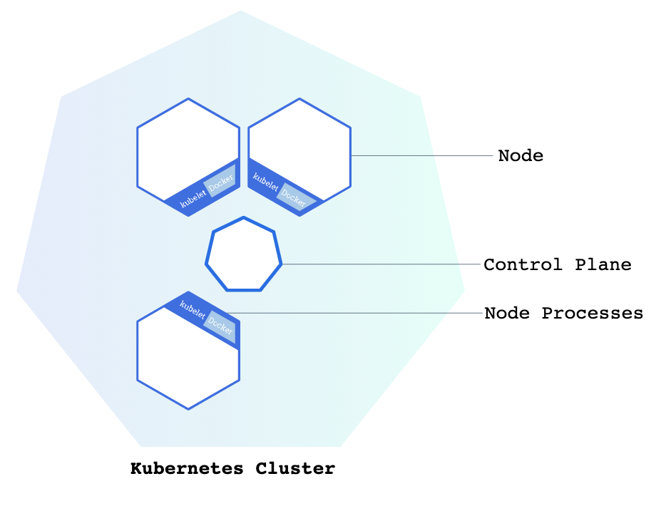
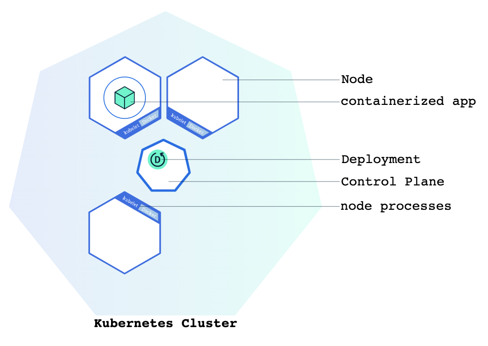
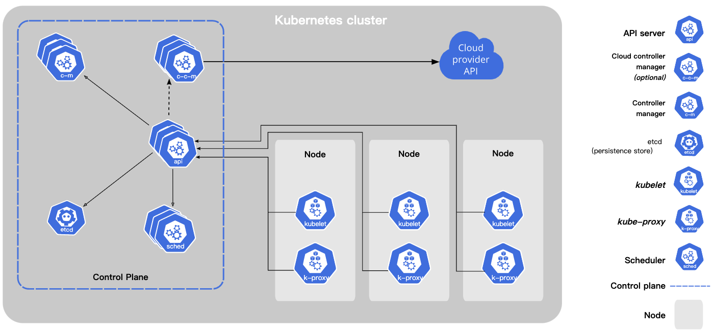
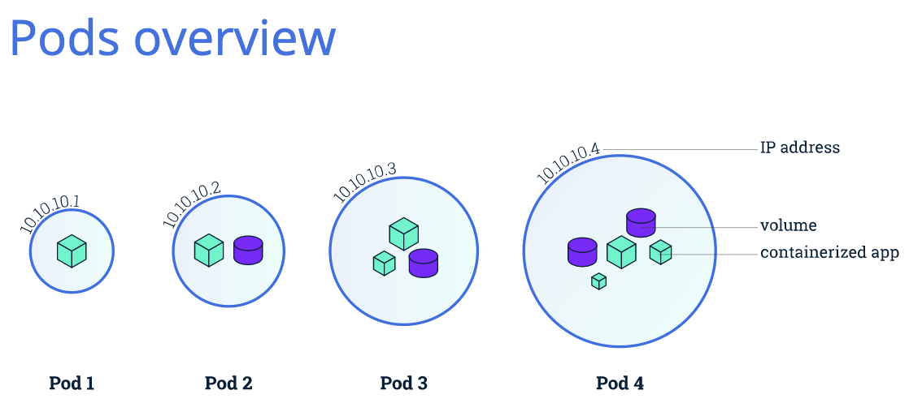
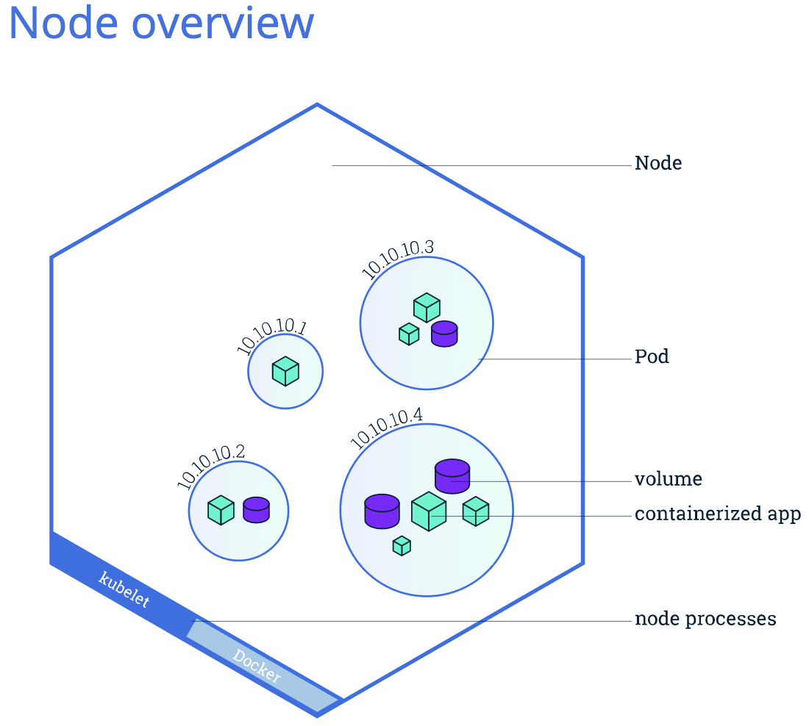
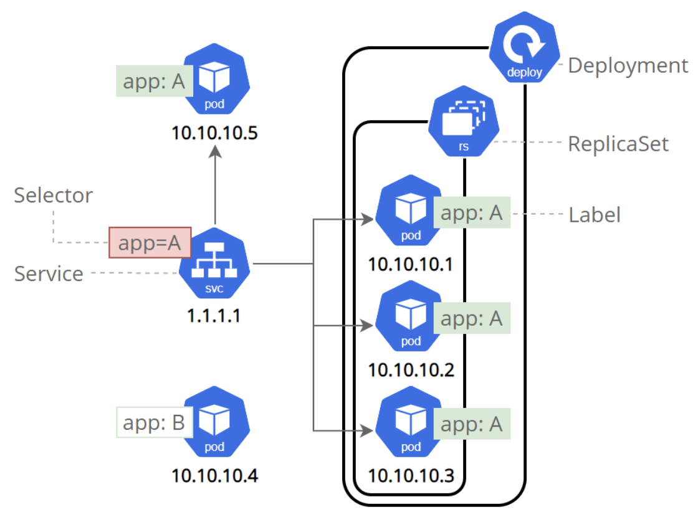
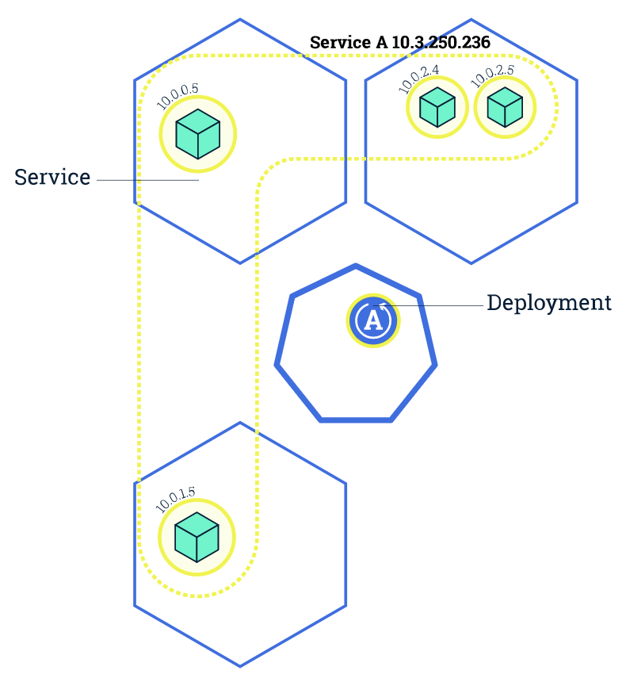

# Kubernetes

Kubernetes coordinates a highly available cluster of computers that are connected to work as a single unit. Kubernetes automates the distribution and scheduling of application containers across a cluster in a more efficient way.

A Kubernetes cluster consists of two types of resources:

- The **Control Plane** coordinates the cluster
- **Nodes** are the workers that run applications



**The Control Plane is responsible for managing the cluster.** The Control Plane coordinates all activities in your cluster, such as scheduling applications, maintaining applications' desired state, scaling applications, and rolling out new updates.

**A node is a VM or a physical computer that serves as a worker machine in a Kubernetes cluster.** Each node has a Kubelet, which is an agent for managing the node and communicating with the Kubernetes control plane. The node should also have tools for handling container operations, such as containerd or Docker. A Kubernetes cluster that handles production traffic should have a minimum of three nodes.

#### minikube tutorial command

```shell
minikube version
minikube start
kubectl version
kubectl cluster-info
kubectl get nodes
kubectl get nodes --help
```


Once the application instances are created, a Kubernetes Deployment Controller continuously monitors those instances. If the Node hosting an instance goes down or is deleted, the Deployment controller replaces the instance with an instance on another Node in the cluster. **This provides a self-healing mechanism to address machine failure or maintenance.**



You can create and manage a Deployment by using the Kubernetes command line interface, **Kubectl**. Kubectl uses the Kubernetes API to interact with the cluster. 

A Pod is the basic execution unit of a Kubernetes application. Each Pod represents a part of a workload that is running on your cluster.


```shell
kubectl create deployment
kubectl create deployment kubernetes-bootcamp --image=gcr.io/google-samples/kubernetes-bootcamp:v1
kubectl get deployments

echo -e "\n\n\n\e[92mStarting Proxy. After starting it will not output a response. Please click the first Terminal Tab\n"; 
kubectl proxy
curl http://localhost:8001/version
export POD_NAME=$(kubectl get pods -o go-template --template '{{range .items}}{{.metadata.name}}{{"\n"}}{{end}}')
echo Name of the Pod: $POD_NAME
# You can access the Pod through the API by running:
curl http://localhost:8001/api/v1/namespaces/default/pods/$POD_NAME
```

## Kubernetes Components

When you deploy Kubernetes, you get a cluster.

A Kubernetes cluster consists of a set of **worker machines, called nodes**, that **run containerized applications**. Every cluster has at least one worker node.

The **worker node(s) host the Pods** that are the components of the application workload. The control plane manages the worker nodes and the Pods in the cluster. In production environments, the control plane usually runs across multiple computers and a cluster usually runs multiple nodes, providing fault-tolerance and high availability.

This document outlines the various components you need to have for a complete and working Kubernetes cluster.



### kubelet

An agent that runs on each node in the cluster. It makes sure that containers are running in a Pod.

The kubelet takes a set of PodSpecs that are provided through various mechanisms and ensures that the containers described in those PodSpecs are running and healthy. The kubelet doesn't manage containers which were not created by Kubernetes.

kubelet has interface to interact with both the container and node. Kubelet is responsible for taking that configuration and actually running a pod or starting a pod with a container inside and then assigning resources from the node to container like cpu, ram and storage resouces. 

## Master Processes

Kubernetes cluster is usually  made up of mulitiple masters

### API server

The API server is a component of the Kubernetes control plane that exposes the Kubernetes API. The API server is the front end for the Kubernetes control plane.

The main implementation of a Kubernetes API server is kube-apiserver. kube-apiserver is designed to scale horizontally—that is, it scales by deploying more instances. You can run several instances of kube-apiserver and balance traffic between those instances.

- Cluster Gateway
- Act as a gatekeeper for authentication

### Scheduler

Control plane component that watches for newly created Pods with no assigned node and selects a node for them to run on.

Factors taken into account for scheduling decisions include: individual and collective resource requirements, hardware/software/policy constraints, affinity and anti-affinity specifications, data locality, inter-workload interference, and deadlines.

It will look at your request and see how much resources the application that you want to schedule, will need how much cpu, how much ram and then it is going to look at and go though the worker node to see the availible resources on each one of them and if it says that one node is the least busy or has the most resources availible, it will schedule the new pod on that pod. It decides on which node a new pod will be scheduled, the process that actually does the scheduling that actually starts that pod with a container is the kubelet. so it gets the request from the scheduler and executes that request on that node.

### kube-controller-manager

Control plane component that runs controller processes.

Logically, each controller is a separate process, but to reduce complexity, they are all compiled into a single binary and run in a single process.

Some types of these controllers are:

- Node controller: Responsible for noticing and responding when nodes go down.
- Job controller: Watches for Job objects that represent one-off tasks, then creates Pods to run those tasks to completion.
- Endpoints controller: Populates the Endpoints   (that is, joins Services & Pods).
- Service Account & Token controllers: Create default accounts and API access tokens for new namespaces.

### etcd

Consistent and highly-available key value store used as Kubernetes' backing store for all cluster data.

If your Kubernetes cluster uses etcd as its backing store, make sure you have a back up plan for those data.

Every change in the cluster, for example new pod gets scheduled when the pod dies, all of these changes get saved in or updated in this key-value store of etcd. Cluster informaction stored in etcd is used to for master processes to communicate with the worker processes and vice versa.


## Kubernetes Pods

When you created a Deployment in Module 2, Kubernetes created a **Pod** to host your application instance. **A Pod is a Kubernetes abstraction that represents a group of one or more application containers (such as Docker), and some shared resources for those containers.** Those resources include:

- Shared storage, as Volumes
- Networking, as a unique cluster IP address
- Information about how to run each container, such as the container image version or specific ports to use

A Pod models an application-specific "logical host" and can contain different application containers which are relatively tightly coupled. 

Pods are the **atomic unit** on the Kubernetes platform. When **we create a Deployment on Kubernetes, that Deployment creates Pods with containers inside them (as opposed to creating containers directly).** Each Pod is tied to the Node where it is scheduled, and remains there until termination (according to restart policy) or deletion. In case of a Node failure, identical Pods are scheduled on other available Nodes in the cluster.

Kubernetes 使用 Pod 来管理容器，**每个 Pod 可以包含一个或多个紧密关联的容器。**

Pod 是一组紧密关联的容器集合，它们共享 PID、IPC、Network 和 UTS namespace，是 Kubernetes 调度的基本单位。Pod 内的多个容器共享网络和文件系统，可以通过进程间通信和文件共享这种简单高效的方式组合完成服务。

Pod就像是我们的一个”专有主机”，上面除了运行我们的主应用程序之外，还可以运行一个与该应用紧密相关的进程。如日志收集工具、Git文件拉取器、配置文件更新重启器等。因为在Kubernetes中，一个Pod里的所有container都只会被分配到同一台主机上运行。

#### 参考

[Kubernetes 基本概念 ](https://feisky.gitbooks.io/kubernetes/content/introduction/concepts.html)

http://dockone.io/article/9065




## Nodes

**A Pod always runs on a Node.** A Node is a worker machine in Kubernetes and may be **either a virtual or a physical machine**, depending on the cluster. Each Node is managed by the control plane. **A Node can have multiple pods**, and the Kubernetes control plane automatically handles **scheduling the pods across the Nodes** in the cluster. The control plane's automatic scheduling takes into account the available resources on each Node.

Every Kubernetes Node runs at least:

- **Kubelet**, a process responsible for communication between the Kubernetes control plane and the Node; it manages the Pods and the containers running on a machine.

- A **container runtime (like Docker)** responsible for pulling the container image from a registry, unpacking the container, and running the application.

- **kube-proxy** is a network proxy that runs on each node in your cluster, implementing part of the Kubernetes Servce concept.

  kube-proxy maintains network rules on nodes. These network rules allow network communication to your Pods from network sessions inside or outside of your cluster.

  kube-proxy uses the operating system packet filtering layer if there is one and it's available. Otherwise, kube-proxy forwards the traffic itself.

Node 是 Pod 真正运行的主机，可以是物理机，也可以是虚拟机。为了管理 Pod，每个 Node 节点上至少要运行 container runtime（比如 docker 或者 rkt）、`kubelet` 和 `kube-proxy` 服务。



## Troubleshooting with kubectl

- **kubectl get** - list resources
- **kubectl describe** - show detailed information about a resource
- **kubectl logs** - print the logs from a container in a pod
- **kubectl exec** - execute a command on a container in a pod

You can use these commands to see when applications were deployed, what their current statuses are, where they are running and what their configurations are.

```shell
kubectl get pods
kubctl describe pods

echo -e "\n\n\n\e[92mStarting Proxy. After starting it will not output a response. Please click the first Terminal Tab\n"; 
kubectl proxy

export POD_NAME=$(kubectl get pods -o go-template --template '{{range .items}}{{.metadata.name}}{{"\n"}}{{end}}')
echo Name of the Pod:

curl http://localhost:8001/api/v1/namespaces/default/pods/$POD_NAME/proxy/$POD_NAME

kubectl logs $POD_NAME
```

A node may have multiple pods. Each Pod in a Kubernetes cluster has a unique IP address. Although each Pod has a unique IP address, those IPs are not exposed outside the cluster without a Service.

ervices allow your applications to receive traffic. Services can be exposed in different ways by specifying a `type` in the ServiceSpec:

- *ClusterIP* (default) - Exposes the Service on an internal IP in the cluster. This type makes the Service only reachable from within the cluster.
- *NodePort* - Exposes the Service on the same port of each selected Node in the cluster using NAT. Makes a Service accessible from outside the cluster using `:`. Superset of ClusterIP.
- *LoadBalancer* - Creates an external load balancer in the current cloud (if supported) and assigns a fixed, external IP to the Service. Superset of NodePort.
- *ExternalName* - Maps the Service to the contents of the `externalName` field (e.g. `foo.bar.example.com`), by returning a `CNAME` record with its value. No proxying of any kind is set up. This type requires v1.7 or higher of `kube-dns`, or CoreDNS version 0.0.8 or higher.


### Services

A Service routes traffic across a set of Pods. Services are the abstraction that allow pods to die and replicate in Kubernetes without impacting your application. Discovery and  among dependent Pods (such as the frontend and backend components in an application) is handled by Kubernetes Services.

Service 是应用服务的抽象，通过 labels 为应用提供**负载均衡**和**服务发现**。匹配 labels 的 **Pod IP 和端口**列表组成 endpoints，由 kube-proxy 负责将服务 IP 负载均衡到这些 endpoints 上。

每个 Service 都会自动分配一个 **cluster IP（仅在集群内部可访问的虚拟地址）和 DNS 名**，其他容器可以通过该地址或 DNS 来访问服务，而不需要了解后端容器的运行。

- Permenent IP address
- Lifecycle of Pod and Service not Connected

There are internal service and external service. External Service opens the communication from external sources, the internal service do the opposite.

Services has two functionalities: permenent IP, load balancer.

### Ingress

It route traffic into the clutser. For example, It forwards http request whose url contains domain name to the service.

### ConfigMap

External Configuration to your application. It would usually contain configuration data like urls of database or some other services that you use. The pod get the data that ConfigMap contains. If you change the name of a service or the endpoint of the service, you just adjust the config map and you don't have to build a new image and have to go through this whole cycle.

### Sercret

Like Config map, but the difference is that it's used to store secret data, credentials for example and it's stored not in a plain text format of course but in base64 encoded format.

### Deployment

- Blueprint for my-app pods
- you create deployments

You can use depoyments to specify how many replicas, scale up or down the number of replicas of pods that you need. Pod is a layer of abstraction on top of containers and deployment is another abstraction on top of pods which make it more convenient to interacted with pods and replicate them and do some other configuration.

### StatefulSet

meant for stateful applications like databases. DB are often hosted outside of k8s cluster.

### Labels

Services match a set of Pods using labels and selectors, a grouping primitive that allows logical operation on objects in Kubernetes. Labels are key/value pairs attached to objects and can be used in any number of ways:

- Designate objects for development, test, and production
- Embed version tags
- Classify an object using tags

Label 是识别 Kubernetes 对象的标签，以 key/value 的方式附加到对象上（key 最长不能超过 63 字节，value 可以为空，也可以是不超过 253 字节的字符串）。

Label 不提供唯一性，并且实际上经常是很多对象（如 Pods）都使用相同的 label 来标志具体的应用。

Label 定义好后其他对象可以使用 Label Selector 来选择一组相同 label 的对象（比如 ReplicaSet 和 Service 用 label 来选择一组 Pod）。Label Selector 支持以下几种方式：

- 等式，如 `app=nginx` 和 `env!=production`
- 集合，如 `env in (production, qa)`
- 多个 label（它们之间是 AND 关系），如 `app=nginx,env=test`

 

Labels can be attached to objects at creation time or later on. They can be modified at any time.

```shell
kubectl get pods
# NAME                                  READY   STATUS    RESTARTS   AGE
# kubernetes-bootcamp-fb5c67579-b5mp5   1/1     Running   0          3m32s

kubectl get services
# NAME         TYPE        CLUSTER-IP   EXTERNAL-IP   PORT(S)   AGE
# kubernetes   ClusterIP   10.96.0.1    <none>        443/TCP   5m59s

kubectl expose deployment/kubernetes-bootcamp --type="NodePort" --port 8080
# service/kubernetes-bootcamp exposed
# NAME                  TYPE        CLUSTER-IP     EXTERNAL-IP   PORT(S)          AGE
# kubernetes            ClusterIP   10.96.0.1      <none>        443/TCP          8m52s
# kubernetes-bootcamp   NodePort    10.110.20.61   <none>        8080:32766/TCP   82s

kubectl describe services/kubernetes-bootcamp
# Name:                     kubernetes-bootcamp
# Labels:                   app=kubernetes-bootcamp
# Selector:                 app=kubernetes-bootcamp
# Type:                     NodePort
# IP:                       10.110.20.61
# Port:                     <unset>  8080/TCP
# TargetPort:               8080/TCP
# NodePort:                 <unset>  32766/TCP
# Endpoints:                172.18.0.2:8080
# External Traffic Policy:  Cluster
# ... other information...
export NODE_PORT=$(kubectl get services/kubernetes-bootcamp -o go-template='{{(index .spec.ports 0).nodePort}}')

echo NODE_PORT=$NODE_PORT
# NODE_PORT=32766

curl $(minikube ip):$NODE_PORT
# Hello Kubernetes bootcamp! | Running on: kubernetes-bootcamp-fb5c67579-b5mp5 | v=1
kubectl describe deployment
# Name:                   kubernetes-bootcamp
# Namespace:              default
# Labels:                 app=kubernetes-bootcamp
# Annotations:            deployment.kubernetes.io/revision: 1
# Selector:               app=kubernetes-bootcamp

kubectl get pods -l app=kubernetes-bootcamp
# NAME                                  READY   STATUS    RESTARTS   AGE
# kubernetes-bootcamp-fb5c67579-b5mp5   1/1     Running   0          21m

kubectl get services -l app=kubernetes-bootcamp
# NAME                  TYPE       CLUSTER-IP     EXTERNAL-IP   PORT(S)          AGE
# kubernetes-bootcamp   NodePort   10.110.20.61   <none>        8080:32766/TCP   14m

# To apply a new label we use the label command followed by the object type, object name and # the new label:
export POD_NAME=$(kubectl get pods -o go-template --template '{{range .items}}{{.metadata.name}}{{"\n"}}{{end}}')
echo Name of the Pod: $POD_NAME
kubectl label pods $POD_NAME version=v1

# To delete Services you can use the delete service command.
kubectl delete service -l app=kubernetes-bootcamp

# The application is up. This is because the Deployment is managing the application. To shut down the application, you would need to delete the Deployment as well.
```


## Running Multiple Instances of Your App

In the previous modules we created a Deployment, and then exposed it publicly via a [Service](https://kubernetes.io/docs/concepts/services-networking/service/). The Deployment created only one Pod for running our application. When traffic increases, we will need to scale the application to keep up with user demand.

**Scaling** is accomplished by changing the number of replicas in a Deployment



```shell
kubectl get deployments
# NAME                  READY   UP-TO-DATE   AVAILABLE   AGE
# kubernetes-bootcamp   1/1     1            1           52s

kubectl get rs
# NAME                            DESIRED   CURRENT   READY   AGE
# kubernetes-bootcamp-fb5c67579   1         1         1       2m59

# let’s scale the Deployment to 4 replicas. We’ll use the kubectl scale command, followed by # the deployment type, name and desired number of instances:
kubectl scale deployments/kubernetes-bootcamp --replicas=4

kubectl get pods -o wide
# NAME                                  READY   STATUS    RESTARTS   AGE     IP
# NODE       NOMINATED NODE   READINESS GATES
# kubernetes-bootcamp-fb5c67579-cxgwz   1/1     Running   0          5m55s   172.18.0.8   
# minikube   <none>           <none>
# kubernetes-bootcamp-fb5c67579-grngg   1/1     Running   0          5m55s   172.18.0.9   
# minikube   <none>           <none>
# kubernetes-bootcamp-fb5c67579-wt766   1/1     Running   0          5m55s   172.18.0.7   
# minikube   <none>           <none>
# kubernetes-bootcamp-fb5c67579-zcnr5   1/1     Running   0          25m     172.18.0.2   
# minikube   <none>           <none>

# To scale down the Service to 2 replicas, run again the scale command:
kubectl scale deployments/kubernetes-bootcamp --replicas=2
```

## Performing a Rolling Update

### Updating an application

Users expect applications to be available all the time and developers are expected to deploy new versions of them several times a day. In Kubernetes this is done with rolling updates. **Rolling updates** allow Deployments' update to take place with zero downtime by incrementally updating Pods instances with new ones. The new Pods will be scheduled on Nodes with available resources.

Similar to application Scaling, if a Deployment is exposed publicly, the Service will load-balance the traffic only to available Pods during the update. An available Pod is an instance that is available to the users of the application.

Rolling updates allow the following actions: 

- Promote an application from one environment to another (via container image updates)
- Rollback to previous versions
- Continuous Integration and Continuous Delivery of applications with zero downtime

```shell
kubectl get deployments
# NAME                  READY   UP-TO-DATE   AVAILABLE   AGE
# kubernetes-bootcamp   0/4     0            0           11s
kubectl get pods
# NAME                                  READY   STATUS    RESTARTS   AGE
# kubernetes-bootcamp-fb5c67579-mdffx   1/1     Running   0          12s
# kubernetes-bootcamp-fb5c67579-mtb9x   1/1     Running   0          12s
# kubernetes-bootcamp-fb5c67579-qbf4p   1/1     Running   0          12s
# kubernetes-bootcamp-fb5c67579-tnc95   1/1     Running   0          12s

kubectl describe pods
# Controlled By:  ReplicaSet/kubernetes-bootcamp-fb5c67579
# Containers:
#  kubernetes-bootcamp:
#    Container ID:   docker://90ae604836899843452f01a632975cb45ed477d6e8ecb62c2e89c8ccb0a960a1
#    Image:          gcr.io/google-samples/kubernetes-bootcamp:v1
    
# To update the image of the application to version 2, use the set image command, followed by the deployment name and the new image version:
kubectl set image deployments/kubernetes-bootcamp kubernetes-bootcamp=jocatalin/kubernetes-bootcamp:v2
# deployment.apps/kubernetes-bootcamp image updated

kubectl describe pods
# Controlled By:  ReplicaSet/kubernetes-bootcamp-7d44784b7c
# Containers:
#  kubernetes-bootcamp:
#    Container ID:   docker://3f71842a218f20faa6bf8ca2098609ae2e1831a56e3e166b39ccccf62f72d93f
#    Image:          jocatalin/kubernetes-bootcamp:v2


# First, check that the app is running. To find the exposed IP and Port, run the describe service command:
kubectl describe services/kubernetes-bootcamp

# Create an environment variable called NODE_PORT that has the value of the Node port assigned:
export NODE_PORT=$(kubectl get services/kubernetes-bootcamp -o go-template='{{(index .spec.ports 0).nodePort}}')
echo NODE_PORT=$NODE_PORT

# Next, do a curl to the the exposed IP and port:
curl $(minikube ip):$NODE_PORT

# Every time you run the curl command, you will hit a different Pod. Notice that all Pods are running the latest version (v2).

# To roll back the deployment to your last working version, use the rollout undo command:
kubectl rollout undo deployments/kubernetes-bootcamp

# The rollout undo command reverts the deployment to the previous known state (v2 of the image). Updates are versioned and you can revert to any previously known state of a deployment.
```

