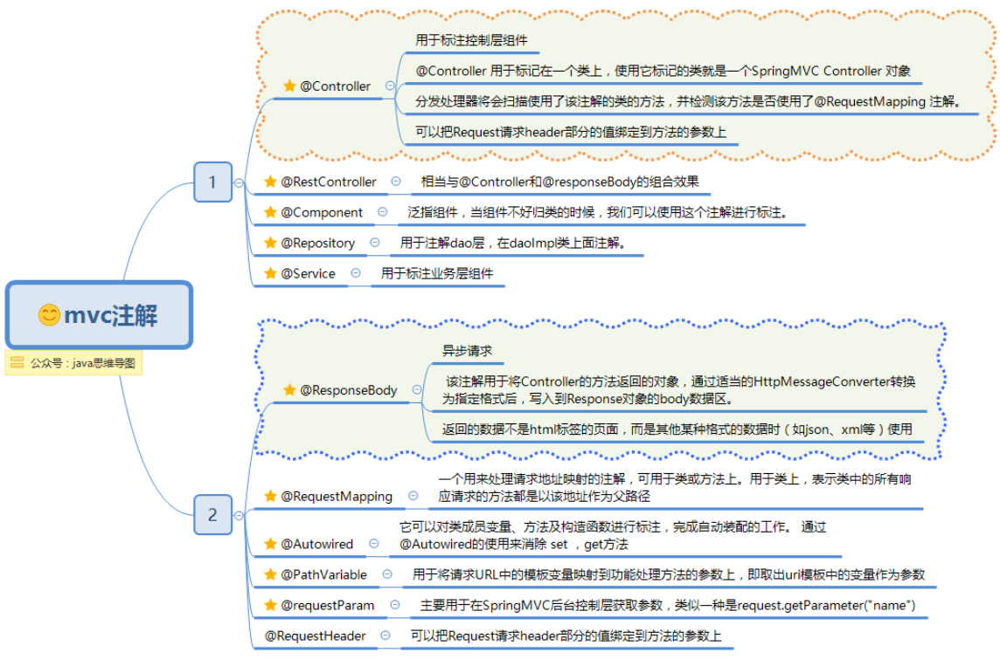

## Spring中Bean的作用域

| 类别            | 说明                                                                       |
| ------------- | ------------------------------------------------------------------------ |
| singleton     | 在Spring IoC容器中仅存在一个实例，也就是单例。                                             |
| prototype     | 每次从容器中调用getBean()，都会生成一个新的实例。                                            |
| request(web)  | 每次HTTP请求都会创建一个新的Bean，不同Session使用不同的Bean，仅适用于WebApplicationContext环境    。 |
| session(web)  | 同一个HTTP Session共享一个Bean，不同Session使用不同的Bean。                              |
| globalSession | 表示在一个全局的HTTP Session中，一个bean定义对应一个实例。典型情况下，仅在使用portlet context的时候有效。     |

## Spring IOC原理

Spring 通过一个配置文件描述 Bean 及 Bean 之间的依赖关系，利用 Java 语言的反射功能实例化  Bean 并建立 Bean 之间的依赖关系。 Spring 的 IoC 容器在完成这些底层工作的基础上，还提供  了 Bean 实例缓存、生命周期管理、 Bean 实例代理、事件发布、资源装载等高级服务。

## Bean的生命周期

Bean实例生命周期的执行过程如下：


1. Spring对bean进行实例化，默认bean是单例。

2. Spring对bean进行依赖注入。

3. 如果bean实现了BeanNameAware接口，Spring将bean的名称传给setBeanName()方法。

4. 如果bean实现了BeanFactoryAware接口，Spring将调用setBeanFactory()方法，将BeanFactory实例传进来。

5. 如果bean实现了<mark>ApplicationContextAware</mark>接口，它的setApplicationContext()方法将被调用，将应用上下文的引用传入到bean中。

6. 如果bean实现了BeanPostProcessor接口，它的postProcessBeforeInitialization()方法将被调用。

7. 如果bean中有方法添加了@PostConstruct注解，那么该方法将被调用。

8. 如果bean实现了InitializingBean接口，spring将调用它的afterPropertiesSet()接口方法。

9. 如果在xml文件中通过<bean>标签的init-method元素指定了初始化方法，那么该方法将被调用。

10. 如果bean实现了BeanPostProcessor接口，它的postProcessAfterInitialization()接口方法将被调用。

11. 此时bean已经准备就绪，可以被应用程序使用了，他们将一直驻留在应用上下文中，直到该应用上下文被销毁。

12. 如果bean中有方法添加了@PreDestroy注解，那么该方法将被调用。

13. 若bean实现了DisposableBean接口，spring将调用它的distroy()接口方法。

14. 如果bean使用了destroy-method属性声明了销毁方法，则该方法被调用。

[Spring中bean的作用域与生命周期](https://blog.csdn.net/fuzhongmin05/article/details/73389779)

```java
package com.keepthinker.example.spring.ioc;

import org.slf4j.Logger;
import org.slf4j.LoggerFactory;
import org.springframework.beans.BeansException;
import org.springframework.beans.factory.*;
import org.springframework.beans.factory.config.BeanPostProcessor;
import org.springframework.context.ApplicationContext;
import org.springframework.context.ApplicationContextAware;
import org.springframework.stereotype.Component;

import javax.annotation.PostConstruct;

/**
2022-02-14 21:44:59,296 [main] DEBUG [org.springframework.core.io.support.PathMatchingResourcePatternResolver]: Resolved location pattern [classpath*:com/keepthinker/example/spring/ioc/**/*.class] to resources [file [D:\git\...
2022-02-14 21:44:59,358 [main] DEBUG [org.springframework.beans.factory.xml.BeanDefinitionParserDelegate]: Neither XML 'id' nor 'name' specified - using generated bean name [com.keepthinker.example.spring.ioc.BeanLifeCircleObserver#0]
2022-02-14 21:44:59,358 [main] DEBUG [org.springframework.context.support.ClassPathXmlApplicationContext]: Bean factory for org.springframework.context.support.ClassPathXmlApplicationContext@28ba21f3: org.springframework.beans.factory.support.DefaultListableBeanFactory@402a079c:
2022-02-14 21:44:59,543 [main] INFO  [com.keepthinker.example.spring.ioc.postprocessor.AnimalNamePrefixAddBeanFactoryPostProcessor]: postProcessBeanFactory|configurableListableBeanFactory
2022-02-14 21:44:59,559 [main] DEBUG [org.springframework.beans.factory.support.DefaultListableBeanFactory]: Creating shared instance of singleton bean 'com.keepthinker.example.spring.ioc.BeanLifeCircleObserver#0'
2022-02-14 21:44:59,559 [main] DEBUG [org.springframework.beans.factory.support.DefaultListableBeanFactory]: Creating instance of bean 'com.keepthinker.example.spring.ioc.BeanLifeCircleObserver#0'
2022-02-14 21:44:59,559 [main] DEBUG [org.springframework.context.annotation.CommonAnnotationBeanPostProcessor]: Found destroy method on class [com.keepthinker.example.spring.ioc.BeanLifeCircleObserver]: public void com.keepthinker.example.spring.ioc.BeanLifeCircleObserver.preDestroyMethod() throws java.lang.Exception
2022-02-14 21:44:59,559 [main] DEBUG [org.springframework.context.annotation.CommonAnnotationBeanPostProcessor]: Found init method on class [com.keepthinker.example.spring.ioc.BeanLifeCircleObserver]: public void com.keepthinker.example.spring.ioc.BeanLifeCircleObserver.PostConstructMethod()
2022-02-14 21:44:59,574 [main] DEBUG [org.springframework.context.annotation.CommonAnnotationBeanPostProcessor]: Registered init method on class [com.keepthinker.example.spring.ioc.BeanLifeCircleObserver]: org.springframework.beans.factory.annotation.InitDestroyAnnotationBeanPostProcessor$LifecycleElement@8c636b8
2022-02-14 21:44:59,574 [main] DEBUG [org.springframework.context.annotation.CommonAnnotationBeanPostProcessor]: Registered destroy method on class [com.keepthinker.example.spring.ioc.BeanLifeCircleObserver]: org.springframework.beans.factory.annotation.InitDestroyAnnotationBeanPostProcessor$LifecycleElement@63071798
2022-02-14 21:44:59,574 [main] DEBUG [org.springframework.beans.factory.support.DefaultListableBeanFactory]: Eagerly caching bean 'com.keepthinker.example.spring.ioc.BeanLifeCircleObserver#0' to allow for resolving potential circular references
2022-02-14 21:44:59,574 [main] INFO  [com.keepthinker.example.spring.ioc.BeanLifeCircleObserver]: -------setBeanName|com.keepthinker.example.spring.ioc.BeanLifeCircleObserver#0
2022-02-14 21:44:59,574 [main] INFO  [com.keepthinker.example.spring.ioc.BeanLifeCircleObserver]: -------setBeanFactory|org.springframework.beans.factory.support.DefaultListableBeanFactory@402a079c:
2022-02-14 21:44:59,574 [main] INFO  [com.keepthinker.example.spring.ioc.BeanLifeCircleObserver]: -------setApplicationContext|org.springframework.context.support.ClassPathXmlApplicationContext@28ba21f3: startup date [Mon Feb 14 21:44:59 CST 2022]; root of context hierarchy
2022-02-14 21:44:59,574 [main] DEBUG [org.springframework.context.annotation.CommonAnnotationBeanPostProcessor]: Invoking init method on bean 'com.keepthinker.example.spring.ioc.BeanLifeCircleObserver#0': public void com.keepthinker.example.spring.ioc.BeanLifeCircleObserver.PostConstructMethod()
2022-02-14 21:44:59,574 [main] INFO  [com.keepthinker.example.spring.ioc.BeanLifeCircleObserver]: -------@PostConstructMethod
2022-02-14 21:44:59,574 [main] INFO  [com.keepthinker.example.spring.ioc.postprocessor.InstantiationTracingBeanPostProcessor]: postProcessBeforeInitialization before init0|bean:com.keepthinker.example.spring.ioc.BeanLifeCircleObserver@e50a6f6|beanName:com.keepthinker.example.spring.ioc.BeanLifeCircleObserver#0
2022-02-14 21:44:59,574 [main] INFO  [com.keepthinker.example.spring.ioc.postprocessor.InstantiationTracingBeanPostProcessor2]: postProcessBeforeInitialization before init1|bean:com.keepthinker.example.spring.ioc.BeanLifeCircleObserver@e50a6f6|beanName:com.keepthinker.example.spring.ioc.BeanLifeCircleObserver#0
2022-02-14 21:44:59,574 [main] DEBUG [org.springframework.beans.factory.support.DefaultListableBeanFactory]: Invoking afterPropertiesSet() on bean with name 'com.keepthinker.example.spring.ioc.BeanLifeCircleObserver#0'
2022-02-14 21:44:59,574 [main] INFO  [com.keepthinker.example.spring.ioc.BeanLifeCircleObserver]: -------afterPropertiesSet
2022-02-14 21:44:59,574 [main] DEBUG [org.springframework.beans.factory.support.DefaultListableBeanFactory]: Invoking init method  'xmlInitMethod' on bean with name 'com.keepthinker.example.spring.ioc.BeanLifeCircleObserver#0'
2022-02-14 21:44:59,574 [main] INFO  [com.keepthinker.example.spring.ioc.BeanLifeCircleObserver]: -------XmlInitMethod
2022-02-14 21:44:59,574 [main] INFO  [com.keepthinker.example.spring.ioc.postprocessor.InstantiationTracingBeanPostProcessor]: postProcessAfterInitialization after init0|bean:com.keepthinker.example.spring.ioc.BeanLifeCircleObserver@e50a6f6|beanName:com.keepthinker.example.spring.ioc.BeanLifeCircleObserver#0
2022-02-14 21:44:59,574 [main] INFO  [com.keepthinker.example.spring.ioc.postprocessor.InstantiationTracingBeanPostProcessor2]: postProcessAfterInitialization after init1|bean:com.keepthinker.example.spring.ioc.BeanLifeCircleObserver@e50a6f6|beanName:com.keepthinker.example.spring.ioc.BeanLifeCircleObserver#0
2022-02-14 21:44:59,574 [main] DEBUG [org.springframework.beans.factory.support.DefaultListableBeanFactory]: Finished creating instance of bean 'com.keepthinker.example.spring.ioc.BeanLifeCircleObserver#0'
2022-02-14 21:44:59,581 [main] DEBUG [org.springframework.beans.factory.support.DefaultListableBeanFactory]: Pre-instantiating singletons in org.springframework.beans.factory.support.DefaultListableBeanFactory@402a079c:
2022-02-14 21:44:59,581 [main] INFO  [com.keepthinker.example.spring.ioc.BeanLifeCircleObserver]: -------postProcessBeforeInitialization|bean:com.keepthinker.example.spring.ioc.AnnotationConfig$$EnhancerBySpringCGLIB$$e14d7637@475e586c|beanName:annotationConfig
2022-02-14 21:44:59,581 [main] INFO  [com.keepthinker.example.spring.ioc.BeanLifeCircleObserver]: -------postProcessAfterInitialization|bean:com.keepthinker.example.spring.ioc.AnnotationConfig$$EnhancerBySpringCGLIB$$e14d7637@475e586c|beanName:annotationConfig
2022-02-14 21:44:59,628 [main] INFO  [com.keepthinker.example.spring.ioc.BeanLifeCircleObserver]: -------postProcessBeforeInitialization|bean:com.keepthinker.example.spring.ioc.model.Person@197d671|beanName:person
2022-02-14 21:44:59,628 [main] INFO  [com.keepthinker.example.spring.ioc.BeanLifeCircleObserver]: -------postProcessAfterInitialization|bean:com.keepthinker.example.spring.ioc.model.Person@197d671|beanName:person
2022-02-14 21:44:59,675 [main] INFO  [com.keepthinker.example.spring.ioc.BeanLifeCircleObserver]: -------postProcessBeforeInitialization|bean:org.springframework.context.event.EventListenerMethodProcessor@10e92f8f|beanName:org.springframework.context.event.internalEventListenerProcessor
2022-02-14 21:44:59,675 [main] INFO  [com.keepthinker.example.spring.ioc.BeanLifeCircleObserver]: -------postProcessAfterInitialization|bean:org.springframework.context.event.EventListenerMethodProcessor@10e92f8f|beanName:org.springframework.context.event.internalEventListenerProcessor
2022-02-14 21:44:59,675 [main] INFO  [com.keepthinker.example.spring.ioc.BeanLifeCircleObserver]: -------postProcessBeforeInitialization|bean:org.springframework.context.event.DefaultEventListenerFactory@5223e5ee|beanName:org.springframework.context.event.internalEventListenerFactory
2022-02-14 21:44:59,675 [main] INFO  [com.keepthinker.example.spring.ioc.BeanLifeCircleObserver]: -------postProcessAfterInitialization|bean:org.springframework.context.event.DefaultEventListenerFactory@5223e5ee|beanName:org.springframework.context.event.internalEventListenerFactory
2022-02-14 21:44:59,681 [main] INFO  [com.keepthinker.example.spring.ioc.BeanLifeCircleObserver]: -------postProcessBeforeInitialization|bean:com.keepthinker.example.spring.ioc.model.MyFactoryBean@69b2283a|beanName:earthFromFactory
2022-02-14 21:44:59,681 [main] INFO  [com.keepthinker.example.spring.ioc.BeanLifeCircleObserver]: -------postProcessAfterInitialization|bean:com.keepthinker.example.spring.ioc.model.MyFactoryBean@69b2283a|beanName:earthFromFactory
2022-02-14 21:44:59,681 [main] INFO  [com.keepthinker.example.spring.ioc.BeanLifeCircleObserver]: -------postProcessBeforeInitialization|bean:Inner class|beanName:inner
2022-02-14 21:44:59,681 [main] INFO  [com.keepthinker.example.spring.ioc.BeanLifeCircleObserver]: -------postProcessAfterInitialization|bean:Inner class|beanName:inner
2022-02-14 21:44:59,681 [main] INFO  [com.keepthinker.example.spring.ioc.BeanLifeCircleObserver]: -------postProcessBeforeInitialization|bean:com.keepthinker.example.spring.ioc.XmlMain@76908cc0|beanName:main
2022-02-14 21:44:59,681 [main] INFO  [com.keepthinker.example.spring.ioc.BeanLifeCircleObserver]: -------postProcessAfterInitialization|bean:com.keepthinker.example.spring.ioc.XmlMain@76908cc0|beanName:main
2022-02-14 21:44:59,681 [main] DEBUG [org.springframework.beans.factory.support.DefaultListableBeanFactory]: Returning cached instance of singleton bean 'com.keepthinker.example.spring.ioc.BeanLifeCircleObserver#0'
2022-02-14 21:44:59,697 [main] INFO  [com.keepthinker.example.spring.ioc.BeanLifeCircleObserver]: -------postProcessBeforeInitialization|bean:com.keepthinker.example.spring.ioc.atimport.A@49b0b76|beanName:a
2022-02-14 21:44:59,697 [main] INFO  [com.keepthinker.example.spring.ioc.BeanLifeCircleObserver]: -------postProcessAfterInitialization|bean:com.keepthinker.example.spring.ioc.atimport.A@49b0b76|beanName:a
2022-02-14 21:45:00,747 [main] DEBUG [org.springframework.beans.factory.support.DefaultListableBeanFactory]: Destroying singletons in org.springframework.beans.factory.support.DefaultListableBeanFactory@402a079c: defining beans [annotationConfig,beanInsideComponent,beanInsideConfiguration,configA,configB,cglibBean,person,xmlMain,org.springframework.context.annotation.internalConfigurationAnnotationProcessor,org.springframework.context.annotation.internalAutowiredAnnotationProcessor,org.springframework.context.annotation.internalRequiredAnnotationProcessor,org.springframework.context.annotation.internalCommonAnnotationProcessor,org.springframework.context.event.internalEventListenerProcessor,org.springframework.context.event.internalEventListenerFactory,abstractAnimal,animal,animalDuplicate,inheritedAnimal,overrideAnimal,earth,earthFromFactory,inner,main,com.keepthinker.example.spring.ioc.postprocessor.InstantiationTracingBeanPostProcessor#0,com.keepthinker.example.spring.ioc.postprocessor.InstantiationTracingBeanPostProcessor2#0,com.keepthinker.example.spring.ioc.postprocessor.MyInstantiationAwareBeanPostProcessor#0,com.keepthinker.example.spring.ioc.postprocessor.AnimalNamePrefixAddBeanFactoryPostProcessor#0,com.keepthinker.example.spring.ioc.BeanLifeCircleObserver#0,panda,compTiger,confTiger,a,b,myTiger,tiger,propertyConfigInDev]; root of factory hierarchy
2022-02-14 21:45:00,747 [main] DEBUG [org.springframework.context.annotation.CommonAnnotationBeanPostProcessor]: Invoking destroy method on bean 'com.keepthinker.example.spring.ioc.BeanLifeCircleObserver#0': public void com.keepthinker.example.spring.ioc.BeanLifeCircleObserver.preDestroyMethod() throws java.lang.Exception
2022-02-14 21:45:00,747 [main] INFO  [com.keepthinker.example.spring.ioc.BeanLifeCircleObserver]: -------@PreDestroyMethod
2022-02-14 21:45:00,747 [main] DEBUG [org.springframework.beans.factory.support.DisposableBeanAdapter]: Invoking destroy() on bean with name 'com.keepthinker.example.spring.ioc.BeanLifeCircleObserver#0'
2022-02-14 21:45:00,747 [main] INFO  [com.keepthinker.example.spring.ioc.BeanLifeCircleObserver]: -------destroy
2022-02-14 21:45:00,747 [main] DEBUG [org.springframework.beans.factory.support.DisposableBeanAdapter]: Invoking destroy method 'xmlDestroyMethod' on bean with name 'com.keepthinker.example.spring.ioc.BeanLifeCircleObserver#0'
2022-02-14 21:45:00,747 [main] INFO  [com.keepthinker.example.spring.ioc.BeanLifeCircleObserver]: -------xmlDestroyMethod
*/
public class BeanLifeCircleObserver implements BeanNameAware, BeanFactoryAware, ApplicationContextAware, InitializingBean, BeanPostProcessor, DisposableBean {
    private static Logger logger = LoggerFactory.getLogger(BeanLifeCircleObserver.class);

    /**
     * 如果这个 Bean 已经实现了 BeanNameAware 接口，会调用它实现的 setBeanName(String)
     * 方法，此处传递的就是 Spring 配置文件中 Bean 的 id 值
     */
    @Override
    public void setBeanName(String name) {
        logger.info("-------setBeanName|{}", name);
    }

    /**
     * 如果这个 Bean 已经实现了 BeanFactoryAware 接口，会调用它实现的 setBeanFactory，
     * setBeanFactory(BeanFactory)传递的是 Spring 工厂自身（可以用这个方式来获取其它 Bean，
     * 只需在 Spring 配置文件中配置一个普通的 Bean 就可以）。
     */
    @Override
    public void setBeanFactory(BeanFactory beanFactory) throws BeansException {
        logger.info("-------setBeanFactory|{}", beanFactory);
    }

    /**
     *如果这个 Bean 已经实现了 ApplicationContextAware 接口，会调用
     * setApplicationContext(ApplicationContext)方法，传入 Spring 上下文（同样这个方式也
     * 可以实现步骤 4 的内容，但比 4 更好，因为 ApplicationContext 是 BeanFactory 的子接
     * 口，有更多的实现方法）
     */
    @Override
    public void setApplicationContext(ApplicationContext applicationContext) throws BeansException {
        logger.info("-------setApplicationContext|{}", applicationContext);
    }

    @PostConstruct
    public void PostConstructMethod() {
        logger.info("-------PostConstructMethod");
    }

    @Override
    public void afterPropertiesSet() throws Exception {
        logger.info("-------afterPropertiesSet");
    }

    public void xmlInitMethod() {
        logger.info("-------XmlInitMethod");
    }

    /**
     * 如果这个 Bean 关联了 BeanPostProcessor 接口，将会调用
     * postProcessBeforeInitialization(Object obj, String s)方法， BeanPostProcessor 经常被用
     * 作是 Bean 内容的更改，并且由于这个是在 Bean 初始化结束时调用那个的方法，也可以被应
     * 用于内存或缓存技术。
     */
    @Override
    public Object postProcessBeforeInitialization(Object bean, String beanName) throws BeansException {
        logger.info("-------postProcessBeforeInitialization|bean:{}|beanName:{}", bean, beanName);
        return bean;
    }

    @Override
    public Object postProcessAfterInitialization(Object bean, String beanName) throws BeansException {
        logger.info("-------postProcessAfterInitialization|bean:{}|beanName:{}", bean, beanName);
        return bean;
    }

    /**
     * Destroy 过期自动清理阶段
     * 当 Bean 不再需要时，会经过清理阶段，如果 Bean 实现了 DisposableBean 这个接口，会调
     * 用那个其实现的 destroy()方法；
     * @throws Exception
     */
    @Override
    public void destroy() throws Exception {
        logger.info("-------destroy");
    }

    public void xmlDestroyMethod() {
        logger.info("-------xmlDestroyMethod");
    }

    /*
    destroy-method
    自配置清理，如果这个 Bean 的 Spring 配置中配置了 destroy-method 属性，会自动调用其配置的
    销毁方法。
     */

    /*
    bean 标签有两个重要的属性（init-method 和 destroy-method）。用它们你可以自己定制
    初始化和注销方法。它们也有相应的注解（@PostConstruct 和@PreDestroy） 。
    <bean id="" class="" init-method="初始化方法" destroy-method="销毁方法">
     */
}
```

## BeanFactoryPostProcessor

```java
public interface BeanFactoryPostProcessor {
   void postProcessBeanFactory(ConfigurableListableBeanFactory beanFactory) throws BeansException;
}
```

实现该接口，可以在 Spring 创建 bean 之前修改 bean 的定义属性。也就是说，Spring 允许 BeanFactoryPostProcessor 在容器实例化 bean 之前读取配置元数据，并可以根据需要进行修改。例如可以把 bean 的 Scope 从 singleton 改为 prototype ，也可以把 **property 的值给修改掉**。另外可以同时配置多个 BeanFactoryPostProcessor，并通过 order 属性来控制 BeanFactoryPostProcessor 的执行顺序 （ 在实现 BeanFactoryPostProcessor 时应该考虑实现 Ordered 接口 ）。比如PropertyPlaceholderConfigurer就是在postProcessBeanFactory方法里实现property值的替换。

BeanFactoryPostProcessor 是在 Spring 容器加载了定义 bean 的 XML 文件之后，在 bean 实例化之前执行的，**也就是一定会在BeanNameAware.SetBeanName之前执行**。接口方法的入参是 ConfigurrableListableBeanFactory 类型，使用该参数可以获取到相关的 bean 的定义信息。

使用BeanFactoryPostProcessor可以修改Spring Bean的全限定类名，scope，是否懒加载，所依赖的类名等。

[Spring扩展点之BeanFactoryPostProcessor：彻底搞懂原理以及使用场景【源码分析】_CoderOu-CSDN博客_beanfactorypostprocessor使用场景](https://blog.csdn.net/qq_42154259/article/details/108305938)

## PostProcessor

### Bean post processors

Spring 框架提供了几种 PostProcessor接口用于建模对容器或者bean的后置处理器，它们定义了一些方法，这些方法在特定的时机会被调用。通过这种机制，框架自身或者应用开发人员有机会在不侵入容器或者bean核心逻辑的情况下为容器或者bean做针对某些特定方面的定制或者扩展：能力增强，属性设置，内容修改，对象代理，甚至直接替换整个bean。Spring 提供的 PostProcessor 接口有如下几种 ：

1. BeanDefinitionRegistryPostProcessor– BeanDefinitionRegistry后置处理器 – 容器级别

2. BeanFactoryPostProcessor–BeanFactory后置处理器 – 容器级别

3. BeanPostProcessor–Bean后置处理器 – bean实例级别
   实际应用中又可细分为如下几类 :
   
   1. InstantiationAwareBeanPostProcessor
   
   2. MergedBeanDefinitionPostProcessor
   
   3. DestructionAwareBeanPostProcessor
   
   4. SmartInstantiationAwareBeanPostProcessor
   
   5. 一般BeanPostProcessor

Spring框架自身提供了很多这些PostProcessor的实现类，每个PostProcessor实现类分别有不同的关注点,Spring利用这些PostProcessor实现类完成了很多框架自身的任务，主要在容器启动和bean获取阶段。另外，开发人员也可以实现自己的PostProcessor来扩展Spring容器或者bean的能力。这里面尤其是通过自定义实现BeanPostProcessor,开发人员有机会对容器中所有的bean做定制。

[Spring的各种PostProcessor_Details Inside Spring-CSDN博客](https://blog.csdn.net/andy_zhang2007/article/details/78595558)

[Spring之BeanFactoryPostProcessor和BeanPostProcessor - 掘金](https://juejin.cn/post/6844903708745007112)

## Spring AOP原理

"横切"的技术，剖解开封装的对象内部，并将那些影响了多个类的公共行为封装到一个可重用模块，并将其命名为"Aspect"，即切面。所谓"切面"，简单说就是那些与业务无关，却为业务模块所共 同调用的逻辑或责任封装起来，便于减少系统的重复代码，降低模块之间的耦合度，并有利于未来的可操作性和可维护性。

使用"横切"技术，AOP把软件系统分为两个部分：核心关注点和横切关注点。业务处理的主要流程是核心关注点，与之关系不大的部分是横切关注点。横切关注点的一个特点是，他们经常发生 在核心关注点的多处，而各处基本相似，比如权限认证、日志、事物。AOP的作用在于分离系统中的各种关注点，将核心关注点和横切关注点分离开来。  

AOP 主要应用场景有：  

1. Authentication 权限  

2. Caching 缓存  

3. Context passing 内容传递  

4. Error handling 错误处理  

5. Lazy loading 懒加载  

6. Debugging 调试  

7. logging, tracing, profiling and monitoring 记录跟踪 优化 校准  

8. Performance optimization 性能优化  

9. Persistence 持久化  

10. Resource pooling 资源池  

11. Synchronization 同步  

12. Transactions 事务

### 例子

```java
@Configuration
@EnableAspectJAutoProxy
public class AspectJContext {

    @Bean
    LoggingHandler loggingHandler(){
        return new LoggingHandler();
    }    
    @Bean
    public StringService stringService(){
        return new StringService();
    }
}


@Aspect
public class LoggingHandler {

    @Pointcut("execution(* com.keepthinker.example.spring.aop.aspectj.StringService.*(..))")
    private void log(){}

    @Before("log()")
    public void beforeAdvice(JoinPoint joinpoint){
        System.out.println("beforeAdvice");
        String targetClassName=joinpoint.getTarget().getClass().getName();

        String signature=joinpoint.getSignature().toString();
        StringBuilder argsInfo = new StringBuilder();
        for(Object obj:joinpoint.getArgs()){
            argsInfo.append(obj).append(":").append(obj.getClass().getName()).append("  ");
        }
        Logger logger = Logger.getLogger(targetClassName);
        logger.info("get into via " + signature + (argsInfo.length() > 0 ? 
                (" with args: " + argsInfo) : ""));
    }

    @After("log()")
    public void afterAdvice(){
        System.out.println("afterAdvice");
    }

    @AfterReturning(pointcut = "log()", returning="retVal")
    public void afterReturningAdvice(Object retVal){
        System.out.println("afterReturningAdvice : Returning:" + retVal.toString() );
    }

    @AfterThrowing(pointcut = "log()", throwing = "ex")
    public void AfterThrowingAdvice(IllegalArgumentException ex){
        System.out.println("AfterThrowingAdvice: There has been an exception: " + ex.toString());   
    }
}

public class StringService {
    private String str = "string";

    public String getStr(String suffix) {
        return str + ":" + suffix;
    }
    public void setStr(String str) {
        this.str = str;
    }    
}

public class Main {
    public static void main(String[] args){
        AbstractApplicationContext context = new AnnotationConfigApplicationContext(AspectJContext.class);
        StringService service = context.getBean(StringService.class);

        System.out.println("main string:" + service.getStr("suffix"));

        context.registerShutdownHook();
        context.close();
    }
}


/**
输出如下：
beforeAdvice
get into via String com.keepthinker.example.spring.aop.aspectj.StringService.getStr(String) with args: suffix:java.lang.String  
afterAdvice
afterReturningAdvice : Returning:string:suffix
main string:string:suffix
*/
```

### AOP 核心概念

1. 切面（aspect） ： 类是对物体特征的抽象，切面就是对横切关注点的抽象。

2. 横切关注点： 对哪些方法进行拦截，拦截后怎么处理，这些关注点称之为横切关注点。  

3. 连接点（joinpoint） ： 被拦截到的点，因为 Spring 只支持方法类型的连接点，`所以在 Spring  中连接点指的就是被拦截到的方法，实际上连接点还可以是字段或者构造器。`  

4. 切入点（pointcut） ： 对连接点进行拦截的定义。

5. 通知（advice） ： 所谓通知指的就是指拦截到连接点之后要执行的代码， 通知分为**前置**、**后置**、 **异常**、**最终**、**环绕**通知五类。

6. 目标对象： 代理的目标对象。

7. 织入（weave） ： 将切面应用到目标对象并导致代理对象创建的过程。

8. 引入（introduction） ： 在不修改代码的前提下，引入可以在运行期为类动态地添加一些方法或字段。

Spring 提供了两种方式来生成代理对象: JDKProxy 和 Cglib，具体使用哪种方式 生成由  AopProxyFactory 根据 AdvisedSupport 对象的配置来决定。 默认的策略是如果目标类是接口， 则使用 JDK 动态代理技术，否则使用 Cglib 来生成代理。

AOP实现的核心类AnnotationAwareAspectJAutoProxyCreator实现了BeanPostProcessor接口，当Spring加载了这个Bean时会在实例化前调用其postProcessAfterInitialization方法实现创建代理逻辑。

## Spring AOP的JDK与Cglib代理总结

如果目标对象实现了接口，默认情况下会采用JDK的动态代理实现AOP。

如果目标对象实现了接口，可以强制使用CGLIB实现AOP。

如果目标对象没有实现接口，必须采用CGLIB库，Spring会自动在JDK动态代理和CGLIB之间转换。

#### 如何强制使用CGLIB实现AOP

添加CGLIB库，Spring_HOME、cglib/*.jar

在Spring配置文件中加入<aop:aspectj-autoproxy proxy-target-class="true"/>

## Resource

Resource 接口是 Spring 资源访问策略的抽象，它本身并不提供任何资源访问实现，具体的资源访问由该接口的实现类完成——每个实现类代表一种资源访问策略。 Spring 为 Resource 接口提供了如下实现类：

- UrlResource：访问网络资源的实现类。
- ClassPathResource：访问类加载路径里资源的实现类。
- FileSystemResource：访问文件系统里资源的实现类。
- ServletContextResource：访问相对于 ServletContext 路径里的资源的实现类：
- InputStreamResource：访问输入流资源的实现类。
- ByteArrayResource：访问字节数组资源的实现类。 这些 Resource 实现类，针对不同的的底层资源，提供了相应的资源访问逻辑，并提供便捷的包装，以利于客户端程序的资源访问。

## AbstractApplicationContext

最常被使用的 ApplicationContext 接口实现：

- FileSystemXmlApplicationContext：该容器从 XML 文件中加载已被定义的 bean。在这里，你需要提供给构造器 XML 文件的完整路径

- ClassPathXmlApplicationContext：该容器从 XML 文件中加载已被定义的 bean。在这里，你不需要提供 XML 文件的完整路径，只需正确配置 CLASSPATH 环境变量即可，因为，容器会从 CLASSPATH 中搜索 bean 配置文件。

- WebXmlApplicationContext：该容器会在一个 web 应用程序的范围内加载在 XML 文件中已被定义的 bean。

参考：[Homiss/Java-interview-questions · GitHub](https://github.com/Homiss/Java-interview-questions/blob/master/%E6%A1%86%E6%9E%B6/Spring%20%E9%9D%A2%E8%AF%95%E9%A2%98.md)

## Spring MVC

Spring 的模型-视图-控制器（MVC）框架是围绕一个 DispatcherServlet (继承javax.servlet.http.HttpServlet)来设计的，这个 Servlet  会把请求分发给各个处理器，并支持可配置的处理器映射、视图渲染、本地化、时区与主题渲染等，甚至还能支持文件上传。


### Http 请求到 DispatcherServlet

    (1) 客户端请求提交到 DispatcherServlet。

### HandlerMapping 寻找处理器

    (2) 由 DispatcherServlet 控制器查询一个或多个 HandlerMapping，找到处理请求的Controller。

### 调用处理器 Controller

    (3) DispatcherServlet 将请求提交到 Controller。

### Controller 调用业务逻辑处理后，返回 ModelAndView

    (4)(5)调用业务处理和返回结果： Controller 调用业务逻辑处理后，返回 ModelAndView。

### DispatcherServlet 查询 ModelAndView

    (6)(7)处理视图映射并返回模型： DispatcherServlet 查询一个或多个 ViewResoler 视图解析器，找到 ModelAndView 指定的视图。

### ModelAndView 反馈浏览器 HTTP

    (8) Http 响应：视图负责将结果显示到客户端。

### MVC常用注解



### web.xml配置

```xml
    <!--使用ContextLoaderListener配置时，需要告诉它Spring配置文件的位置-->
    <context-param>
        <param-name>contextConfigLocation</param-name>
        <param-value>classpath:spring.xml,classpath:spring-mvc.xml</param-value>
    </context-param>
    <listener>
        <listener-class>org.springframework.web.context.ContextLoaderListener</listener-class>
    </listener>
    <servlet>
        <servlet-name>wm-web-api</servlet-name>
        <servlet-class>org.springframework.web.servlet.DispatcherServlet</servlet-class>
        <init-param>
            <param-name>contextConfigLocation</param-name>
            <param-value></param-value>
        </init-param>
        <load-on-startup>1</load-on-startup>
    </servlet>
```
