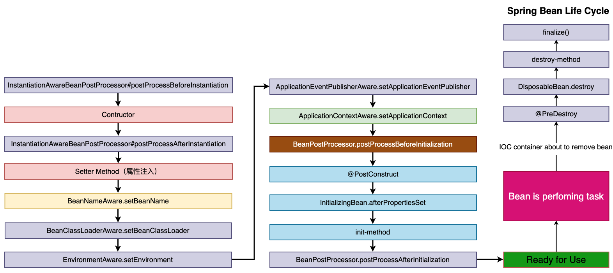

## Spring中Bean的作用域

| 类别            | 说明                                                                       |
| ------------- | ------------------------------------------------------------------------ |
| singleton     | 在Spring IoC容器中仅存在一个实例，也就是单例。                                             |
| prototype     | 每次从容器中调用getBean()，都会生成一个新的实例。                                            |
| request(web)  | 每次HTTP请求都会创建一个新的Bean，不同Session使用不同的Bean，仅适用于WebApplicationContext环境    。 |
| session(web)  | 同一个HTTP Session共享一个Bean，不同Session使用不同的Bean。                              |
| globalSession | 表示在一个全局的HTTP Session中，一个bean定义对应一个实例。典型情况下，仅在使用portlet context的时候有效。     |

## Bean的生命周期

Bean实例生命周期的执行过程如下：

Spring对bean进行实例化，默认bean是单例；

Spring对bean进行依赖注入；

如果bean实现了BeanNameAware接口，Spring将bean的名称传给setBeanName()方法；

如果bean实现了BeanFactoryAware接口，Spring将调用setBeanFactory()方法，将BeanFactory实例传进来；

如果bean实现了ApplicationContextAware接口，它的setApplicationContext()方法将被调用，将应用上下文的引用传入到bean中；

如果bean实现了BeanPostProcessor接口，它的postProcessBeforeInitialization()方法将被调用；

如果bean中有方法添加了@PostConstruct注解，那么该方法将被调用；

如果bean实现了InitializingBean接口，spring将调用它的afterPropertiesSet()接口方法，类似的如果bean使用了init-method属性声明了初始化方法，该方法也会被调用；

如果在xml文件中通过<bean>标签的init-method元素指定了初始化方法，那么该方法将被调用；

如果bean实现了BeanPostProcessor接口，它的postProcessAfterInitialization()接口方法将被调用；

此时bean已经准备就绪，可以被应用程序使用了，他们将一直驻留在应用上下文中，直到该应用上下文被销毁；

如果bean中有方法添加了@PreDestroy注解，那么该方法将被调用；

若bean实现了DisposableBean接口，spring将调用它的distroy()接口方法。同样的，如果bean使用了destroy-method属性声明了销毁方法，则该方法被调用；

[Spring中bean的作用域与生命周期](https://blog.csdn.net/fuzhongmin05/article/details/73389779)
