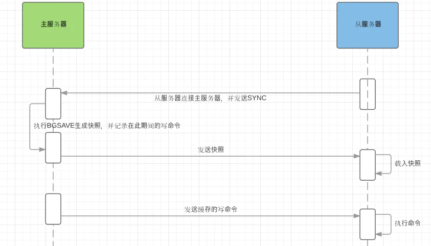

## Redis特点

1. Redis 采用单线程模式处理客户端请求。这样做的原因有 2个：一个是因为采用了非阻塞的异步事件处理机制(epoll网络处理)；另一个是缓存数据都是内存操作 IO 时间不会太长，单线程可以避免线程上下文切换产生的代价。
2. Redis 支持持久化，所以 Redis 不仅仅可以用作缓存，也可以用作 NoSQL 数据库。
3. Redis除了 K-V 之外，还支持多种数据格式，例如 list、set、sorted set、hash 等。
4. Redis 提供主从同步机制，以及 Cluster 集群部署能力，能够提供高可用服务。


## 数据基础类型

### String
String 类型是 Redis 中最常使用的类型，内部的实现是通过 SDS（Simple Dynamic String ）来存储的。SDS 类似于 Java 中的 ArrayList，可以通过预分配冗余空间的方式来减少内存的频繁分配。

这是最简单的类型，就是普通的 set 和 get，做简单的 KV缓存。当然可以用作数字进行计数。

### Hash
redis的哈希对象的底层存储可以使用ziplist（压缩列表）和hashtable。当hash对象可以同时满足以下两个条件时，哈希对象使用ziplist编码。

哈希对象保存的所有键值对的键和值的字符串长度都小于64字节。
哈希对象保存的键值对数量小于512个。


命令 | 时间复杂度
---|---
HDEL key field [field ...] | O(N) where N is the number of fields to be removed.
HMGET key field [field ...] | O(N) where N is the number of fields being requested.
HMSET key field value [field value ...] | O(N) where N is the number of fields being requested.
HLEN key | O(N) where N is the size of the hash.
HEXISTS key field | O(1)
HINCRBY key field | O(1)


### List
redis list数据结构底层采用压缩列表ziplist或linkedlist两种数据结构进行存储，首先以ziplist进行存储，在不满足ziplist的存储要求后转换为linkedlist列表。

当列表对象同时满足以下两个条件时，列表对象使用ziplist进行存储，否则用linkedlist存储。

列表对象保存的所有字符串元素的长度小于64字节
列表对象保存的元素数量小于512个。

quicklist是在Redis 3.2之后出现的一种Redis底层数据结构用于List结构的具体实现，List在Redis中更像是数据结构中常说的双向链表，可以被用作栈或者队列。

命令 | 时间复杂度
---|---
LLEN key | O(1)
LINDEX key index | O(N) where N is the number of elements to traverse to get to the element at index. This makes asking for the first or the last element of the list O(1).
LINSERT key BEFORE\|AFTER pivot element |  O(N) where N is the number of elements to traverse before seeing the value pivot. This means that inserting somewhere on the left end on the list (head) can be considered O(1) and inserting somewhere on the right end (tail) is O(N).
LPOP key | O(1)
LPUSH key element [element ...] | O(1) for each element added, so O(N) to add N elements when the command is called with multiple arguments.
LRANGE key start stop | O(S+N) where S is the distance of start offset from HEAD for small lists, from nearest end (HEAD or TAIL) for large lists; and N is the number of elements in the specified range.
LREM key count element | O(N+M) where N is the length of the list and M is the number of elements removed.
RPOP key | O(1)
RPUSH key element [element ...] | O(1) for each element added, so O(N) to add N elements when the command is called with multiple arguments.

### Set
set底层存储
redis的集合对象set的底层存储结构特别神奇，我估计一般人想象不到，底层使用了intset和hashtable两种数据结构存储的，intset我们可以理解为数组，hashtable就是普通的哈希表（key为set的值，value为null）。是不是觉得用hashtable存储set是一件很神奇的事情。

set的底层存储intset和hashtable是存在编码转换的，使用intset存储必须满足下面两个条件，否则使用hashtable，条件如下：

结合对象保存的所有元素都是整数值
集合对象保存的元素数量不超过512个。

命令 | 时间复杂度
---|---
SADD key member [member ...] | O(1) for each element added, so O(N) to add N elements when the command is called with multiple arguments.
SINTER key [key ...] | O(N*M) worst case where N is the cardinality of the smallest set and M is the number of sets.
SREM key member [member ...] | O(N) where N is the number of members to be removed.
SISMEMBER key member | O(1)
SMOVE source destination member | O(1)
SPOP key [count] | O(1)
SCARD key | O(1)

### Zset
zset底层的存储结构包括ziplist或skiplist，在同时满足以下两个条件的时候使用ziplist，其他时候使用skiplist，两个条件如下：

有序集合保存的元素数量小于128个
有序集合保存的所有元素的长度小于64字节
当ziplist作为zset的底层存储结构时候，每个集合元素使用两个紧挨在一起的压缩列表节点来保存，第一个节点保存元素的成员，第二个元素保存元素的分值。

当skiplist作为zset的底层存储结构的时候，使用skiplist按序保存元素及分值，使用dict来保存元素和分值的映射关系。

| 命令                                                      | 时间复杂度                                                   |
| --------------------------------------------------------- | ------------------------------------------------------------ |
| ZADD key score member [[score member] [score member] ...] | O(M*log(N))，`N` 是有序集的基数， `M` 为成功添加的新成员的数量。 |
| ZCARD key                                                 | O(1)                                                         |
| ZRANK key member                                          | O(log(N))                                                    |
| ZRANGE                                                    | O(log(N)+M)， `N` 为有序集的基数，而 `M` 为结果集的基数。    |
| ZREM key member [member ...]                              | O(M*log(N))， `N` 为有序集的基数， `M` 为被成功移除的成员的数量。 |


### Expire
How Redis expires keys
Redis keys are expired in two ways: a passive way, and an active way.

A key is passively expired simply when some client tries to access it, and the key is found to be timed out.

Of course this is not enough as there are expired keys that will never be accessed again. These keys should be expired anyway, so periodically Redis tests a few keys at random among keys with an expire set. All the keys that are already expired are deleted from the keyspace.

Specifically this is what Redis does 10 times per second:

- Test 20 random keys from the set of keys with an associated expire.
- Delete all the keys found expired.
- If more than 25% of keys were expired, start again from step 1.

定时删除策略即基于定时器的删除策略对于内存是最友好的，因为它保证过期键尽可能快的被删除，从而释放过期键占用的内存。但是这样的策略对 CPU 是最不友好的，因为它以键为粒度调用 CPU 执行过期删除的过程。**一旦某个时间段内有大量的键过期，CPU 将有可能被抢占完成删除过期键的任务，这有可能导致 Redis 对外服务的性能明显降低**。

### ZipList数据结构

Ziplist 是由一系列特殊编码的内存块构成的列表， 一个 ziplist 可以包含多个节点（entry）， 每个节点可以保存一个长度受限的字符数组（不以 `\0` 结尾的 `char` 数组）或者整数， 包括：

- - 字符数组

    长度小于等于 `63` （26−126−1）字节的字符数组长度小于等于 `16383` （214−1214−1） 字节的字符数组长度小于等于 `4294967295` （232−1232−1）字节的字符数组

- - 整数

    `4` 位长，介于 `0` 至 `12` 之间的无符号整数`1` 字节长，有符号整数`3` 字节长，有符号整数`int16_t` 类型整数`int32_t` 类型整数`int64_t` 类型整数

因为 ziplist 节约内存的性质， 哈希键、列表键和有序集合键初始化的底层实现皆有采用 ziplist。

 ziplist 的典型分布结构：

```html
area        |<---- ziplist header ---->|<----------- entries ------------->|<-end->|

size          4 bytes  4 bytes  2 bytes    ?        ?        ?        ?     1 byte
            +---------+--------+-------+--------+--------+--------+--------+-------+
component   | zlbytes | zltail | zllen | entry1 | entry2 |  ...   | entryN | zlend |
            +---------+--------+-------+--------+--------+--------+--------+-------+
                                       ^                          ^        ^
address                                |                          |        |
                                ZIPLIST_ENTRY_HEAD                |   ZIPLIST_ENTRY_END
                                                                  |
                                                         ZIPLIST_ENTRY_TAIL
```

图中各个域的作用如下：

| 域        | 长度/类型  | 域的值                                                       |
| :-------- | :--------- | :----------------------------------------------------------- |
| `zlbytes` | `uint32_t` | 整个 ziplist 占用的内存字节数，对 ziplist 进行内存重分配，或者计算末端时使用。 |
| `zltail`  | `uint32_t` | 到达 ziplist 表尾节点的偏移量。 通过这个偏移量，可以在不遍历整个 ziplist 的前提下，弹出表尾节点。 |
| `zllen`   | `uint16_t` | ziplist 中节点的数量。 当这个值小于 `UINT16_MAX` （`65535`）时，这个值就是 ziplist 中节点的数量； 当这个值等于 `UINT16_MAX` 时，节点的数量需要遍历整个 ziplist 才能计算得出。 |
| `entryX`  | `?`        | ziplist 所保存的节点，各个节点的长度根据内容而定。           |
| `zlend`   | `uint8_t`  | `255` 的二进制值 `1111 1111` （`UINT8_MAX`） ，用于标记 ziplist 的末端。 |

为了方便地取出 ziplist 的各个域以及一些指针地址， ziplist 模块定义了以下宏：

| 宏                             | 作用                                                 | 算法复杂度 |
| :----------------------------- | :--------------------------------------------------- | :--------- |
| `ZIPLIST_BYTES(ziplist)`       | 取出 `zlbytes` 的值                                  | θ(1)θ(1)   |
| `ZIPLIST_TAIL_OFFSET(ziplist)` | 取出 `zltail` 的值                                   | θ(1)θ(1)   |
| `ZIPLIST_LENGTH(ziplist)`      | 取出 `zllen` 的值                                    | θ(1)θ(1)   |
| `ZIPLIST_HEADER_SIZE`          | 返回 ziplist header 部分的长度，总是固定的 `10` 字节 | θ(1)θ(1)   |
| `ZIPLIST_ENTRY_HEAD(ziplist)`  | 返回到达 ziplist 第一个节点（表头）的地址            | θ(1)θ(1)   |
| `ZIPLIST_ENTRY_TAIL(ziplist)`  | 返回到达 ziplist 最后一个节点（表尾）的地址          | θ(1)θ(1)   |
| `ZIPLIST_ENTRY_END(ziplist)`   | 返回 ziplist 的末端，也即是 `zlend` 之前的地址       | θ(1)θ(1)   |

因为 ziplist header 部分的长度总是固定的（`4` 字节 + `4` 字节 + `2` 字节）， 因此将指针移动到表头节点的复杂度为常数时间； 除此之外， 因为表尾节点的地址可以通过 `zltail` 计算得出， 因此将指针移动到表尾节点的复杂度也为常数时间。

以下是用于操作 ziplist 的函数：

| 函数名               | 作用                                                         | 算法复杂度 |
| :------------------- | :----------------------------------------------------------- | :--------- |
| `ziplistNew`         | 创建一个新的 ziplist                                         | θ(1)θ(1)   |
| `ziplistResize`      | 重新调整 ziplist 的内存大小                                  | O(N)O(N)   |
| `ziplistPush`        | 将一个包含给定值的新节点推入 ziplist 的表头或者表尾          | O(N2)O(N2) |
| `zipEntry`           | 取出给定地址上的节点，并将它的属性保存到 `zlentry` 结构然后返回 | θ(1)θ(1)   |
| `ziplistInsert`      | 将一个包含给定值的新节点插入到给定地址                       | O(N2)O(N2) |
| `ziplistDelete`      | 删除给定地址上的节点                                         | O(N2)O(N2) |
| `ziplistDeleteRange` | 在给定索引上，连续进行多次删除                               | O(N2)O(N2) |
| `ziplistFind`        | 在 ziplist 中查找并返回包含给定值的节点                      | O(N)O(N)   |
| `ziplistLen`         | 返回 ziplist 保存的节点数量                                  | O(N)O(N)   |
| `ziplistBlobLen`     | 以字节为单位，返回 ziplist 占用的内存大小                    | θ(1)θ(1)   |

因为 ziplist 由连续的内存块构成， 在最坏情况下， 当 `ziplistPush` 、 `ziplistDelete` 这类对节点进行增加或删除的函数之后， 程序需要执行一种称为连锁更新的动作来维持 ziplist 结构本身的性质， 所以这些函数的最坏复杂度都为 O(N2)O(N2) 。 不过，因为这种最坏情况出现的概率并不高， 所以大可以放心使用 ziplist ， 而不必太担心出现最坏情况。

参考：[压缩列表--Redis设计与实现](https://redisbook.readthedocs.io/en/latest/compress-datastruct/ziplist.html#ziplist-chapter)

## 内存淘汰策略

The exact behavior Redis follows when the maxmemory limit is reached is configured using the maxmemory-policy configuration directive.

当前Redis3.0版本支持的淘汰策略有6种：

1. volatile-lru：从设置过期时间的数据集(server.db[i].expires)中挑选出最近最少使用的数据淘汰。没有设置过期时间的key不会被淘汰，这样就可以在增加内存空间的同时保证需要持久化的数据不会丢失。evict keys by trying to remove the less recently used (LRU) keys first, but only among keys that have an expire set, in order to make space for the new data added.

2. volatile-ttl：除了淘汰机制采用LRU，策略基本上与volatile-lru相似，从设置过期时间的数据集(server.db[i].expires)中挑选将要过期的数据淘汰，ttl值越大越优先被淘汰。volatile-ttl: evict keys with an expire set, and try to evict keys with a shorter time to live (TTL) first, in order to make space for the new data added.

3. volatile-random：从已设置过期时间的数据集(server.db[i].expires)中任意选择数据淘汰。当内存达到限制无法写入非过期时间的数据集时，可以通过该淘汰策略在主键空间中随机移除某个key。evict keys randomly in order to make space for the new data added, but only evict keys with an expire set.

4. allkeys-lru：从数据集(server.db[i].dict)中挑选最近最少使用的数据淘汰，该策略要淘汰的key面向的是全体key集合，而非过期的key集合。evict keys by trying to remove the less recently used (LRU) keys first, in order to make space for the new data added.

5. allkeys-random：从数据集(server.db[i].dict)中选择任意数据淘汰。evict keys randomly in order to make space for the new data added.

6. no-enviction：禁止驱逐数据，也就是当内存不足以容纳新入数据时，新写入操作就会报错，请求可以继续进行，线上任务也不能持续进行，采用no-enviction策略可以保证数据不被丢失，这也是系统默认的一种淘汰策略。return errors when the memory limit was reached and the client is trying to execute commands that could result in more memory to be used (most write commands, but DEL and a few more exceptions).

How the eviction process works
It is important to understand that the eviction process works like this:

- A client runs a new command, resulting in more data added.
- Redis checks the memory usage, and if it is greater than the maxmemory limit , it evicts keys according to the policy.
- A new command is executed, and so forth.

## 持久化

### RDB模式
RDB其实就是把数据以快照的形式保存在磁盘上。

对于RDB来说，提供了三种机制：save、bgsave、自动化
#### SAVE
该命令会阻塞当前Redis服务器，执行save命令期间，Redis不能处理其他命令，直到RDB过程完成为止。

#### BGSAVE
执行该命令时，Redis会在后台异步进行快照操作，快照同时还可以响应客户端请求。

具体操作是Redis进程执行fork操作创建子进程，RDB持久化过程由子进程负责，完成后自动结束。阻塞只发生在fork阶段，一般时间很短。基本上 Redis 内部所有的RDB操作都是采用 bgsave 命令。

#### 自动触发
自动触发是由我们的配置文件来完成的。在redis.conf配置文件中，里面有如下配置，我们可以去设置：

save：这里是用来配置触发 Redis的 RDB 持久化条件，也就是什么时候将内存中的数据保存到硬盘。比如“save m n”。表示m秒内数据集存在n次修改时，自动触发bgsave。

### RDB的优势和劣势

1、 优势

- RDB文件紧凑，全量备份，非常适合用于进行备份和灾难恢复。

- 生成RDB文件的时候，redis主进程会fork()一个子进程来处理所有保存工作，主进程不需要进行任何磁盘IO操作。

- RDB 在恢复大数据集时的速度比AOF的恢复速度要快。

2、 劣势

　RDB快照是一次全量备份，存储的是内存数据的二进制序列化形式，存储上非常紧凑。当进行快照持久化时，会开启一个子进程专门负责快照持久化，子进程会拥有父进程的内存数据，父进程修改内存子进程不会反应出来，所以在快照持久化期间修改的数据不会被保存，可能丢失数据。假如同步过程中发生父进程对内存修改，由于Copy on Write机制，会使操作系统申请额外内存给父进程做内存修改。
　
### AOF模式（Append Only File）
全量备份总是耗时的，有时候我们提供一种更加高效的方式AOF，工作机制很简单，redis会将每一个收到的写命令都通过write函数追加到文件中。通俗的理解就是日志记录。
　
#### AOF也有三种触发机制

（1）每修改同步"always"：同步持久化 每次发生数据变更会被立即记录到磁盘 性能较差但数据完整性比较好

（2）每秒同步"everysec"：异步操作，每秒记录 如果一秒内宕机，有数据丢失

（3）不同步"no"：从不同步

#### 优点

（1）AOF可以更好的保护数据不丢失，一般AOF会每隔1秒，通过一个后台线程执行一次fsync操作，最多丢失1秒钟的数据。
（2）AOF日志文件没有任何磁盘寻址的开销，写入性能非常高，文件不容易破损。

（3）AOF日志文件即使过大的时候，出现后台重写操作，也不会影响客户端的读写。

（4）AOF日志文件的命令通过非常可读的方式进行记录，这个特性非常适合做灾难性的误删除的紧急恢复。比如某人不小心用flushall命令清空了所有数据，只要这个时候后台rewrite还没有发生，那么就可以立即拷贝AOF文件，将最后一条flushall命令给删了，然后再将该AOF文件放回去，就可以通过恢复机制，自动恢复所有数据

#### 缺点

（1）对于同一份数据来说，AOF日志文件通常比RDB数据快照文件更大

（2）AOF开启后，支持的写QPS会比RDB支持的写QPS低，因为AOF一般会配置成每秒fsync一次日志文件，当然，每秒一次fsync，性能也还是很高的

（3）以前AOF发生过bug，就是通过AOF记录的日志，进行数据恢复的时候，没有恢复一模一样的数据出来。

### 面试问题
bgsave做镜像全量持久化，aof做增量持久化。因为bgsave会耗费较长时间，不够实时，在停机的时候会导致大量丢失数据，所以需要aof来配合使用。在redis实例重启时，会使用bgsave持久化文件重新构建内存，再使用aof重放近期的操作指令来实现完整恢复重启之前的状态。

对方追问那如果突然机器掉电会怎样？取决于aof日志sync属性的配置，如果不要求性能，在每条写指令时都sync一下磁盘，就不会丢失数据。但是在高性能的要求下每次都sync是不现实的，一般都使用定时sync，比如1s1次，这个时候最多就会丢失1s的数据。

对方追问bgsave的原理是什么？你给出两个词汇就可以了，fork和cow。fork是指redis通过创建子进程来进行bgsave操作，cow指的是copy on write，子进程创建后，父子进程共享数据段，父进程继续提供读写服务，写脏的页面数据会逐渐和子进程分离开来。


## Pipeline
Pipeline有什么好处，为什么要用pipeline？

可以将多次IO往返的时间缩减为一次，前提是pipeline执行的指令之间没有因果相关性。使用redis-benchmark进行压测的时候可以发现影响redis的QPS峰值的一个重要因素是pipeline批次指令的数目。

## 同步机制
Redis的同步机制了解么？

Redis可以使用主从同步，从从同步。第一次同步时，主节点做一次bgsave，并同时将后续修改操作记录到内存buffer，待完成后将rdb文件全量同步到复制节点，复制节点接受完成后将rdb镜像加载到内存。加载完成后，再通知主节点将期间修改的操作记录同步到复制节点进行重放就完成了同步过程。

 Redis全量复制一般发生在Slave初始化阶段，这时Slave需要将Master上的所有数据都复制一份。具体步骤如下：

 1）从服务器连接主服务器，发送SYNC命令；

 2）主服务器接收到SYNC命名后，开始执行BGSAVE命令生成RDB文件，并使用缓冲区记录此后执行的所有写命令；

 3）主服务器BGSAVE执行完后，向所有从服务器发送快照文件，并在发送期间继续记录被执行的写命令；

 4）从服务器收到快照文件后丢弃所有旧数据，载入收到的快照；

 5）主服务器快照发送完毕后开始向从服务器发送缓冲区中的写命令；

 6）从服务器完成对快照的载入，开始接收命令请求，并执行来自主服务器缓冲区的写命令；



[Redis主从同步原理-SYNC](https://blog.csdn.net/sk199048/article/details/50725369)

## Redis 集群
是否使用过Redis集群，集群的原理是什么？

Redis 集群有16384个哈希槽，每个key通过CRC16校验后对16384取模来决定放置哪个槽，集群的每个节点负责一部分hash槽。

Redis Sentinal着眼于高可用，在master宕机时会自动将slave提升为master，继续提供服务。

Redis Cluster着眼于扩展性，在单个redis内存不足时，使用Cluster进行分片存储。

### 主从高可用

部分节点不可用时，集群仍可用。通过增加 Slave 做 standby 数据副本，能够实现故障自动 failover，节点之间通过 gossip 协议交换状态信息，用投票机制完成 Slave 到 Master 的角色提升


## Redis Server事件模型
redis服务器是一个事件驱动的程序，内部需要处理两类事件，一类是文件事件（file event），一类是时间事件（time event），前者对应着处理各种io事件，后者对应着处理各种定时任务。

file event 和 time event都是由单个线程驱动的，file event 底层其实是通过select/epoll等模型去执行驱动的，time event是通过内部维持一个定时任务列表来实现的。

redis server的事件模型其实就是经典的NIO模型，底层通过select/epoll等机制实现异步NIO，通过检测到event到来后for循环实现串行处理。

[redis数据淘汰原理](https://www.jianshu.com/p/60cc093d6c36)

[Redis两种持久化机制RDB和AOF详解（面试常问，工作常用）](https://database.51cto.com/art/202002/610603.htm)


