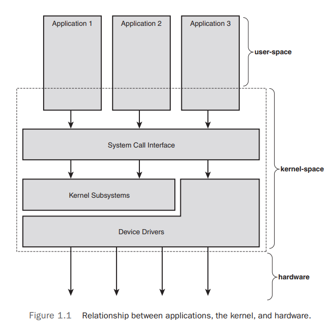
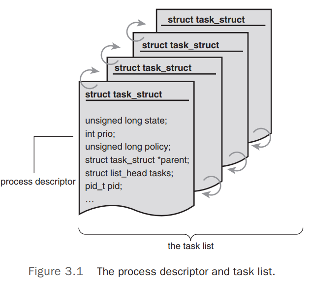
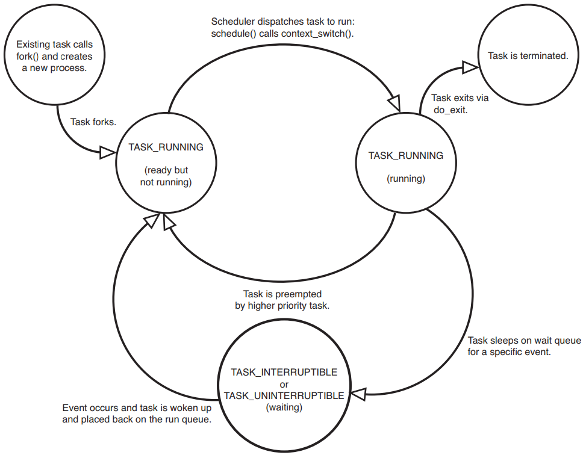
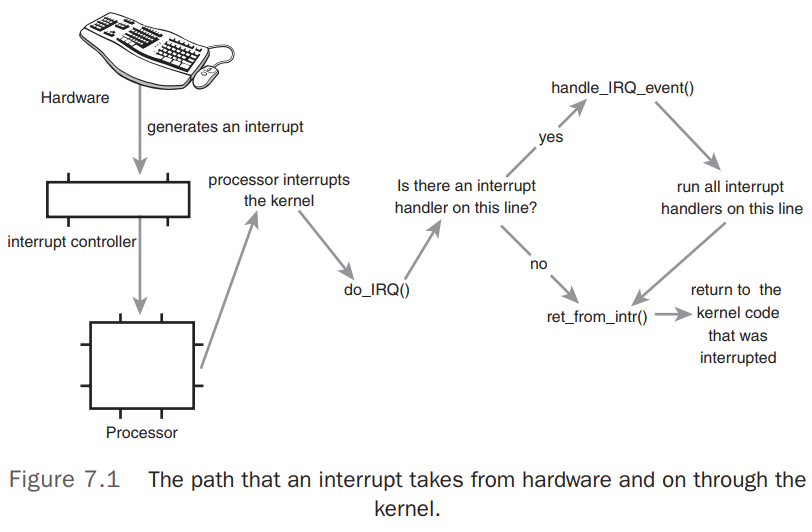
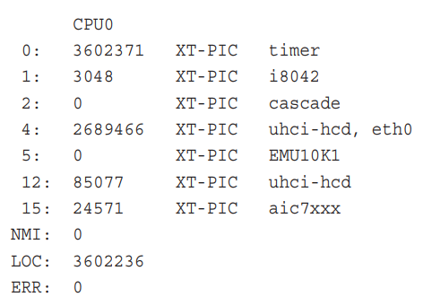
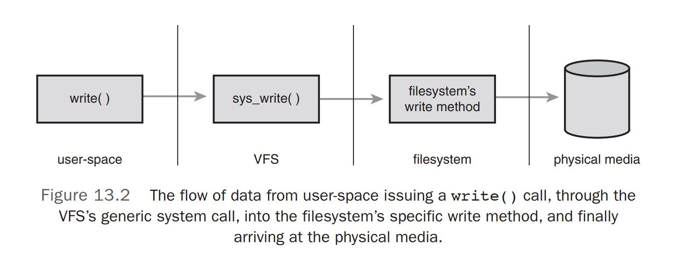
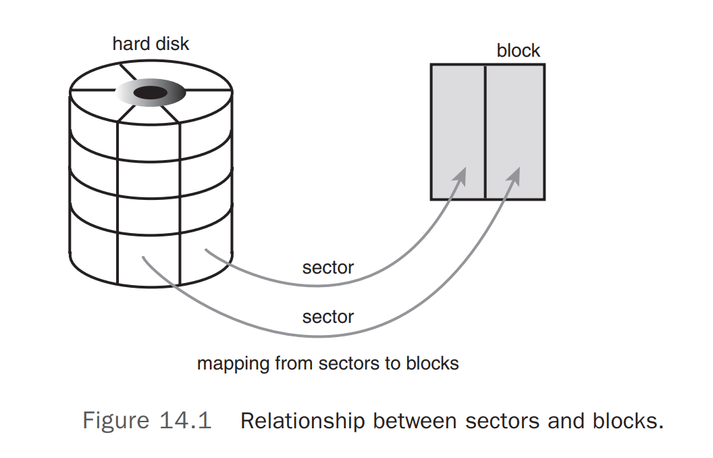
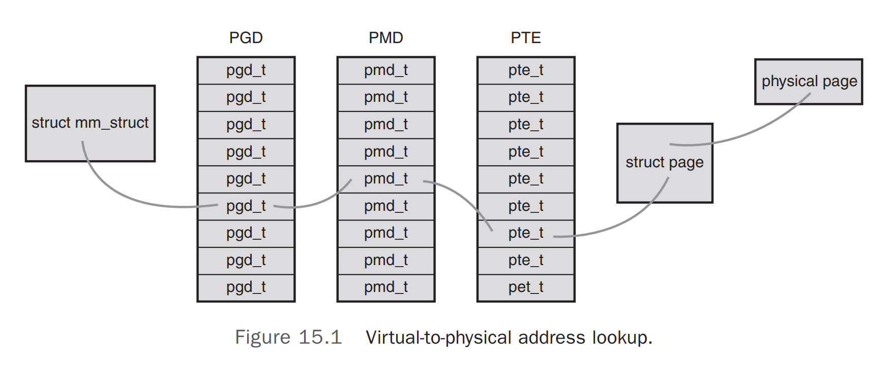

# Linux Kernel

## Overview

Typical components of a kernel are interrupt handlers to service interrupt requests, a scheduler to share processor time among multiple processes, a memory management system to manage process address spaces, and system services such as networking and interprocess communication.  

Applications running on the system communicate with the kernel via system calls (see Figure 1.1). An application typically calls functions in a library—for example, the C library—that in turn rely on the system call interface to instruct the kernel to carry out tasks on the application’s behalf.   



The kernel also manages the system’s hardware. Nearly all architectures, including all systems that Linux supports, provide the concept of interrupts.When hardware wants to communicate with the system, it issues an interrupt that literally interrupts the processor, which in turn interrupts the kernel.  

## Process

Processes are, however, more than just the executing program code (often called the text section in Unix).They also include a set of resources such as **open files** and **pending signals**, **internal kernel data**, **processor state**, **a memory address space with one or more memory mappings**, one or more **threads of execution**, and **a data section containing global variables**.  

### Thread

Each thread includes a unique **program counter**, **process stack**, and **set of processor registers**.  The kernel schedules individual threads, not processes.

Linux has a unique implementation of threads: It does not differentiate between threads and processes. To Linux, **a thread is just a special kind of process.**  

On modern operating systems, processes provide two virtualizations: **a virtualized processor** and **virtual memory**. The virtual processor **gives the process the illusion that it alone monopolizes the system**, despite possibly sharing the processor among hundreds of other processes. Virtual memory lets the process allocate and manage memory **as if it alone owned all the memory** in the system.  

threads share the virtual memory abstraction, whereas each receives its own virtualized processor.  

A process begins its life when, not surprisingly, it is created. In Linux, this occurs by means of the fork() system call, which creates a new process by duplicating an existing one. The process that calls fork() is the parent, whereas the new process is the child.  The fork() system call returns from the kernel twice: once in the parent process and again in the newborn child.  

The kernel stores the list of processes in a circular doubly linked list called the task list.



### Process State 

- **TASK_RUNNING**—The process is runnable; it is either currently running or on a runqueue waiting to run. This is the only possible state for a process executing in user-space; it can also apply to a process in kernel-space that is actively running.

- **TASK_INTERRUPTIBLE**—The process is sleeping (that is, it is blocked), waiting for some condition to exist. When this condition exists, the kernel sets the process’s state to TASK_RUNNING. The process also awakes prematurely and becomes runnable if it receives a signal.  

- **TASK_UNINTERRUPTIBLE**—This state is identical to TASK_INTERRUPTIBLE except that it does not wake up and become runnable if it receives a signal. This is used in situations where the process must wait without interruption or when the event is expected to occur quite quickly. Because the task does not respond to signals in this state, TASK_UNINTERRUPTIBLE is less often used than TASK_INTERRUPTIBLE.  

- **TASK_TRACED**—The process is being traced by another process, such as a debugger, via ptrace.

- **TASK_STOPPED**—Process execution has stopped; the task is not running nor is it eligible to run. This occurs if the task receives the SIGSTOP, SIGTSTP, SIGTTIN, or SIGTTOU signal or if it receives any signal while it is being debugged.  

- 

  Normal program execution occurs in user-space.  When a program executes a system call or triggers an exception, it enters kernel-space.  

### The Process Family Tree 

A distinct hierarchy exists between processes in Unix systems, and Linux is no exception. **All processes are descendants of the init process**, whose PID is one. The kernel starts init in the last step of the boot process. The init process, in turn, reads the system initscripts and executes more programs, eventually completing the boot process. 

Every process on the system has exactly one parent. Likewise, every process has zero or more children.   

### Process Creation

The first, fork(), creates a child process that is a copy of the current task. It differs from the parent only in its PID (which is unique), its PPID
(parent’s PID, which is set to the original process), and certain resources and statistics, such as pending signals, which are not inherited. The second function, exec(), loads a new executable into the address space and begins executing it. The combination of fork() followed by exec() is similar to the single function most operating systems provide.  

#### Copy on Write

In Linux, fork() is implemented through the use of copy-on-write pages. Copy-on-write (or COW) is a technique to delay or altogether prevent copying of the data. Rather than duplicate the process address space, **the parent and the child can share a single copy.**

**The duplication of resources occurs only when they are written; until then, they are shared read-only.**  

The only overhead incurred by fork() is the duplication of the parent’s page tables and the creation of a unique process descriptor for the child.  

### The Linux Implementation of Threads  

To the Linux kernel, there is no concept of a thread. Linux implements all threads as standard processes. The Linux kernel does not provide any special scheduling semantics or data structures to represent threads.  Instead, **a thread is merely a process that shares certain resources with other processes.**  

This approach to threads contrasts greatly with operating systems such as Microsoft Windows or Sun Solaris, which have explicit kernel support for threads (and sometimes call threads lightweight processes).  To Linux, threads are simply a manner of sharing resources between processes (which are
already quite lightweight).  

#### Creating Threads  

Threads are created the same as normal tasks, with the exception that the clone() system call is passed flags corresponding to the specific resources to be shared:  

``` clone(CLONE_VM | CLONE_FS | CLONE_FILES | CLONE_SIGHAND, 0);   ```

The previous code results in behavior identical to a normal fork(), except that the **address space**, **filesystem resources**, **file descriptors**, and **signal handlers** are shared. In other words, the new task and its parent are what are popularly called threads.  The flags provided to clone() help specify the behavior of the new process and detail what resources the parent and child will share. 

## Process scheduling

The **Completely Fair Scheduler** (CFS) is the registered scheduler class for normal processes, called SCHED_NORMAL in Linux (and SCHED_OTHER in POSIX). CFS is defined in kernel/sched_fair.c. The CFS algorithm and is germane to any Linux kernel since 2.6.23.  

CFS根据各个进程的权重分配进程运行时间。
**分配给进程的运行时间 = 调度周期 * 当前进程权重 / 所有进程权重总和** (公式3.1)
调度周期：将所有处于TASK_RUNNING态进程都调度一遍的时间，在O(1)调度算法中就是运行队列中进程运行一遍的时间。所以进程权重与分配给进程的运行时间成正比。

vruntime的计算公式为：
**vruntime = 实际运行时间 * NICE_0_LOAD / 当前进程权重** (公式3.2)

如果分配给进程的运行时间等于实际运行的时间时，将推到出另一vruntime计算公式。把公式3.2中的分配给进程的运行时间 与公式3.1中实际运行时间替换，将得出以下结果：
vruntime = (调度周期 * 当前进程权重 / 所有进程权重总和) * NICE_0_LOAD/ 当前进程权重 = 调度周期 * NICE_0_LOAD/ 所有进程权重总和
初步结论：当分配给进程的运行时间等于实际运行的时间时，虽然每个进程的权重不同，但是它们的 vruntime增长速度均相同，与权重无关。上文已述用vruntime来选择将要运行的进程，vruntime值较小表明它以前占用cpu的时间较短，受到了“不公平”对待，因此下一个运行进程就是它。如此一来既能公平选择进程，又能保证高优先级进程获得较多的运行时间。

如果分配给进程的运行时间不等于实际运行的时间时：CFS的思想就是让每个调度实体的vruntime增加速度不同，权重越大的增加的越慢，这样高优先级进程就能获得更多的cpu执行时间，而vruntime值较小者也得到执行。

每一个进程或者调度组都对应一个调度的实体，每一个进程都通过调度实体与CFS运行对列建立联系，每次进行CFS调度的时候都会在CFS运行对列红黑树中选择一个进程（vruntime值较小者）。

CFS uses a **red-black tree** to manage the list of runnable processes and efficiently **find the process with the smallest vruntime**.  

[浅析Linux中完全公平调度——CFS](https://zhuanlan.zhihu.com/p/269511249)

### Process priority

#### nice value

**Larger nice values correspond to a lower priority**—you are being "nice" to the other processes on the system. Processes with a lower nice value (higher priority) receive a larger proportion of the system's processor compared to processes with a higher nice value (lower priority).  

```shell
# command to see nice value
ps -el
```

#### real-time priority 

The values are configurable, but by default range from 0 to 99, inclusive. Opposite from nice values, higher real-time priority values correspond to a greater priority. All real-time processes are at a higher priority than normal processes; that is, the real-time priority and nice value are in disjoint value spaces.  

```  shell
# rtprio is real-time priority
ps -eo state,uid,pid,ppid,rtprio,time,comm.  
```

### Process Selection

When CFS is deciding what process to run next, it picks the process with the smallest vruntime.  

CFS uses a red-black tree to manage the list of runnable processes and efficiently find the process with the smallest vruntime.  

### Sleeping and Waking Up 

A task sleeps for a number of reasons, but always while it is waiting for some event. The event can be a specified amount of time, more data from a file I/O, or another hardware event. 

The task marks itself as **sleeping**, puts itself on a **wait queue**, removes itself from the red-black tree of runnable, and calls schedule() to select a new process to execute. Waking back up is the inverse: The task is set as runnable, removed from the wait queue, and added back to the red-black tree.  

## System calls

System calls provide a layer between the hardware and user-space processes.

This layer serves three primary purposes: 

1. it provides an abstracted hardware interface for userspace.  
2. system calls ensure system security and stability.
3. a single common layer between user-space and the rest of the system allows for the virtualized system provided to processes.

System calls (often called syscalls in Linux) are typically accessed via function calls defined in the C library. 

#### execution

trapping into the kernel, transmitting the syscall number and any arguments, executing the correct system call function, and returning to user-space with the syscall’s return value. 

## Interrupts

Interrupts enable hardware to signal to the processor.  The processor receives the interrupt and signals the operating system to enable the operating system to respond to the new data.  **Hardware devices generate interrupts asynchronously** with respect to the processor clock—they can occur
at any time.  Consequently, the kernel can be interrupted at any time to process interrupts.

An interrupt is physically produced by electronic signals originating from hardware devices and directed into input pins on an interrupt controller, a simple chip that multiplexes multiple interrupt lines into a single line to the processor. Upon receiving an interrupt, the interrupt controller sends a signal to the processor. **The processor detects this signal and interrupts its current execution to handle the interrupt.** The processor can then notify the operating system that an interrupt has occurred, and the operating system can handle the interrupt appropriately.

**Different devices can be associated with different interrupts by means of a unique value associated with each interrupt**. This way, interrupts from the keyboard are distinct from interrupts from the hard drive.  

These interrupt values are often called **interrupt request (IRQ)** lines.  Each IRQ line is assigned a numeric value—for example, on the classic PC, IRQ zero is the timer interrupt and IRQ one is the keyboard interrupt.  

### Interrupt handler 

The function the kernel runs in response to a specific interrupt is called an **interrupt handler** or **interrupt service routine (ISR)**. Each device that generates interrupts has an associated interrupt handler.   

The interrupt handler for a device is part of the device’s driver—the kernel code that manages the device.  What differentiates interrupt handlers from other kernel functions is that the kernel invokes them in response to interrupts and that they run in a special context (discussed later in this chapter) called **interrupt context**.  

Interrupt handlers run with the current interrupt line disabled on all processors.

### Top Halves Versus Bottom Halves  

Because of these competing goals, the processing of interrupts is split into two parts, or halves. **The interrupt handler is the top half**.
**The top half is run immediately upon receipt of the interrupt and performs only the work that is time-critical**, such as acknowledging receipt of the interrupt or resetting the hardware. **Work that can be performed later is deferred until the bottom half.** The bottom half runs in the future, at a more convenient time, with all interrupts enabled.

The top half is quick and simple and runs with some or all interrupts disabled.The bottom half (however it is implemented) runs later with all interrupts enabled.This design keeps system latency low by running with interrupts disabled for as little time as necessary.

Top Halves例子：中断快速回复硬件，快速复制网卡的网络包到主内存，防止网卡过早满了不能接受更多数据包，处理完数据复制后，将控制权交给操作系统。

Bottom Halves例子：上述TopHavles例子处理完毕后，接下来就是Bottom Halves要做的事情。

为了在中断执行时间尽可能短和中断处理需完成大量工作之间找到一个平衡点，Linux 将中断处理程序分解为两个半部：顶半部（top half）和底半部（bottom half）。 

顶半部完成尽可能少的比较紧急的功能，它往往只是简单地读取寄存器中的中断状态并清除，中断标志后就进行“登记中断”的工作。“登记中断”意味着将底半部处理程序挂到该设备的底半部执行队列中去。这样，顶半部执行的速度就会很快，可以服务更多的中断请求。现在，中断处理工作的重心就落在了底半部的头上，它来完成中断事件的绝大多数任务。

底半部几乎做了中断处理程序所有的事情，而且可以被新的中断打断，这也是底半部和顶半部的最大不同，因为顶半部往往被设计成不可中断。底半部则相对来说并不是非常紧急的，而且相对比较耗时，不在硬件中断服务程序中执行。 

[linux中断处理-顶半部（top half）和底半部（bottom half）](https://blog.csdn.net/weixin_30716725/article/details/95298142)


### Interrupt Context  

When executing an interrupt handler, the kernel is in interrupt context.   

Interrupt context, on the other hand, is not associated with a process.  

Interrupt context is time-critical because the interrupt handler interrupts other code.  Code should be quick and simple.  



A device issues an interrupt by sending an electric signal over its bus to the interrupt controller. If the interrupt line is enabled (they can be masked out), the interrupt controller sends the interrupt to the processor.  

### /proc/interrupts  

A relevant example is the /proc/interrupts file, which is populated with statistics related to interrupts on the system.  



The first column is the interrupt line. On this system, interrupts numbered 0–2, 4, 5, 12, and 15 are present. Handlers are not installed on lines not displayed.The second column is a counter of the number of interrupts received. The third column is the interrupt controller handling this interrupt.  The last column is the device associated with this interrupt.  

## Interrupt Control  

The Linux kernel implements a family of interfaces for manipulating the state of interrupts on a machine.These interfaces enable you to disable the interrupt system for the current processor or mask out an interrupt line for the entire machine.  

### 用户态内核态切换

当程序中有系统调用语句，程序执行到系统调用时，首先使用类似int 80H的软中断指令，保存现场，去系统调用，在内核态执行，然后恢复现场，每个进程都会有两个栈，一个内核态栈和一个用户态栈。当int中断执行时就会由用户态栈转向内核态栈。系统调用时需要进行栈的切换。而且内核代码对用户不信任，需要进行额外的检查。系统调用的返回过程有很多额外工作，比如检查是否需要调度等。 

系统调用一般都需要保存用户程序的上下文(context), 在进入内核的时候需要保存用户态的寄存器，在内核态返回用户态的时候会恢复这些寄存器的内容。这是一个开销的地方。 如果需要在不同用户程序间切换的话，那么还要更新cr3寄存器，这样会更换每个程序的虚拟内存到物理内存映射表的地址，也是一个比较高负担的操作

[Linux | 用户态和内核态的切换耗费时间的原因](https://www.cnblogs.com/gtblog/p/12155109.html)


## Kernel Synchronization

### Spin Lock

The most common lock in the Linux kernel is the spin lock. A spin lock is a lock that can be held by at most one thread of execution. If a thread of execution attempts to acquire a spin lock while it is already held, which is called contended, the thread busy loops spins—waiting for the lock to become available.

No context switch is involved.

The actual usable interfaces are defined in <linux/spinlock.h>.The basic use of a spin lock is

```c
DEFINE_SPINLOCK(mr_lock);
spin_lock(&mr_lock);
/* critical region ... */
spin_unlock(&mr_lock);
```

 

### Semaphore

Semaphores in Linux are sleeping locks.When a task attempts to acquire a semaphore that is unavailable, the semaphore places the task onto a wait queue and puts the task to sleep.The processor is then free to execute other code.When the semaphore becomes available, one of the tasks on the wait queue is awakened so that it can then acquire the semaphore.

```c
/* define and declare a semaphore, named mr_sem, with a count of one */
static DECLARE_MUTEX(mr_sem);
/* attempt to acquire the semaphore ... */ 
if (down_interruptible(&mr_sem)) {
/* signal received, semaphore not acquired ... */
}
/* critical region ... */
/* release the given semaphore */ 
up(&mr_sem);
```

###  Mutex

The mutex is represented by struct mutex. It behaves similar to a semaphore with a count of one, but it has a simpler interface, more efficient performance, and additional constraints on its use.

```c
//To statically define a mutex, you do:
DEFINE_MUTEX(name);
//To dynamically initialize a mutex, you call
mutex_init(&mutex);
//Locking and unlocking the mutex is easy:
mutex_lock(&mutex);
/* critical region ... */ 
mutex_unlock(&mutex);

```

### Preemption Disabling

we can use Preemption Disabling to protect a per-processor variable. kernel preemption can be disabled via preempt_disable(). The call is nestable; you can call it any number of times. For each call, a corresponding call to preempt_enable() is required.The final corresponding call to preempt_enable() reenables preemption. For example:

```c
preempt_disable();
/* preemption is disabled ... */ 
preempt_enable();
```

### Ordering and Barrier

When talking with hardware, you often need to ensure that a given read occurs before another read or write. Complicating these issues is the fact that both the compiler and the processor can reorder reads and writes for performance reasons. It is also possible to instruct the compiler not to reorder instructions around a given point. These instructions are called *barriers*.

The rmb() method provides a read memory barrier. It ensures that no loads are re-ordered across the rmb() call. That is, no loads prior to the call will be reordered to after the call, and no loads after the call will be reordered to before the call.

The wmb() method provides a write barrier.

The mb() call provides both a read barrier and a write barrier. 

## Memory Management

### Pages

The kernel treats physical pages as the basic unit of memory management. Although the processor’s smallest addressable unit is a byte or a word, the memory management unit (MMU, the hardware that manages memory and performs virtual to physical address translations) typically deals in pages. In terms of virtual memory, pages are the smallest unit that matters.

Most 32-bit architectures have 4KB pages, whereas most 64-bit architectures have 8KB pages.

The important point to understand is that the page structure is associated with physical pages, not virtual pages. The data structure’s goal is to describe physical memory, not the data contained therein.

### Zones

Because of hardware limitations, the kernel cannot treat all pages as identical. Some pages, because of their physical address in memory, cannot be used for certain tasks. Because of this limitation, the kernel divides pages into different *zones*.The kernel uses the zones to group pages of similar properties.

### Getting Pages

The kernel provides one low-level mechanism for requesting memory, along with sev- eral interfaces to access it. The core function is 

```c
struct page * alloc_pages(gfp_t gfp_mask, unsigned int order)
```

#### Getting Zeroed pages

This function works the same as __get_free_page(), except that the allocated page is then zero-filled—every bit of every byte is unset.

```c
unsigned long get_zeroed_page(unsigned int gfp_mask)
```

#### Free Pages

A family of functions enables you to free allocated pages when you no longer need them:

```c
void __free_pages(struct page *page, unsigned int order) 
void free_pages(unsigned long addr, unsigned int order) 
void free_page(unsigned long addr)
```

### kmalloc

The kmalloc() function’s operation is similar to that of user-space’s familiar malloc() routine, with the exception of the additional flags parameter.

The function is declared in <linux/slab.h>:

```c
void * kmalloc(size_t size, gfp_t flags)
```

The region of memory allocated is physically contiguous.

#### kfree

The counterpart to kmalloc() is kfree(), which is declared in <linux/slab.h>: 

``` c
void kfree(const void *ptr) 
```

### vmalloc

The vmalloc() function works in a similar fashion to kmalloc(), except it allocates memory that is only virtually contiguous and not necessarily physically contiguous.

The vmalloc() function is declared in <linux/vmalloc.h> and defined in mm/vmalloc.c. Usage is identical to user-space’s malloc():

```c
void * vmalloc(unsigned long size)
```

To free an allocation obtained via vmalloc(), use

```c
void vfree(const void *addr)
```

### Slab Layer

The slab layer divides different objects into groups called *caches*, each of which stores a different type of object.

The caches are then divided into *slabs* (hence the name of this subsystem). The slabs are composed of one or more physically contiguous pages. Typically, slabs are composed of only a single page. Each cache may consist of multiple slabs.

Each slab contains some number of *objects*, which are the data structures being cached. Each slab is in one of three states: full, partial, or empty. A full slab has no free objects. (All objects in the slab are allocated.) An empty slab has no allocated objects. (All objects in the slab are free.) A partial slab has some allocated objects and some free objects.

 

## Virtual File System(VFS)

The VFS is the glue that enables system calls such as open(), read(), and write() to work regardless of the filesystem or underlying physical medium.

Such a generic interface for any type of filesystem is feasible only because the kernel implements an abstraction layer around its low-level filesystem interface.



### Unix File System

#### Directory

In Unix, directories are actually normal files that simply list the files contained therein. Because a directory is a file to the VFS, the same operations performed on files can be performed on directories.

#### Inode

Unix systems separate the concept of a file from any associated information about it, such as access permissions, size, owner, creation time, and so on. This information is sometimes called file metadata (that is, data about the file’s data) and is stored in a separate data structure from the file, called the inode.This name is short for index node, although these days the term inode is much more ubiquitous.

#### VFS Objects and Their Data Structures

The four primary object types of the VFS are

- The superblock object, which represents a specific mounted filesystem. some operations: alloc_inode, destroy_inode, write_inode, put_super.
- The inode object, which represents a specific file. The inode object represents all the information needed by the kernel to manipulate a file or directory. some operations: create, link, unlink, mkdir, mknod, rename, getattr.
- The dentry object, which represents a directory entry, which is a single component of a path. some operations: d_hash, d_delete, d_compare, d_release.
- The file object, which represents an open file as associated with a process.  Some operations: llseek, read, write, readdir, ioctl.

An operations object is contained within each of these primary objects. These objects describe the methods that the kernel invokes against the primary objects:

- The super_operations object, which contains the methods that the kernel can invoke on a specific filesystem, such as write_inode() and sync_fs()
- The inode_operations object, which contains the methods that the kernel can invoke on a specific file, such as create() and link()
- The dentry_operations object, which contains the methods that the kernel can invoke on a specific directory entry, such as d_compare() and d_delete()
- The file_operations object, which contains the methods that a process can invoke on an open file, such as read() and write()

Because multiple processes can open and manipulate a file at the same time, there can be multiple file objects in existence for the same file. The file object merely represents a process’s view of an open file. The object points back to the dentry (which in turn points back to the inode) that actually represents the open file. The inode and dentry objects, of course, are unique.


## The Block I/O Layer

Block devices are hardware devices distinguished by the random (that is, not necessarily sequential) access of fixed-size chunks of data.The fixed-size chunks of data are called blocks. 

The other basic type of device is a character device. Character devices, or char devices, are accessed as a stream of sequential data, one byte after another.

The difference comes down to whether the device accesses data randomly—in other words, whether the device can seek to one position from another.

### Anatomy of a Block Device

**The smallest addressable unit on a block device is a sector.** Sectors come in various powers of two, but 512 bytes is the most common size. The **sector size** is **a physical property of the device**, and the sector is the fundamental unit of all block devices—the device cannot address or operate on a unit smaller than the sector.

The block is an abstraction of the filesystem—filesystems can be accessed only in multiples of a block. Although the physical device is addressable at the sector level, the kernel performs all disk operations in terms of blocks. Because the device’s smallest addressable unit is the sector, the block size can be no smaller than the sector and must be a multiple of a sector. The kernel also requires that a block be
no larger than the page size. Therefore, **block sizes are a power-of-two multiple of the sector size and are not greater than the page size.** 



### Buffers and Buffer Heads

When a block is stored in memory—say, after a read or pending a write—it is stored in a buffer. Each buffer is associated with exactly one block.The buffer serves as the object that represents a disk block in memory. 

### Request Queues

Block devices maintain request queues to store their pending block I/O requests. The request queue contains a doubly linked list of requests and associated control information. Requests are added to the queue by higher-level code in the kernel, such as filesystems.As long as the request queue is nonempty, the block device driver associated with the queue grabs the request from the head of the queue and submits it to its associated block device. Each item in the queue’s request list is a single request, of type struct request.

### I/O Schedulers

 the kernel does not issue block I/O requests to the disk in the order they are received or as soon as they are received. Instead, it performs operations called **merging and sorting** to greatly improve the performance of the system as a whole. The subsystem of the kernel that performs these operations is called the I/O scheduler.

The I/O scheduler divides the resource of disk I/O among the pending block I/O requests in the system. It does this through the merging and sorting of pending requests in the request queue. the I/O scheduler virtualizes block devices among multiple outstanding block requests.This is done to minimize disk seeks and ensure optimum disk performance.

#### The Job of an I/O Scheduler

An I/O scheduler works by managing a block device’s request queue. It decides the order of requests in the queue and at what time each request is dispatched to the block device. It manages the request queue with the goal of reducing seeks, which results in greater global throughput.

I/O schedulers perform two primary actions to minimize seeks: **merging** and **sorting**. Merging is the coalescing of two or more requests into one. If a request is already in the queue to read from an adjacent sector on the disk (for example, an earlier chunk of the same file), the two requests can be merged into a single request operating on one or more adjacent on-disk sectors. The entire request queue is kept sorted, sectorwise, so that all seeking activity along the queue moves (as much as possible) sequentially over the sectors of the hard disk.


## The Process Address Space

### Address Spaces

The process address space consists of the virtual memory addressable by a process and the addresses within the virtual memory that the process is allowed to use. Each process is given a flat 32- or 64-bit address space, with the size depending on the architecture. **Normally, this flat address space is unique to each process.** Alternatively, processes can elect to share their address space with other processes.We know these processes as threads.

The interesting part of the address space is the intervals of memory addresses, such as 08048000-0804c000, that the process has permission to access. These intervals of legal addresses are called memory areas.The process, through the kernel, can dynamically add and remove memory areas to its address space.

The process can access a memory address only in a valid memory area. Memory areas have associated permissions, such as readable, writable, and executable, that the associated process must respect. If a process accesses a memory address not in a valid memory area, or if it accesses a valid area in an invalid manner, the kernel kills the process with the dreaded “Segmentation Fault” message


## Page Tables

Although applications operate on virtual memory mapped to physical addresses, processors operate directly on those physical addresses. Consequently, when an application accesses a virtual memory address, it must first be converted to a physical address before the processor can resolve the request. Performing this lookup is done via page tables. Page tables work by splitting the virtual address into chunks. Each chunk is used as an index into a table.The table points to either another table or the associated physical page.

In Linux, the page tables consist of three levels.The multiple levels enable a sparsely populated address space, even on 64-bit machines. If the page tables were implemented asPage Tables 321 a single static array, their size on even 32-bit architectures would be enormous. Linux uses three levels of page tables even on architectures that do not support three levels in hardware. 

In most architectures, page table lookups are handled (at least to some degree) by hardware. 



## The Page Cache And Page Writeback

The Linux kernel implements a disk cache called the page cache. The goal of this cache is to minimize disk I/O by storing data in physical memory that would otherwise require disk access.

The page cache consists of physical pages in RAM, the contents of which correspond to physical blocks on a disk. Whenever the kernel begins a read operation for example, when a process issues the read() system call—it first checks if the requisite data is in the page cache. If it is, the kernel can forgo accessing the disk and read the data directly out of RAM. This is called a cache hit. If the data is not in the cache, called a cache
miss, the kernel must schedule block I/O operations to read the data off the disk. After the data is read off the disk, the kernel populates the page cache with the data so that any subsequent reads can occur out of the cache. Entire files need not be cached; the page cache can hold some files in their entirety while storing only a page or two of other files. What is cached depends on what has been accessed.

### Write Caching of Linux

Cacheing strategy, employed by Linux, is called write-back. In a write-back cache, processes perform write operations directly into the page cache. The backing store is not immediately or directly updated. Instead, the written-to pages in the page cache are marked as dirty and are added to a dirty list. Periodically, pages in the dirty list are written back to disk in a process called writeback, bringing the on-disk copy in line with the inmemory cache. The pages are then marked as no longer dirty. The term “dirty” can be confusing because what is actually dirty is not the data in the page cache (which is up to date) but the data on disk (which is out of date). A better term would be unsynchronized. A writeback is generally considered superior to a write-through strategy because by deferring the writes to disk, they can be coalesced and performed in bulk at a later time. The downside is complexity.

### Cache Eviction

The final piece to caching is the process by which data is removed from the cache, either to make room for more relevant cache entries or to shrink the cache to make available more RAM for other uses. This process, and the strategy that decides what to remove, is called cache eviction. Linux’s cache eviction works by **selecting clean (not dirty) pages** and **simply replacing them with something else.** If insufficient clean pages are in the cache, the kernel forces a writeback to make more clean pages available.

#### The Two-List Strategy

Linux, therefore, implements a modified version of LRU, called the two-list strategy. Instead of maintaining one list, the LRU list, Linux keeps two lists: the active list and the inactive list. Pages on the active list are considered “hot” and are not available for eviction. Pages on the inactive list are available for cache eviction.  Pages are placed on the active list only when they are accessed while already residing on the inactive list.  

Write operations are deferred in the page cache. When data in the page cache is newer than the data on the backing store, we call that data dirty. Dirty pages that accumulate in memory eventually need to be written back to disk. Dirty page writeback occurs in three situations:

- When free memory shrinks below a specified threshold, the kernel writes dirty data back to disk to free memory because only clean (nondirty) memory is available for eviction.When clean, the kernel can evict the data from the cache and then shrink the cache, freeing up more memory.
- When dirty data grows older than a specific threshold, sufficiently old data is written back to disk to ensure that dirty data does not remain dirty indefinitely.
- When a user process invokes the sync() and fsync() system calls, the kernel performs writeback on demand.

A gang of kernel threads, the flusher threads, performs all three jobs.


## Devices and Modules

In Linux, as with all Unix systems, devices are classified into one of three types:

- Block devices
- Character devices
- Network devices

Often abbreviated blkdevs, **block device**s are addressable in device-specified chunks called
blocks and generally support seeking, the random access of data. 

Often abbreviated cdevs, **character devices** are generally not addressable, providing
access to data only as a stream, generally of characters (bytes). 

Sometimes called Ethernet devices after the most common type of **network devices**, network devices provide access to a network (such as the Internet) via a physical adapter and and a specific protocol. Breaking Unix’s “everything is a file” design principle, network devices are not accessed via a device node
but with a special interface called the socket API.

Not all device drivers represent physical devices. Some device drivers are virtual, providing access to kernel functionality.We call these pseudo devices; some of the most common are the kernel random number generator (accessible at /dev/random and /dev/urandom), the null device (accessible at /dev/null), the zero device (accessible at /dev/zero), the full device (accessible at /dev/full), and the memory device (accessible at /dev/mem). Most device drivers, however, represent physical hardware.

## Module

Despite being “monolithic,” in the sense that the whole kernel runs in a single address space, the Linux kernel is modular, supporting the dynamic insertion and removal of code from itself at runtime. Related subroutines, data, and entry and exit points are grouped together in a single binary image, a loadable kernel object, called a module. Support for modules allows systems to have only a minimal base kernel image, with optional features and drivers supplied via loadable, separate objects. Modules also enable the removal and reloading of kernel code, facilitate debugging, and allow for the loading of new drivers on
demand in response to the hot plugging of new devices.


# 用户登录文件执行顺序

## 全局文件名称
1. /etc/profile
2. /etc/bashrc(bash resource config)

## 用户私有文件

## 登录文件

1. ~/.bashrc
2. ~/.bash_profile

### 历史文件
~/.bash_history

### 退出文件
1. ~/.bash_logout


## 过程
在刚登录Linux时，首先启动/etc/profile文件，然后在profile文件里面去启动/etc/profile.d目录里面的脚本，然后再启动用户根目录下的 .bash_profile文件，查看.bash_profile文件，.bash_profile文件还会判断.bashrc文件是否存在并执行。

再查看.bashrc文件，它会再去判断并执行/etc/bashrc


## 各文件含义
（1）/etc/profile： 此文件为系统的每个用户设置环境信息，当用户第一次登录时，该文件被执行. 并从/etc/profile.d目录的配置文件中搜集shell的设置。

（2）/etc/bashrc: 为每一个运行bash shell的用户执行此文件.当bash shell被打开时，该文件被读取。

（3）~/.bash_profile: 每个用户都可使用该文件输入专用于自己使用的shell信息，当用户登录时，该文件仅仅执行一次!默认情况下，他设置一些环境变量，执行用户的.bashrc文件。

（4）~/.bashrc: 该文件包含专用于你的bash shell的bash信息，当登录时以及每次打开新的shell时，该该文件被读取。

（5）~/.bash_logout:当每次退出系统(退出bash shell)时，执行该文件. 另外，/etc/profile中设定的变量(全局)的可以作用于任何用户，而~/.bashrc等中设定的变量(局部)只能继承/etc /profile中的变量，他们是"父子"关系。

（6）~/.bash_profile 是交互式、login 方式进入 bash 运行的~/.bashrc 是交互式 non-login 方式进入 bash 运行的通常二者设置大致相同，所以通常前者会调用后者。

## 参考博客
[Linux 用户登录后执行的脚本](https://www.jianshu.com/p/a47c9e6f6ff3)

# CPU指标

## cpu utilization
CPU utilization is a measure of how busy the CPU is right now. It is useful to measure CPU time as **a percentage of the CPU's capacity**, which is called the CPU usage. When the CPU usage is **above 70%**, the user may experience lag. Such high CPU usage indicates **insufficient processing power**. Either the CPU needs to be upgraded, or the user experience reduced, for example, by switching to lower resolution graphics or reducing animations.

## cpu load averages
An idle computer has a load number of 0 (the idle process isn't counted). Each process **using** or **waiting for CPU** (the ready queue or run queue) increments the load number by 1. Each process that terminates decrements it by 1. Most UNIX systems count only processes in the running (on CPU) or runnable (waiting for CPU) states. However, Linux also includes processes in uninterruptible sleep states (usually waiting for disk activity), which can lead to markedly different results if many processes remain blocked in I/O due to a busy or stalled I/O system

## Details about cpu utilization and load averages
On Linux at least, the load average and CPU utilization are actually two different things. Load average is a measurement of how many tasks are waiting in a kernel run queue (not just CPU time but also disk activity) over a period of time. CPU utilization is a measure of how busy the CPU is right now. The most load that a single CPU thread pegged at 100% for one minute can "contribute" to the 1 minute load average is 1. A 4 core CPU with hyperthreading (8 virtual cores) all at 100% for 1 minute would contribute 8 to the 1 minute load average.

Often times these two numbers have patterns that correlate to each other, but you can't think of them as the same. You can have a high load with nearly 0% CPU utilization (such as when you have a lot of IO data stuck in a wait state) and you can have a load of 1 and 100% CPU, when you have a single threaded process running full tilt. Also for short periods of time you can see the CPU at close to 100% but the load is still below 1 because the average metrics haven't "caught up" yet.

I've seen a server have a load of over 15,000 (yes really that's not a typo) and a CPU % of close to 0%. It happened because a Samba share was having issues and lots and lots of clients started getting stuck in an IO wait state. Chances are if you are seeing a regular high load number with no corresponding CPU activity, you are having a storage problem of some kind. On virtual machines this can also mean that there are other VMs heavily competing for storage resources on the same VM host.


## 参考文献
[Load_(computing)-Wikipedia](https://en.wikipedia.org/wiki/Load_(computing))

[CPU_time-Wikipedia](https://en.wikipedia.org/wiki/CPU_time)

# inode
The inode (index node) is a data structure in a **Unix-style file system** that describes a file-system object such as a file or a directory. Each inode stores the attributes and disk block location(s) of the object's data. File-system object attributes may include metadata (times of last change, access, modification), as well as owner and permission data.

A file system relies on data structures about the files, beside the file content. The former are called metadata—data that describe data. Each file is associated with an inode, which is **identified by an integer number**, often referred to as an i-number or inode number.

Inodes store information about files and directories (folders), such as file **ownership, access mode (read, write, execute permissions), and file type**. On many types of file system implementations, the maximum number of inodes is fixed at file system creation, limiting the maximum number of files the file system can hold. A typical allocation heuristic for inodes in a file system is one percent of total size.

The inode number indexes a table of inodes in a known location on the device. From the inode number, the kernel's file system driver can access the inode contents, including the location of the file - thus allowing access to the file.

## Implications
Files can have multiple names. If multiple names hard link to the same inode then the names are equivalent; i.e., the first to be created has no special status. This is unlike symbolic links, which depend on the original name, not the inode (number).

A file's inode number stays the same when it is moved to another directory on the same device, or when the disk is defragmented which may change its physical location. This also implies that completely conforming inode behavior is impossible to implement with many non-Unix file systems, such as FAT and its descendants, which don't have a way of storing this invariance when both a file's directory entry and its data are moved around.

## 参考文献
[inode-Wikipedia](https://en.wikipedia.org/wiki/Inode)

# File Descriptor
In Unix and related computer operating systems, a file descriptor (FD, less frequently fildes) is an abstract indicator (handle) used to access a file or other input/output resource, such as a pipe or network socket.

To perform input or output, the process passes the file descriptor to the kernel through a system call, and the kernel will access the file on behalf of the process. The process does not have direct access to the file or inode tables.

On Linux, the set of file descriptors open in a process can be accessed under the path /proc/PID/fd/, where PID is the process identifier.

## 参考文献
[File descriptor-Wikipedia](https://en.wikipedia.org/wiki/File_descriptor)

# Inode number vs File Descriptor
An inode number unambiguously identifies a file or directory on a given device, but two files on **different mounts** may have **the same inode**. A file descriptor does not unambiguously identify anything by itself; in combination with a process ID it unambiguously identifies some resource on the system, even if you don't know which device it's on.

在不同的逻辑分区，两个文件的inode可以相同。

## 参考文献
[What's the difference between inode number and file descriptor?](https://www.quora.com/Whats-the-difference-between-inode-number-and-file-descriptor)


# 中断
## 硬中断
1. 硬中断是由硬件产生的，比如，像磁盘，网卡，键盘，时钟等。每个设备或设备集都有它自己的IRQ（中断请求）。基于IRQ，CPU可以将相应的请求分发到对应的硬件驱动上（注：硬件驱动通常是内核中的一个子程序，而不是一个独立的进程）。

2. 处理中断的驱动是需要运行在CPU上的，因此，当中断产生的时候，CPU会中断当前正在运行的任务，来处理中断。在有多核心的系统上，一个中断通常只能中断一颗CPU（也有一种特殊的情况，就是在大型主机上是有硬件通道的，它可以在没有主CPU的支持下，可以同时处理多个中断。）。

3. 硬中断可以直接中断CPU。它会引起内核中相关的代码被触发。对于那些需要花费一些时间去处理的进程，中断代码本身也可以被其他的硬中断中断。

4. 对于时钟中断，内核调度代码会将当前正在运行的进程挂起，从而让其他的进程来运行。它的存在是为了让调度代码（或称为调度器）可以调度多任务。

## 软中断

1. 软中断的处理非常像硬中断。然而，它们仅仅是由当前正在运行的进程所产生的。

2. 通常，软中断是一些对I/O的请求。这些请求会调用内核中可以调度I/O发生的程序。对于某些设备，I/O请求需要被立即处理，而磁盘I/O请求通常可以排队并且可以稍后处理。根据I/O模型的不同，进程或许会被挂起直到I/O完成，此时内核调度器就会选择另一个进程去运行。I/O可以在进程之间产生并且调度过程通常和磁盘I/O的方式是相同。

3. 软中断仅与内核相联系。而内核主要负责对需要运行的任何其他的进程进行调度。一些内核允许设备驱动的一些部分存在于用户空间，并且当需要的时候内核也会调度这个进程去运行。

4. 软中断并不会直接中断CPU。也只有当前正在运行的代码（或进程）才会产生软中断。这种中断是一种需要内核为正在运行的进程去做一些事情（通常为I/O）的请求。有一个特殊的软中断是Yield调用，它的作用是请求内核调度器去查看是否有一些其他的进程可以运行。

## 参考文献
[硬中断与软中断的区别！！！](https://blog.51cto.com/noican/1361087)

# 页缓存

# mmap

# 文件锁
文件锁（也叫记录锁）的作用是，当一个进程读写文件的某部分时，其他进程就无法修改同一文件区域。

能够实现文件锁的函数主要有2个：flock和fcntl。

lockf是在fcntl基础上构造的函数，它提供了一个简化的接口。它们允许对文件中任意字节区域加锁，短至一个字节，长至整个文件。

## 锁类型
共享读锁F_RDLCK，独占性写锁F_WRLCK，解锁F_UNLCK

## 使用锁的基本规则
- 任意多个进程在一个给定的字节上可以有一把共享的读锁（F_RDLCK），但是在一个给定的字节上只能有一个进程有一把独占性写锁（F_WRLCK）。

- 如果在一个给定字节上已经有一把或多把读锁，则不能在该字节上再加写锁，如果在一个字节上已经有一把独占性写锁，则不能再对它加任何读锁。

- 对于单个进程而言，如果进程对某个文件区域已经有了一把锁，然后又试图在相同区域再加一把锁，则新锁会替换旧锁。

- 加读锁时，该描述符必须是读打开，加写锁时，该描述符必须是写打开

## 参考
[件锁的使用浅析](https://blog.csdn.net/guotianqing/article/details/80044087)