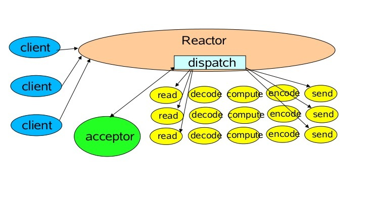

# Java堆外内存

# Netty基本结构

## Reactor线程模型
### 服务端线程模型
一种比较流行的做法是服务端监听线程和IO线程分离，类似于Reactor的多线程模型，它的工作原理图如下：



第一步，从用户线程发起创建服务端操作。

服务端的创建是在用户进程启动的时候进行，因此一般由Main函数或者启动类负责创建，服务端的创建由业务线程负责完成。在创建服务端的时候实例化了2个EventLoopGroup，1个EventLoopGroup实际就是一个EventLoop线程组，负责管理EventLoop的申请和释放。

EventLoopGroup管理的线程数可以通过构造函数设置，如果没有设置，默认取-Dio.netty.eventLoopThreads，如果该系统参数也没有指定，则为可用的CPU内核数 × 2。

**bossGroup**线程组实际就是**Acceptor**线程池，负责处理客户端的TCP连接请求，如果系统只有一个服务端端口需要监听，则建议bossGroup线程组线程数设置为1。

**workerGroup**是真正负责I/O读写操作的线程组，通过ServerBootstrap的group方法进行设置，用于后续的Channel绑定。

第二步，Acceptor线程绑定监听端口，启动NIO服务端。服务端Channel创建完成之后，将其注册到多路复用器Selector上，用于接收客户端的TCP连接。

第三步，如果监听到客户端连接，则创建客户端SocketChannel连接，重新注册到workerGroup的IO线程上。

## Channel实现
每一个Channel在其生命周期里绑定一个线程。
## Pipeline
### Creation of a pipeline
Each channel has its own pipeline and it is created automatically when a new channel is created.
### How an event flows in a pipeline
The following diagram describes how I/O events are processed by ChannelHandlers in a ChannelPipeline typically. An I/O event is handled by either a ChannelInboundHandler or a ChannelOutboundHandler and be forwarded to its closest handler by calling the event propagation methods defined in ChannelHandlerContext, such as ChannelHandlerContext.fireChannelRead(Object) and ChannelHandlerContext.write(Object).
<html>
  <pre>
  I/O Request
                                               via Channel or
                                           ChannelHandlerContext
                                                      |
  +---------------------------------------------------+---------------+
  |                           ChannelPipeline         |               |
  |                              Tail                \|/              |
  |    +---------------------+            +-----------+----------+    |
  |    | Inbound Handler  N  |            | Outbound Handler  1  |    |
  |    +----------+----------+            +-----------+----------+    |
  |              /|\                                  |               |
  |               |                                  \|/              |
  |    +----------+----------+            +-----------+----------+    |
  |    | Inbound Handler N-1 |            | Outbound Handler  2  |    |
  |    +----------+----------+            +-----------+----------+    |
  |              /|\                                  .               |
  |               .                                   .               |
  | ChannelHandlerContext.fireIN_EVT() ChannelHandlerContext.OUT_EVT()|
  |        [ method call]                       [method call]         |
  |               .                                   .               |
  |               .                                  \|/              |
  |    +----------+----------+            +-----------+----------+    |
  |    | Inbound Handler  2  |            | Outbound Handler M-1 |    |
  |    +----------+----------+            +-----------+----------+    |
  |              /|\                                  |               |
  |               |                                  \|/              |
  |    +----------+----------+            +-----------+----------+    |
  |    | Inbound Handler  1  |            | Outbound Handler  M  |    |
  |    +----------+----------+            +-----------+----------+    |
  |              /|\                                  |               |
  +---------------+-----------------------------------+---------------+
                  |                                  \|/
  +---------------+-----------------------------------+---------------+
  |               |                                   |               |
  |       [ Socket.read() ]                    [ Socket.write() ]     |
  |                              Head                                 |
  |                                                                   |
  |  Netty Internal I/O Threads (Transport Implementation)            |
  +--------------------------------------------------------------------
  </pre>
</html>

Let us assume that we created the following pipeline:

```
ChannelPipeline p = ...;
 p.addLast("1", new InboundHandlerA());
 p.addLast("2", new InboundHandlerB());
 p.addLast("3", new OutboundHandlerA());
 p.addLast("4", new OutboundHandlerB());
 p.addLast("5", new InboundOutboundHandlerX());
```

In the example above, the class whose name starts with Inbound means it is an inbound handler. The class whose name starts with Outbound means it is a outbound handler.
In the given example configuration, the handler evaluation order is 1, 2, 3, 4, 5 when an event goes inbound. When an event goes outbound, the order is 5, 4, 3, 2, 1. On top of this principle, ChannelPipeline skips the evaluation of certain handlers to shorten the stack depth:

3 and 4 don't implement ChannelInboundHandler, and therefore the actual evaluation order of an inbound event will be: 1, 2, and 5.
1 and 2 don't implement ChannelOutboundHandler, and therefore the actual evaluation order of a outbound event will be: 5, 4, and 3.
If 5 implements both ChannelInboundHandler and ChannelOutboundHandler, the evaluation order of an inbound and a outbound event could be 125 and 543 respectively.

## ByteBuf
A random and sequential accessible sequence of zero or more bytes (octets). This interface provides an abstract view for one or more **primitive byte arrays** (byte[]) and **NIO buffers**.

### Sequential Access Indexing
ByteBuf provides two pointer variables to support sequential read and write operations - readerIndex for a read operation and writerIndex for a write operation respectively. The following diagram shows how a buffer is segmented into three areas by the two pointers:
<html>
<pre>
      +-------------------+------------------+------------------+
      | discardable bytes |  readable bytes  |  writable bytes  |
      |                   |     (CONTENT)    |                  |
      +-------------------+------------------+------------------+
      |                   |                  |                  |
      0      <=      readerIndex   <=   writerIndex    <=    capacity
</pre>
</html>

### Derived buffers
You can create a view of an existing buffer by calling either duplicate(), slice() or slice(int, int). A derived buffer will have an independent readerIndex, writerIndex and marker indexes, while it shares other internal data representation, just like a NIO buffer does.

In case a completely fresh copy of an existing buffer is required, please call copy() method instead.

Also be aware that **obtaining derived** buffers will NOT call retain() and so the **reference count will NOT be increased**.

## 内存回收原理
### 软引用（SoftReference）

### 弱引用（WeakReference）

### 虚引用（PhantomReference）

TODO  在Netty中的作用


## 操作系统select, poll, epoll与Netty的对应关系

# 源码分析
## DefaultChannelConfig

```
if (option == CONNECT_TIMEOUT_MILLIS) {
    setConnectTimeoutMillis((Integer) value);
} else if (option == MAX_MESSAGES_PER_READ) {
    setMaxMessagesPerRead((Integer) value);
} else if (option == WRITE_SPIN_COUNT) {
    setWriteSpinCount((Integer) value);
} else if (option == ALLOCATOR) {
    setAllocator((ByteBufAllocator) value);
} else if (option == RCVBUF_ALLOCATOR) {
    setRecvByteBufAllocator((RecvByteBufAllocator) value);
} else if (option == AUTO_READ) {
    setAutoRead((Boolean) value);
} else if (option == AUTO_CLOSE) {
    setAutoClose((Boolean) value);
} else if (option == WRITE_BUFFER_HIGH_WATER_MARK) {
    setWriteBufferHighWaterMark((Integer) value);
} else if (option == WRITE_BUFFER_LOW_WATER_MARK) {
    setWriteBufferLowWaterMark((Integer) value);
} else if (option == WRITE_BUFFER_WATER_MARK) {
    setWriteBufferWaterMark((WriteBufferWaterMark) value);
} else if (option == MESSAGE_SIZE_ESTIMATOR) {
    setMessageSizeEstimator((MessageSizeEstimator) value);
} else {
    return false;
}
```
## ServerBootstrap启动
设置option，独有的option总共有三种既SO_RCVBUF，SO_REUSEADDR与SO_BACKLOG。
具体代码位于DefaultServerSocketChannelConfig。

设置childOption，独有的option有SO_RCVBUF，SO_SNDBUF，TCP_NODELAY，SO_KEEPALIVE，SO_REUSEADDR，SO_LINGER，IP_TOS，ALLOW_HALF_CLOSURE
具体代码位于DefaultSocketChannelConfig。


bootstrap.bind(port)。
绑定一个端口，未指定IP，则为0.0.0.0。
AbstractBootstrap.doBind方法包含初始化与注册，与绑定ServerChannel的Pipeline的doBind0方法
