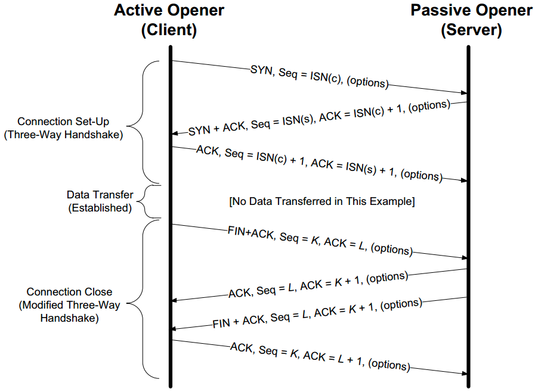

# 背景
## 可能出现的问题
1. Packet bit errors.
2. Packet reordering.
3. Packet duplication.
4. Packet erasures(drops).
5. Receiver inability to receive more data.
6. Intermediate router's inability to handle more data.

A straightforward method of **dealing with packet drops (and bit errors)** is to
resend the packet until it is received properly. This requires a way to determine (1) **whether the receiver has received the packet** and (2) w**hether the packet it received was the same one the sender sent**. The method for a receiver to signal to a sender that it has received a packet is called an acknowledgment, or ACK. In its most basic form, the sender sends a packet and awaits an ACK. When the receiver receives the packet, it sends the ACK. When the sender receives the ACK, it sends another packet, and the process continues. Interesting questions to ask here are (1) **How long should the sender wait for an ACK?** (2) **What if the ACK is lost?** (3) **What if the packet was received but had errors in it?**

## 针对问题的解决

### 窗口协议
This window structure is kept at both the sender and the receiver. At the sender, it keeps track of what packets can be released, what packets are awaiting ACKs, and what packets cannot yet be sent. At the receiver, it keeps track of what packets have already been received and acknowledged, what packets are expected (and how much memory has been allocated to hold them), and which packets, even if received, will not be kept because of limited memory.

### 流控制
To handle the problem that arises when a receiver is too slow relative to a sender,
we introduce a way to force the sender to slow down when the receiver cannot keep up.

Window-based flow control and is the most popular approach when sliding windows are being used. In this approach, the window size is not fixed but is instead allowed to vary over time. To achieve flow control using this technique, there must be a method for the
receiver to signal the sender how large a window to use. This is typically called a window advertisement, or simply a window update. The window update and ACK are carried in a single packet, meaning that the sender tends to adjust the size of its window at the same time it slides it
to the right.
### 拥塞控制
We may have routers with limited memory between the sender and the receiver that have to contend with slow network links. When this happens, it is possible for the sender's rate to exceed a router's ability to keep up, leading to packet loss. This is addressed with a special form of flow control called congestion control.

### 设置重传时间
A better strategy is to have the protocol implementation try to estimate them. This is
called round-trip-time estimation and is a statistical process.

# 简介
是一种面向连接的、可靠的、基于字节流的传输层通信协议。

面向连接：需要通过三次握手建立两端连接，四次挥手断开连接。通过两端的IP与端口确定一个连接。

可靠性：通过流量控制中**序列号**，**滑动窗口**，**ACK**与**SACK**，**发送方重传**，**校验和**等。
- Because it provides a byte stream interface, TCP must convert a sending application's stream of bytes into a set of packets that IP can carry. This is called packetization. These packets contain sequence numbers, which in TCP actually represent the byte offsets of the first byte in each packet in the overall data stream rather than packet numbers. The application data is broken into what TCP considers the best-size chunks to send, typically fitting each segment into a single IP-layer datagram that will not be fragmented. 
- TCP maintains a mandatory checksum on its header, any associated application data, and fields from the IP header. This is an end-to-end pseudo-header checksum whose purpose is to detect any bit errors introduced in transit.
- When TCP sends a group of segments, it normally sets a single retransmission timer, waiting for the other end to acknowledge reception.
- When TCP receives data from the other end of the connection, it sends an acknowledgment. This acknowledgment may not be sent immediately but is normally delayed a fraction of a second. The ACKs used by TCP are cumulative in the sense that an ACK indicating byte number N implies that all bytes up to number N(but not including it) have already been received successfully.
- TCP provides a full-duplex service to the application layer. This means that data can be flowing in each direction, independent of the other direction. Therefore, each end of a connection must maintain a sequence number of the data flowing in each direction. Once a connection is established, every TCP segment that contains data flowing in one direction of the connection also includes an ACK for segments flowing in the opposite direction. Each segment also contains a window advertisement for implementing flow control in the opposite direction.
- Using sequence numbers, a receiving TCP discards duplicate segments and reorders segments that arrive out of order. TCP never delivers data to the receiving application out of order. Thus, the receiving TCP may be forced to hold on to data with larger sequence numbers before giving it to an application until a missing lower-sequence-numbered segment (a "hole") is filled in.

基于字节流：字节流传输，无界，超过MSS则被拆分发送。TCP provides a byte stream abstraction to applications that use it. The consequence of this design decision is that no record markers or message boundaries are automatically inserted by TCP. Each segment also contains a window advertisement for implementing flow control in the opposite direction. 

# TCP Header and Encapsulation
## Encapsulation
IP Header(20 bytes--Ipv4, no options; 40 bytes--IPv6), TCP Header(20 bytes, no options), TCP Data

The TCP header appears immediately following the IP header or last IPv6 extension header and is often 20 bytes long (with no TCP options). With options, the TCP header can be as large as 60 bytes.

## TCP Header Format
Source Port(16 bits), Destination Port(16), Sequece Number(32), Acknoledgement Number(32), Header Length(4), Resv(3), NS(1), CWR(1), ECE(1), URG(1), ACK(1), PSH(1), RST(1), SYN(1), FIN(1), Window Size(16), TCP Checksum(16), Urgent Pointer(16), Options, Data

上述除了Options和Data，总共20bytes。

Acknowledgment Number, Window Size, plus ECE and ACK bits  refer to the data flowing in the opposite direction relative to the sender of this segment.

- **Header Length**: The normal size of TCP header is 20 bytes, unless options are present. The Header Length field gives the size of the header in 32-bit words (minimum value is 5).

- **Source Port, Destination Port**:  It is a pair of sockets or endpoints (the 4-tuple consisting of the client IP address, client port number, server IP address, and server port number) that uniquely identifies each TCP connection.
- **Sequence Number**: identifies the byte in the stream of data from the sending TCP to the receiving TCP that the first byte of data in the containing segment represents. This number is not 0 or 1 but instead is another number, often randomly chosen, called the initial sequence number (ISN). The reason for the ISN not being 0 or 1 is a security measure. The sequence number of the first byte of data sent on this direction of the connection is the ISN plus 1 because the SYN bit field consumes one sequence number. 

- **Acknowledgment Number**:  the Acknowledgment Number field (also called the ACK Number or ACK field for short) contains the next sequence number that the sender of the acknowledgment expects to receive. This field is valid only if the ACK bit field (described later in this section) is on, which it usually is for all but initial and closing segments.The ACK Number field is constructed to indicate the largest byte received in order at the receiver (plus 1).

- **Window Size**: TCP's flow control is provided by each end advertising a window size using the Window Size field. This is the number of bytes, starting with the one specified by the ACK number, that the receiver is willing to accept. This is a 16-bit field, limiting the window to 65,535 bytes, and thereby limiting TCP’s throughput performance. Window Scale option that allows this value to be scaled, providing much larger windows and improved performance
for high-speed and long-delay networks.

- **TCP Checksum**: The TCP Checksum field covers the TCP header and data and some fields in the IP header, using a pseudo-header computation similar to the one used with ICMPv6 and UDP. It is mandatory for this field to be calculated and stored by the sender, and then verified by the receiver.

- **Urgent Pointer**: This “pointer” is
a positive offset that must be added to the Sequence Number field of the segment to yield the sequence number of the last byte of urgent data. TCP’s urgent mechanism is a way for the sender to provide specially marked data to the other end.

- **Options**: 

Kind(1 byte) | Length(1 byte) | Name | Description and Purpose
---|---|---|---
0 | 1 | EOL | End of Option List
1 | 1 | NOP | No Operation (used for padding)
2 | 4 | MSS | Maximum Segment Size
3 | 3 | WSOPT | Window Scaling Factor (left-shift amount on window)
4 | 2 | SACK-Permitted | Sender supports SACK options
5 | Var. | SACK | SACK block(out-of-order data received)
8 | 10 | TSOPT | Timestamps Option
28 | 4 | UTO | User Timeout (abort after idle time)
29 | Var. | TCP-AO | Authentication option (using various algorithms)

Every option begins with a 1-byte kind that specifies the type of option. The options
with a kind value of 0 and 1 occupy a single byte. The other options have a len byte that follows the kind byte. The length is the total length, including the kind and len bytes. 

1. **Maximum Segment Size (MSS)**: It is the largest segment that a TCP is willing to receive from its peer and, consequently, the largest size its peer should ever use when sending. The MSS value counts only **TCP data bytes** and does not include the sizes of any associated TCP or IP header. When a connection is established, each end usually announces its MSS in **an MSS option carried with its SYN segment**.

2. **Selective Acknowledgement(SACK) Options**: A TCP learns that its peer is capable of advertising SACK information by
receiving the SACK-Permitted option in a SYN (or SYN + ACK) segment. Once this has taken place, the TCP receiving out-of-sequence data may provide a SACK option that describes the out-of-sequence data to help its peer perform retransmissions more efficiently.

3. **SACK block**: SACK information contained in a SACK option consists of a range of sequence numbers representing **data blocks the receiver has successfully received**. Each range is called a SACK block and is represented by a pair of 32-bit sequence numbers. Thus, a SACK option containing n SACK blocks is (8n + 2) bytes long. Two bytes are used to hold the kind and length of the SACK option. Because of the limited amount of space available in the option space of a TCP
header, the maximum number of SACK blocks available to be sent in a single segment is three (assuming the Timestamps option is also used).

4. **Window Scale**: effectively increases the capacity of the TCP Window Advertisement field from 16 to about 30 bits. This factor effectively left-shifts the window field value by the scale factor. This, in effect, multiplies **the window value by the value 2^s**, where s is the scale factor. **The maximum scale value of 14** provides for a maximum window of 1,073,725,440 bytes (65,535 × 214), close to 1,073,741,823 (2^30 −1), effectively 1GB. **This option can appear only in a SYN segment**, so the scale factor is fixed in each direction when the connection is established. The end doing the active open sends the option in its SYN, but the end doing the passive open can send the option only if the received SYN specifies the option.

5. **Timestamps Option**: The Timestamps option (sometimes called the Timestamp option and written as TSOPT or TSopt) lets the sender place two 4-byte timestamp values in every segment. The receiver reflects these values in the acknowledgment, allowing the sender to calculate an estimate of the connection's RTT for each ACK received. When using the Timestamps option, the sender places a 32-bit value in the Timestamp Value field (called TSV or TSval) in the first part of the TSOPT, and the receiver echoes this back unchanged in the second Timestamp Echo Retry field (called TSER or TSecr). The main reason for wishing to **calculate a good estimate of the connection's RTT is to set the retransmission timeout**, which tells TCP when it should try resending a segment that is likely lost. It also provides a way for the receiver to **avoid receiving old segments and considering them as valid**. This is called Protection Against Wrapped Sequence Numbers.

6. **User Timeout Option**: The User Timeout (UTO) option is a relatively new TCP capability described in [RFC5482]. The UTO value (also called USER_TIMEOUT) specifies the amount of time a TCP sender is willing to wait for an ACK of outstanding data before concluding that the remote end has failed. NAT devices could also interpret such information to help set their connection activity timers.

7. **Authentication Option**: There is an option used to enhance the security of TCP connections. It is designed to enhance and replace an earlier mechanism called TCP-MD5 [RFC2385].  It uses a cryptographic hash
algorithm (see Chapter 18), in combination with a secret value known to each end of a TCP connection, to authenticate each segment.

- **Data**: The data portion of the TCP segment is optional. when a connection is established, and when a connection is terminated, segments are exchanged that contain only the TCP header (with or without options) but no data. A header without any data is also used to acknowledge received data, if there is no data to be transmitted in that direction (called a pure ACK), and to notify the communication peer of a change in the window size (called a window update). 

### Flags(aka Control bits)
- **NS** (1 bit): ECN-nonce - concealment protection (experimental: see RFC 3540).
- **CWR** (1 bit): Congestion Window Reduced (CWR) flag is set by the sending host to indicate that it received a TCP segment with the ECE flag set and had responded in congestion control mechanism (added to header by RFC 3168).
- **ECE** (1 bit): ECN-Echo has a dual role, depending on the value of the SYN flag. It indicates: If the SYN flag is set (1), that the TCP peer is ECN capable. If the SYN flag is clear (0), that a packet with Congestion Experienced flag set (ECN=11) in the IP header was received during normal transmission (added to header by RFC 3168). This serves as an indication of network congestion (or impending congestion) to the TCP sender.
- **URG** (1 bit): indicates that the Urgent pointer field is significant.
- **ACK** (1 bit): indicates that the Acknowledgment field is significant. All packets after the initial SYN packet sent by the client should have this flag set.
> 例子：192.168.1.107.41358 > 163.177.151.110.80: Flags [.], cksum 0xfd59 (incorrect -> 0xe5f1), ack 2782, win 281, options [nop,nop,sack 1 {2601:2782}], length 0
- **PSH** (1 bit): Push function. Asks to push the buffered data to the receiving application.
- **RST** (1 bit): Reset the connection，触发场景有发送连接请求sync到对端，但端口不存在。一方直接强制断开。在之前已经建立的连接中推送数据，但实际上对端已经不存在该连接。 
> 192.168.1.104.811 > 192.168.1.107.60342: Flags [R.], cksum 0x51f3 (correct), seq 0, ack 82830824, win 0, length 0
- **SYN** (1 bit): Synchronize sequence numbers. Only the first packet sent from each end should have this flag set. Some other flags and fields change meaning based on this flag, and some are only valid when it is set, and others when it is clear.
> 例子：192.168.1.107.41358 > 163.177.151.110.80: Flags [S], cksum 0xfd61 (incorrect -> 0x86db), seq 3223777069, win 29200, options [mss 1460,sackOK,TS val 1789171209 ecr 0,nop,wscale 7], length 0

- **FIN** (1 bit): Last packet from sender.

# 连接管理

## Path MTU Discovery with TCP
Knowing the path MTU can help protocols such as TCP avoid fragmentation.  TCP, in providing the byte stream abstraction it implements, determines what segment size to use and as a result has a much greater degree of control over the size of IP datagrams that are ultimately generated.

When a connection is established, TCP uses the minimum of the MTU of the outgoing interface, or the MSS announced by the other end, as the basis for selecting its send maximum segment size (SMSS).

Once the initial SMSS is chosen, all IPv4 datagrams sent by TCP on that connection have the IPv4 DF bit field set.

## 连接建立
### 三次握手
假如两次握手，一个已失效的连接请求报文段突然又传送到了服务端，服务器误认为连接请求有效，一直等待客户端数据造成资源浪费。
### options情况

## 数据传输
主要内容位于# 超时与重传章节。
### options情况
#### SYN
- SACK-Permitted option appears in a SYN (or SYN + ACK) segment. 
- Maximum segment size.
- Window scale.
- Timestamp Options.
#### 数据传输过程
- Timestamp Options.
- SACK-block

## 连接关闭
### 四次挥手

多一次挥手因为是一方接收到FIN时意味将没有数据再发来，但是还是可以继续发送数据。

Either end can send a FIN when it is done sending data. When a TCP receives a FIN, it must notify the application that the other end has terminated that direction of data flow.

## Initial Sequence Number
It might be possible to have TCP segments being routed through the network that could show up later and disrupt a connection.

The ISN should change over time, so that each connection has a different one. The purpose of doing this is to arrange for the sequence numbers for segments on one connection to not overlap with sequence numbers on a another (new) identical connection.

If a connection had one of its segments
delayed for a long period of time and closed, but then opened again with the same 4-tuple, it is conceivable that the delayed segment could reenter the new connection's data stream as valid data.

knowing the connection 4-tuple as well as the currently active window of sequence numbers is all that is required to form a TCP segment that is considered valid to a communicating TCP endpoint. This represents a form of vulnerability for TCP: anyone can forge a TCP segment and, if the sequence numbers,
IP addresses, and port numbers are chosen appropriately, can interrupt a TCP
connection.

## 连接建立超时
Use the method of exponential backoff to handle timeout.

In Linux, the system configuration variable net.ipv4.tcp_syn_retries gives the maximum number of times to attempt to resend a SYN segment during an active open.

A corresponding value called net.ipv4.tcp_synack_retries gives the maximum number of times to attempt to resend a SYN + ACK segment when responding to a peer's active
open request.

## Maximum Segment Lifetime(MSL)
It is the maximum amount of time any segment can exist in the network before being discarded. We know that this time limit is bounded, because TCP segments are transmitted as IP datagrams, and the IP datagram has the TTL field or Hop Limit field that limits its effective lifetime. [RFC0793] specifies the MSL as 2 minutes.  On Linux, the value net.ipv4.tcp_fin_timeout holds the 2MSL wait timeout value (in seconds).

## TCP连接状态
- **LISTEN**
(server) represents waiting for a connection request from any remote TCP and port.
- **SYN-SENT**
(client) represents waiting for a matching connection request after having sent a connection request.
- **SYN-RECEIVED**
(server) represents waiting for a confirming connection request acknowledgment after having both received and sent a connection request.
- **ESTABLISHED**
(both server and client) represents an open connection, data received can be delivered to the user. The normal state for the data transfer phase of the connection.
- **FIN-WAIT-1**
(both server and client) represents waiting for a connection termination request from the remote TCP, or an acknowledgment of the connection termination request previously sent.
- **FIN-WAIT-2**
(both server and client) represents waiting for a connection termination request from the remote TCP.
- **CLOSE-WAIT**
(both server and client) represents waiting for a connection termination request from the local user.
- **CLOSING**
(both server and client) represents waiting for a connection termination request acknowledgment from the remote TCP.
- **LAST-ACK**
(both server and client) represents waiting for an acknowledgment of the connection termination request previously sent to the remote TCP (which includes an acknowledgment of its connection termination request).
- **TIME-WAIT**
(either server or client) represents waiting for enough time to pass to be sure the remote TCP received the acknowledgment of its connection termination request. [According to RFC 793 a connection can stay in TIME-WAIT for a maximum of four minutes known as two MSL (maximum segment lifetime).]
- **CLOSED**
(both server and client) represents no connection state at all.

## 正在进来的连接队列
进入的新连接处于两种状态。第一种状态是连接未完成但已经收到SYN，处于SYN_RCVD状态。第二种已经完成三次握手处于ESTABLISHED状态，但是连接还未被应用接受。操作系统一般实现两个独立的队列应对上诉两个场景。

net.ipv4.tcp_max_syn_backlog该系统范围参数限制请求SYN到达且处于SYN_RCVD状态的连接数量。

每个监听端有一个固定长度的已经被TCP接受（三次握手完成）的连接队列。应用程序可以设置这个长度，通常叫做backlog。这个backlog必须在0到net.core.somaxconn（系统参数）之间。

# 超时与重传

## 指数退避算法
This doubling of time between successive retransmissions is called a binary exponential backoff.

## RTT（Round-Trip Time）的变化
Knowing the RTT is made more complicated because it can change over time, as routes and network usage vary. TCP must track these changes and modify its timeout accordingly in order to maintain good performance.

## 初始RTO
According to [RFC6298], the initial setting for the RTO(Retransmission Timeout) should be 1s, although 3s is used in the event of a timeout on the initial SYN segment.

## Linux参数
- **tcp_retries1** (integer; default: 3; since Linux 2.2) The number of times TCP will attempt to retransmit a packet on an established connection normally, without the extra effort of getting the network layers involved.  Once we exceed this number of retransmits, we first have the network layer update the route if possible before each new retransmit.  The default is the RFC specified minimum of 3.

- **tcp_retries2** (integer; default: 15; since Linux 2.2) The maximum number of times a TCP packet is retransmitted in established state before giving up.  The default value is 15, which corresponds to a duration of approximately between 13 to 30 minutes, depending on the retransmission timeout.  The RFC 1122 specified minimum limit of 100 seconds is typically deemed too short.

- SYN segments, **net.ipv4.tcp_syn_retries**
and **net.ipv4.tcp_synack_retries** bounds the number of retransmissions of SYN segments; their default value is 5 (roughly 180s)

## 基于时间的重传
Once a sending TCP has established its RTO based upon measurements of the time-varying values of effective RTT, whenever it sends a segment it ensures that a retransmission timer is set appropriately.

When TCP fails to receive an ACK for a segment it has timed on a connection within the RTO, it performs a timer-based retransmission.

TCP considers a timer-based retransmission as a fairly major event; it reacts very cautiously when it happens by **quickly reducing the rate at which it sends data into the network**. It does this in two ways. 
- The first way is to reduce its sending window size based on congestion control procedures (see Chapter 16). 
- The other way is to keep increasing a multiplicative backoff factor
applied to the RTO each time a retransmitted segment is again retransmitted.

## 快速重传
Packet loss can often be more quickly and efficiently repaired using fast retransmit than with timer-based retransmission. 

### Duplicate ACK
The duplicate ACKs sent immediately when out-of-order data arrives are not delayed. The reason is to let the sender know that a segment was received out of order, and to indicate what sequence number is expected (i.e., where the hole is). When SACK is used, these duplicate ACKs typically contain SACK blocks as well, which can provide information about more than one hole.

### Algorithm
A TCP sender observing at least dupthresh duplicate ACKs retransmits one or more packets that appear to be missing without waiting for a retransmission timer to expire. It may also send additional data that has not yet been sent. 

Packet loss inferred by the presence of duplicate ACKs is assumed to be related to network congestion, and congestion control procedures (discussed in Chapter 16) are invoked along with fast retransmit. Without SACK, no more than one segment is typically retransmitted until an acceptable ACK is received. With SACK, ACKs contain additional information allowing the sender to fill more than one hole in the receiver per RTT.

'拥塞控制/快速重传'讲解了流程。
## 选择性重传确认
Gaps between the ACK number and other in-window data cached at the receiver are called holes.

The job of a sending TCP is to fill the holes in the receiver by retransmitting any data the receiver is missing, yet to be as efficient as possible by not resending data the receiver already has.

A SACK-capable receiver is allowed to generate SACKs if it has received the SACK-Permitted option during the TCP connection establishment.

## 欺骗性超时与重传
Under a number of circumstances, TCP may initiate a retransmission even when no data has been lost. Such undesirable retransmissions are called spurious retransmissions and are caused by spurious timeouts (timeouts firing too early) and other reasons such as packet reordering, packet duplication, or lost ACKs. 

### The Eifel Detection Algorithm
 The experimental Eifel Detection Algorithm [RFC3522] deals with this problem using the TCP **TSOPT** to detect spurious retransmissions. After a retransmission timeout occurs, Eifel awaits the next acceptable ACK. If the next acceptable ACK indicates that the first copy of a retransmitted packet (called the original transmit) was the cause for the ACK, the retransmission is considered to be spurious.

 ### The Eifel Response Algorithm
 It is a standard set of operations to be executed by a TCP once a retransmission has been deemed spurious.  Based on an appropriate detection algorithm, the Eifel response algorithm provides a way for a TCP sender to respond to a detected spurious timeout. It adapts the retransmission timer to avoid further spurious timeouts and (depending on the detection algorithm) can avoid the often unnecessary go-back-N retransmits that would otherwise be sent.

## 数据包重排序与重复
Packet reordering can occur in an IP network because IP provides no guaranteethat relative ordering between packets is maintained during delivery.

## 重新打包
When TCP times out and retransmits, it does not have to retransmit the identical segment. Instead, TCP is allowed to perform repacketization, sending a bigger segment, which can increase performance. (Naturally, this bigger segment cannot
exceed the MSS announced by the receiver and should not exceed the path MTU.)

# 流量控制
## 滑动窗口协议
TCP的滑动窗口主要有两个作用，一是提供TCP的可靠性，二是提供TCP的流控特性。

滑动窗口协议是传输层进行流控的一种措施，接收方通过通告发送方自己的窗口大小，从而控制发送方的发送速度，从而达到防止发送方发送速度过快而超过自己的接收能力的目的。

一是期望接收到的下一字节的序号n，该n代表接收方已经接收到了前n-1字节数据，此时如果接收方收到第n+1字节数据而不是第n字节数据，接收方是不会发送序号为n+2的ACK的

发送方维持发送窗口，接收方维持接收窗口。

发送方根据收到ACK当中的期望收到的下一个字节的序号n以及窗口m，还有当前已经发送的字节序号x，算出还可以发送的字节数。

### 滑动窗口基本原理
1）对于TCP会话的发送方，任何时候在其发送缓存内的数据都可以分为4类，“已经发送并得
到对端ACK的”，“已经发送但还未收到对端ACK的”，“未发送但对端允许发送的”，“未发送且对端不允许发送”。“已经发送但还未收到对端ACK的”和“未发送但对端允许发送的”这两部分数据称之为发送窗口。

2）对于TCP的接收方，在某一时刻在它的接收缓存内存在3种。“已接收”，“未接收准备接收”，“未接收并未准备接收”（由于ACK直接由TCP协议栈回复，默认无应用延迟，不存在“已接收未回复ACK”）。其中“未接收准备接收”称之为接收窗口。

### Delayed Acknowledgement
In essence, several ACK responses may be combined together into a single response, reducing protocol overhead. As described in RFC 1122, a host may delay sending an ACK response by up to 500 ms. A delayed ACK can reduce the number of segments sent by the server by a factor of 3 (ACK, window update, and echo character all combined in one  segment).

### Nagle算法
当已经发出的数据还没有收到ACK，那么小块数据(小于SMSS)不可以被发送，直到收到之前发出数据包的ack回复，然后发送之前累积的数据。

特点就数量少但体积大的包被使用，但是增加了时延。

### Selective Acknowledgement(SACK)
A TCP learns that its peer is capable of advertising SACK information by receiving the SACK-Permitted option in a SYN (or SYN + ACK) segment. Once this has taken place, the TCP receiving out-of-sequence data may provide a SACK option that describes the out-of-sequence data to help its peer perform retransmissions more efficiently. SACK information contained in a SACK option consists of a range of sequence numbers representing data blocks the receiver has successfully received. 

The maximum number of SACK blocks available to be sent in a single segment is three (assuming the Timestamps option is also used). 
# 拥塞控制
拥塞窗口是网络可用容量的预估。
## 慢启动
忙启动算法通常由TCP连接创建或因重传超时而发现丢包时启动。有时也因空闲时间过长而触发。

有启动窗口，每次收到ACK则发送窗口加上ACK数量与SMSS最小值。呈现指数型增长。若发现网络拥塞，则发送窗口减半，进入拥塞避免模式。
## 拥塞避免
慢启动到达某个转换点，建立ssthresh后，进入拥塞避免模式。此时拥塞窗口每发完一次窗口加约一段的方式的次线性增加。
## ssthresh
对没有丢包的最优发送窗口的预测。

## 快速重传
假如发送序列号为1,2,3,4,5,6个包，其中1到达，2与3丢失，4、5与6到达接收方后均回复编号为2的ack，那么这些ack就是dup ack(duplicate acknowledgement)，一旦发送方接收到三个dup ack也就是加上最开始的序列号为1的回复总共4个ack，那么发送方认为更高的序列号的包丢失，开始直接重传序列号为2的包，而不是等待超时时间然后重传。

# 其他
## MSS（最大分段大小）
SMSS：发送方最大分段大小

MSS经常设计成MTU减去IP和TCP首部的固定长度。以太网中使用IPv4MSS值为1460，使用IPv6的MSS值为1440（两者TCP首部都是20字节，但是IPv6首部是40字节，IPv4首部是20字节）。

## 重试算法
指数退避。

# Linux TCP参数
见Linux系统参数。