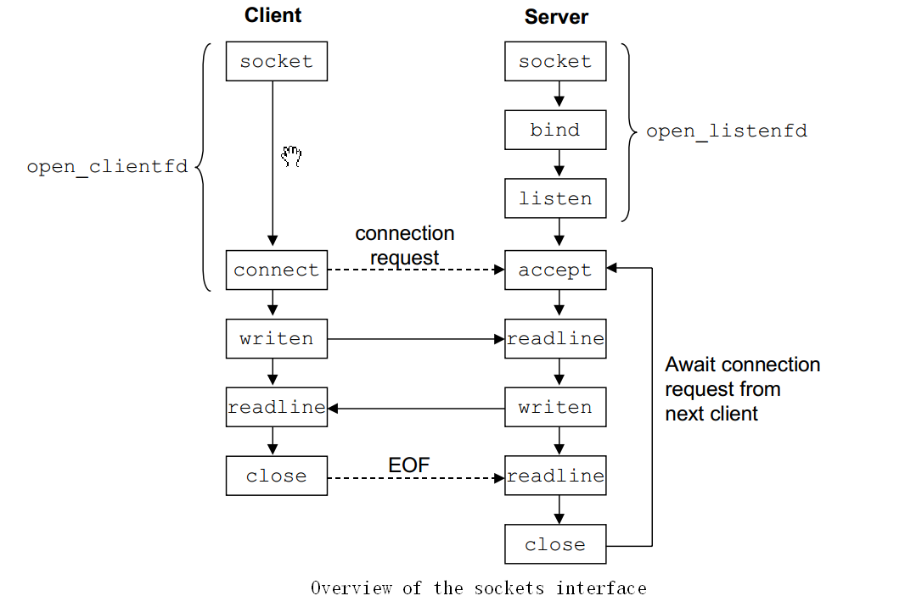
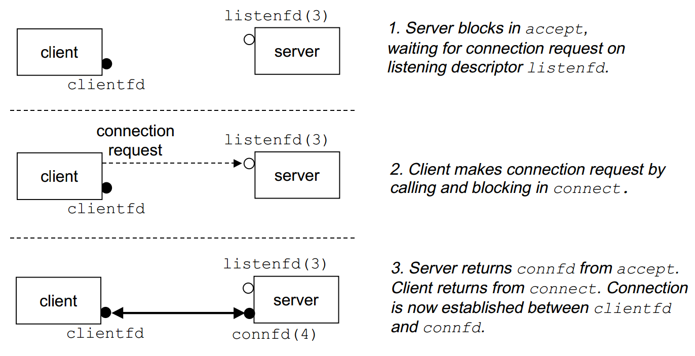

# Unix file I/O
**All I/O devices**, such as networks, disks, and terminals, are **modeled as files**, and all input and output is performed by reading and writing the appropriate files. 

An application announces its intention to **access an I/O device** by asking the kernel to **open the corresponding file**. The kernel returns a small non-negative integer, called a descriptor, that identifies the file in
all subsequent operations on the file. The kernel keeps track of all information about the open file; the application keeps track of only the descriptor.

When an application is finished reading and writing the file, it informs the kernel by asking it to close the file. When a process terminates for any reason, the kernel closes all open files, and frees their memory resources.

By convention, each process created by a Unix shell begins life with three open files: standard input(descriptor 0), standard output (descriptor 1), and standard error (descriptor 2).


# 操作数据
## 打开文件
The open function creates new files and
opens existing files. 
```
int open (const char *__file, int __oflag, ...)
```
## 写数据
```
#include <unistd.h>

//returns: number of bytes written if OK, -1 on error
ssize t write(int fd, const void *buf, size t count);

```

## 读数据
```
#include <unistd.h>

//returns: number of bytes read if OK, 0 on EOF, -1 on error
ssize t read(int fd, void *buf, size t count);

```

## 关闭文件
```
#include <unistd.h>

int close(int fd);
```
The kernel does not delete the associated file table entry unless the reference count is zero.

## socket
From the perspective of the Unix kernel, a socket is an endpoint for communication. From the perspective of a Unix program, a socket is an open file with a corresponding descriptor.



Clients and servers use the socket function to create a socket descriptor.
```
#include <sys/types.h>
#include <sys/socket.h>

//returns: nonnegative descriptor if OK, -1 on error
int socket(int domain, int type, int protocol);

//example code: 
/*AF_INET indicates that we are using the Internet.
SOCK_STREAM indicates that the socket will be an endpoint for an Internet connection. 
The sockfd  descriptor returned by socket is only partially opened and cannot yet be used for reading and writing. */
sockfd = Socket(AF_INET, SOCK_STREAM, 0);

```
# 服务开启
## bind
The functions — bind, listen, and accept — are used by servers to establish connections with clients.

```
#include <sys/socket.h>

//returns: 0 if OK, -1 on error
int bind(int sockfd, struct sockaddr *my_addr, int addrlen)
```
The bind function tells the kernel to associate the server's socket address in my_addr with the socket descriptor sockfd. The addrlen argument is sizeof(sockaddr_in).

## listen
By default, the kernel assumes that a descriptor created by the socket function
corresponds to an active socket that will live on the client end of a connection. A server calls the listen function to tell the kernel that the descriptor will be used by a server instead of a client

## accept
Servers wait for connection requests from clients by calling the accept function.
```
#include <sys/socket.h>

//returns: nonnegative connected descriptor if OK, -1 on error
int accept(int listenfd, struct sockaddr *addr, int *addrlen);
```
The accept function waits for a connection request from a client to arrive on the listening descriptor listenfd, then fills in the client's socket address in addr, and returns a connected descriptor that can be used to communicate with the client using Unix I/O functions.



# 客户端发起连接
A client establishes a connection with a server by calling the connect function.
```
#include <sys/socket.h>

int connect(int sockfd, struct sockaddr *serv addr, int addrlen );
```
The connect function blocks until either the connection is successfully established, or an error occurs. If successful, the sockfd descriptor is now ready for reading and writing, and the resulting connection is characterized by the socket pair (x:y, serv_addr.sin_addr:serv_addr.sin_port) where **x** is the **client's IP** address and **y** is the **ephemeral port** that uniquely identifies the client process on the client host.
```
#include <sys/socket.h>

//returns: 0 if OK, -1 on error
int listen(int sockfd, int backlog);
```
The listen function converts sockfd from an active socket to a listening socket that can accept connection requests from clients. The backlog argument is a hint about the number of outstanding connection requests that the kernel should queue up before it starts to refuse requests.

## JDK函数

# TCP连接状态变化 
## 成功建立连接
客户端发起SYN请求到服务端，此时客户端状态为SYNC_SENT，服务端收到SYN后，此时状态变成SYN_RCV。

## 建立连接的参数
### SO_REUSEADDR
Allows the process to bind a port number that is already in use, but the IP address being bound (including the wildcard) must not already be bound to that same port.

For example, if an attached interface has the IP address 140.252.1.29 then one socket can be bound to 140.252.1.29, port 5555; another socket can be bound to 127.0.0.1, port 5555; and another socket can be bound to the wildcard IP address, port 5555. The call to bind for the second and third cases must be preceded by a call to setsockopt, setting the so_reuseaddr option.

SO_REUSEADDR allows your server to bind to an address which is in a TIME_WAIT state.


### SO_LINGER
```
//SO_LINGER选项有如下结构：
struct linger {
     int l_onoff; /* 0 = off, nozero = on */
     int l_linger; /* linger time */
};
```
The effect of an setsockopt(..., SO_LINGER,...) depends on what the values in the linger structure (the third parameter passed to setsockopt()) are:

**Case 1:  linger->l_onoff is zero** (linger->l_linger has no meaning): This is the default.

A close() retures immediately. On close(), the underlying stack **attempts to gracefully shutdown the connection after ensuring all unsent data is sent**. In the case of connection-oriented protocols such as **TCP, the stack also ensures that sent data is acknowledged by the peer**.  The stack will perform the above-mentioned graceful shutdown in the background (after the call to close() returns), regardless of whether the socket is blocking or non-blocking.

**Case 2: linger->l_onoff is non-zero and linger->l_linger is zero**:

A close() returns immediately. The underlying stack discards any unsent data, and, in the case of connection-oriented protocols such as TCP, sends a RST (reset) to the peer (this is termed a hard or abortive close). All subsequent attempts by the peer's application to read()/recv() data will result in an ECONNRESET.

**Case 3: linger->l_onoff is non-zero and linger->l_linger is non-zero**:

A close() will either block (if a blocking socket) or fail with EWOULDBLOCK (if non-blocking) until a graceful shutdown completes or the time specified in linger->l_linger elapses (time-out). Upon time-out the stack behaves as in case 2 above.

#### 参考文献
[What exactly does SO_LINGER do?](https://developerweb.net/viewtopic.php?id=2982)

[SO_LINGER --- Linux Programmer's Manual](http://man7.org/linux/man-pages/man7/socket.7.html)

## 主动关闭方发起关闭连接动作
程序执行int close(int fd)函数，关闭连接描述符，相当于发起FIN到被关闭方。此时如果被关闭方未回复ack，那么主动关闭方将进行重试。此主动关闭方应用程序不再引用该TCP连接，连接进入orphan状态。

### Orphan Socket
不属于任何进程的socket叫orphan socket。orphan sockets是没有与任何文件描述符关联的socket，应用程序已经不能与此socket进行交互了，但是由于内核中TCP未完成，仍然占用TCP的内存暂时不能释放。 

#### Orphan Socket的连接处于TCP状态阶段
TCP_FIN_WAIT_1、TCP_LAST_ACK、TCP_CLOSING状态都可归类计数于orphan socket，但当通过TCP_LINGER2或sysctl_tcp_fin_timeout设置的超时时间大于60秒时的TCP_FIN_WAIT2的连接也归类计数于orphan socket；小于60秒的TCP_FIN_WAIT2状态的连接则归类计数于TIME_WAIT，从代码可以看出TCP_TIME_WAIT状态是不计入orphan socket；TCP_CLOSE_WAIT 状态的连接既不计入orphan socket 也不计入TIME_WAIT。

##### 参考文献
[结合案例深入解析orphan socket产生与消亡（二）](https://yq.aliyun.com/articles/92925?spm=a2c4e.11155435.0.0.e3cc75b5A0A3vw)

## 主动关闭方收到被关闭方对FIN包的ACK回复 
此时主动关闭方状态变化为FIN_WAIT_2，等待来自被关闭方的FIN请求。被关闭方收到FIN请求，状态变为CLOSE_WAIT。

### close_wait分析
如果被关闭方不进行int close(int fd)，那么被关闭方的连接状态将会一直处于CLOSE_WAIT状态，也就是程序会一直持有该连接文件描述符而不释放资源。

## 主动关闭方收到被关闭方的FIN包
FIN请求只有被关闭方程序主动调用int close(_waint fd)才会发起，一旦FIN请求发起，那么被关闭方的状态变成LAST_ACK，等待来自主动关闭方的ACK回复，如果未收到回复将会进行重试。此时主动关闭方收到FIN包后，状态变为TIME_WAIT，超时长度为2MSL。

### last_ack分析
此时被动关闭方应用程序不再引用该TCP连接，连接进入orphan状态。

## time_wait过程
见## TIME_WAIT定时器。

# TCP 7个定时器
## 建立连接定时器(connection-establishment timer)
发送syn可能丢失，所以需要定时器进行重传。客户端syn重传次数/proc/sys/net/ipv4/tcp_syn_retries，服务端syn+ack重传次数/proc/sys/net/ipv4/tcp_synack_retries。

## 重传计时器
当TCP发送报文段时，就创建该特定报文段的重传计时器。
1.1、若在计时器截止时间到(通常60秒)之前收到了对此特定报文段的确认，则撤销此计时器。
1.2、若在计时器截止时间之前没有收到对此特定报文的确认，则就认为该报文丢失，需要重传此报文段，并将计时器复位。

## 延迟应答定时器(delayed ACK timer)
这个定时器是在延迟应答的时候使用的。目的等一段时间（一般不超过200 ms），如果服务端有数据发给客户端，那么会把数据同ack一起发给客户端。

## 坚持定时器(persist timer)
如果发送方收到接收方要求的窗口大小为0时，那么此时发送方便不会再发数据，假如接收方可接受的窗口大于0时，会发送一个ack告诉发送方，假如这个ack丢失，那么发送方会等待，为了防止死锁发生，那么发送方使用一个定时器周期性向接收方发送窗口探查（window probe），以便查询是否接收方窗口是否增大。

## 保活定时器(keepalive timer)
TCP连接建立的时候指定了SO_KEEPALIVE，保活定时器才会生效。有以下关于此定时器的参数分别为net.ipv4.tcp_keepalive_intvl，net.ipv4.tcp_keepalive_probes和net.ipv4.tcp_keepalive_time。

## FIN_WAIT_2定时器(FIN_WAIT_2 timer)
主动关闭方发送fin请求到接收方，如果收到ack进入FIN_WAIT_2状态后，会等待来自被动关闭方的fin请求。因为不能一直等待不释放资源，所以主动关闭方使用一个定时器超过一定时间后直接释放这个链接。超时时间参数位于/proc/sys/net/ipv4/tcp_fin_timeout。

## TIME_WAIT定时器 (TIME_WAIT timer, 也叫2MSL timer)
TIME_WAIT是主动关闭连接的一端最后进入的状态。进入此状态一个目的是防止被动关闭方发起fin请求后，因为一些原因比如网络丢包，而未收到来自主动关闭方的ack，那么被动关闭方会进行重试，另一个目的是任何迟到的报文段会被接收并丢弃，防止老的TCP连接的包在新的TCP连接里面出现。当然，在这个2MSL等待时间内，不会建立同样(源IP, 源端口，目的IP，目的端口)的连接。


# Zero-copy
## Principle
"Zero-copy" describes computer operations in which the CPU does not perform the task of copying data from one memory area to another. This is frequently used to save CPU cycles and memory bandwidth when transmitting a file over a network.

Zero-copy versions of operating system elements, such as device drivers, file systems, and network protocol stacks, greatly increase the performance of certain application programs and more efficiently utilize system resources. Performance is enhanced by allowing the CPU to move on to other tasks while data copies proceed in parallel in another part of the machine. Also, zero-copy operations reduce the number of time-consuming mode switches between user space and kernel space. System resources are utilized more efficiently since using a sophisticated CPU to perform extensive copy operations, which is a relatively simple task, is wasteful if other simpler system components can do the copying.

## Hardware implementations
An early implementation was IBM OS/360 where a program could instruct the channel subsystem to copy blocks of data from one file or device to another without the nucleus having to copy the data to an intermediate buffer.

Techniques for creating zero-copy software include the use of DMA-based copying and memory-mapping through an MMU. These features require specific hardware support and usually involve particular memory alignment requirements.

A newer approach used by the Heterogeneous System Architecture (HSA) facilitates the passing of pointers between the CPU and the GPU and also other processors. This requires a unified address space for the CPU and the GPU.[2

[零拷贝(Zero-copy) 浅析及其应用][https://www.cnblogs.com/rickiyang/p/13265043.html]

### 编程语言相关函数
对应C语言中的ssize_t sendfile(int out_fd, int in_fd, off_t *offset, size_t count)和Java中的FileChannal.transferTo().

[Zero Copy I: User-Mode Perspective](https://www.linuxjournal.com/article/6345)


# TCP 粘包/拆包的原因及解决方法
TCP是以流的方式来处理数据，一个完整的包可能会被TCP拆分成多个包进行发送，也可能把小的封装成一个大的数据包发送。

## TCP粘包/分包的原因
- 应用程序写入的字节大小**大于套接字发送缓冲区的大小，会发生拆包现象**，而应用程序写入数据**小于套接字缓冲区大小**，网卡将应用多次写入的数据一起发送到网络上，这将会**发生粘包现象**。
- 进行**MSS**大小的TCP分段，当TCP报文长度-TCP头部长度>MSS的时候将发生拆包
- 以太网帧的payload（净荷）**大于MTU（1500字节）进行ip分片**。

## 解决方法（Netty实现例子）
- 消息定长：FixedLengthFrameDecoder类
- 包尾增加特殊字符分割：行分隔符类：LineBasedFrameDecoder或自定义分隔符类 ：DelimiterBasedFrameDecoder
- 将消息分为消息头和消息体：LengthFieldBasedFrameDecoder类。分为有头部的拆包与粘包、长度字段在前且有头部的拆包与粘包、多扩展头部的拆包与粘包。

[最全netty知识点总结](https://blog.csdn.net/aa1215018028/article/details/80948894)

# TCP缓冲区
每个TCP套接字有一个发送缓冲区，我们可以用SO_SNDBUF套接字选项来更改该缓冲区的大小。当某个应用进程调用write时，内核从该应用进程的缓冲区复制所有数据到套接字的发送缓冲区。如果该套接字的发送缓冲区容不下该应用进程的所有数据（或是应用进程的缓冲区大于套接字的发送缓冲区，或是套接字的发送缓冲区中已有其他数据），该应用进程将被进入睡眠。这里假设该套接字是阻塞的，它通常是默认设置。因此，从写一个TCP套接字的write调用成功返回仅仅表示我们可以重新使用原来的应用进程缓冲区，并不表明对端的TCP或应用进程已接受到数据。

[TCP/IP学习（四）TCP缓冲区大小及限制](https://blog.csdn.net/ysu108/article/details/7764461 )


# Linux的socket 事件wakeup callback机制
linux(2.6+)内核的事件wakeup callback机制，这是IO多路复用机制存在的本质。Linux通过socket睡眠队列来管理所有等待socket的某个事件的process，同时通过wakeup机制来异步唤醒整个睡眠队列上等待事件的process，通知process相关事件发生。通常情况，socket的事件发生的时候，其会顺序遍历socket睡眠队列上的每个process节点，调用每个process节点挂载的callback函数。在遍历的过程中，如果遇到某个节点是排他的，那么就终止遍历，总体上会涉及两大逻辑：（1）睡眠等待逻辑；（2）唤醒逻辑。

（1）睡眠等待逻辑：涉及select、poll、epoll_wait的阻塞等待逻辑

- select、poll、epoll_wait陷入内核，判断监控的socket是否有关心的事件发生了，如果没，则为当前process构建一个wait_entry节点，然后插入到监控socket的sleep_list
- 进入循环的schedule直到关心的事件发生了
- 关心的事件发生后，将当前process的wait_entry节点从socket的sleep_list中删除。

（2）唤醒逻辑：
- socket的事件发生了，然后socket顺序遍历其睡眠队列，依次调用每个wait_entry节点的callback函数
- 直到完成队列的遍历或遇到某个wait_entry节点是排他的才停止。
- 一般情况下callback包含两个逻辑：1.wait_entry自定义的私有逻辑；2.唤醒的公共逻辑，主要用于将该wait_entry的process放入CPU的就绪队列，让CPU随后可以调度其执行。

# Select
当用户process调用select的时候，select会将需要监控的readfds集合拷贝到内核空间（假设监控的仅仅是socket可读），然后遍历自己监控的socket sk，挨个调用sk的poll逻辑以便检查该sk是否有可读事件，遍历完所有的sk后，如果没有任何一个sk可读，那么select会调用schedule_timeout进入schedule循环，使得process进入睡眠。如果在timeout时间内某个sk上有数据可读了，或者等待timeout了，则调用select的process会被唤醒，接下来select就是遍历监控的sk集合，挨个收集可读事件并返回给用户了。

## Select存在两个问题
1. 被监控的fds需要从用户空间拷贝到内核空间为了减少数据拷贝带来的性能损坏，内核对被监控的fds集合大小做了限制，并且这个是通过宏控制的，大小不可改变(限制为1024)。
2. 被监控的fds集合中，只要有一个有数据可读，整个socket集合就会被遍历一次调用sk的poll函数收集可读事件由于当初的需求是朴素，仅仅关心是否有数据可读这样一个事件，当事件通知来的时候，由于数据的到来是异步的，我们不知道事件来的时候，有多少个被监控的socket有数据可读了，于是，只能挨个遍历每个socket来收集可读事件。

# Poll
下面是poll的函数原型，poll改变了fds集合的描述方式，使用了pollfd结构而不是select的fd_set结构，使得poll支持的fds集合限制远大于select的1024。poll只解决了fds集合大小1024的限制问题

# Epoll
于是，epoll引入了epoll_ctl系统调用，将高频调用的epoll_wait和低频的epoll_ctl隔离开。同时，epoll_ctl通过(EPOLL_CTL_ADD、EPOLL_CTL_MOD、EPOLL_CTL_DEL)三个操作来分散对需要监控的fds集合的修改，做到了有变化才变更，将select或poll高频、大块内存拷贝(集中处理)变成epoll_ctl的低频、小块内存的拷贝(分散处理)，避免了大量的内存拷贝。同时，对于高频epoll_wait的可读就绪的fd集合返回的拷贝问题，epoll通过内核与用户空间mmap(内存映射)同一块内存来解决。mmap将用户空间的一块地址和内核空间的一块地址同时映射到相同的一块物理内存地址（不管是用户空间还是内核空间都是虚拟地址，最终要通过地址映射映射到物理地址），使得这块物理内存对内核和对用户均可见，减少用户态和内核态之间的数据交换。

Its function is to monitor multiple file descriptors to see whether I/O is possible on any of them. It is meant to replace the older [POSIX](https://en.wikipedia.org/wiki/POSIX) [`select(2)`](https://en.wikipedia.org/wiki/Select_(Unix)) and `poll(2)` [system calls](https://en.wikipedia.org/wiki/System_call), to achieve better performance in more demanding applications, where the number of watched [file descriptors](https://en.wikipedia.org/wiki/File_descriptor) is large (unlike the older system calls, which operate in *O*(*n*) time, `epoll` operates in *O*(1) timehttps://en.wikipedia.org/wiki/Epoll#cite_note-2)).

```C
#define MAX_EVENTS 10
struct epoll_event ev, events[MAX_EVENTS];
int listen_sock, conn_sock, nfds, epollfd;
/* Code to set up listening socket, 'listen_sock',
              (socket(), bind(), listen()) omitted. */
epollfd = epoll_create1(0);
if (epollfd == -1) {
    perror("epoll_create1");
    exit(EXIT_FAILURE);
}
ev.events = EPOLLIN;
ev.data.fd = listen_sock;
if (epoll_ctl(epollfd, _ADD, listen_sock, &ev) == -1) {
    perror("epoll_ctl: listen_sock");
    exit(EXIT_FAILURE);
}
for (;;) {
    nfds = epoll_wait(epollfd, events, MAX_EVENTS, -1);
    if (nfds == -1) {
        perror("epoll_wait");
        exit(EXIT_FAILURE);
    }
    for (n = 0; n < nfds; ++n) {
        if (events[n].data.fd == listen_sock) {
            conn_sock = accept(listen_sock, (struct sockaddr *) &addr, &addrlen);
            if (conn_sock == -1) {
                perror("accept");
                exit(EXIT_FAILURE);
            }
            setnonblocking(conn_sock);
            ev.events = EPOLLIN | EPOLLET;
            ev.data.fd = conn_sock;
            if (epoll_ctl(epollfd, EPOLL_CTL_ADD, conn_sock,
                          &ev) == -1) {
                perror("epoll_ctl: conn_sock");
                exit(EXIT_FAILURE);
            }
        } else {
            do_use_fd(events[n].data.fd);
        }
    }
}
```


[epoll-wiki](https://en.wikipedia.org/wiki/Epoll)

[epoll(7) — Linux manual page](https://man7.org/linux/man-pages/man7/epoll.7.html)

## 按需遍历就绪的fds集合
通过上面的socket的睡眠队列唤醒逻辑我们知道，socket唤醒睡眠在其睡眠队列的wait_entry(process)的时候会调用wait_entry的回调函数callback，并且，我们可以在callback中做任何事情。为了做到只遍历就绪的fd，我们需要有个地方来组织那些已经就绪的fd。为此，epoll引入了一个中间层，一个双向链表(ready_list)，一个单独的睡眠队列(single_epoll_wait_list)，并且，与select或poll不同的是，epoll的process不需要同时插入到多路复用的socket集合的所有睡眠队列中，相反process只是插入到中间层的epoll的单独睡眠队列中，process睡眠在epoll的单独队列上，等待事件的发生。同时，引入一个中间的wait_entry_sk，它与某个socket sk密切相关，wait_entry_sk睡眠在sk的睡眠队列上，其callback函数逻辑是将当前sk排入到epoll的ready_list中，并唤醒epoll的single_epoll_wait_list。而single_epoll_wait_list上睡眠的process的回调函数就明朗了：遍历ready_list上的所有sk，挨个调用sk的poll函数收集事件，然后唤醒process从epoll_wait返回。

## epoll唤醒逻辑
整个epoll的协议栈唤醒逻辑如下(对于可读事件而言)：

1. 协议数据包到达网卡并被排入socket sk的接收队列
2. 睡眠在sk的睡眠队列wait_entry被唤醒，wait_entry_sk的回调函数epoll_callback_sk被执行
3. epoll_callback_sk将当前sk插入epoll的ready_list中
4. 唤醒睡眠在epoll的单独睡眠队列single_epoll_wait_list的wait_entry，wait_entry_proc被唤醒执行回调函数epoll_callback_proc
5. 遍历epoll的ready_list，挨个调用每个sk的poll逻辑收集发生的事件
6. 将每个sk收集到的事件，通过epoll_wait传入的events数组回传并唤醒相应的process。

## 参考文献
[大话 Select、Poll、Epoll](https://cloud.tencent.com/developer/article/1005481)

# 从物理层到应用层的数据流动概述
应用程序写数据到操作系统提供的socket接口里。


[https://www.cnblogs.com/rickiyang/p/13265043.html]: 