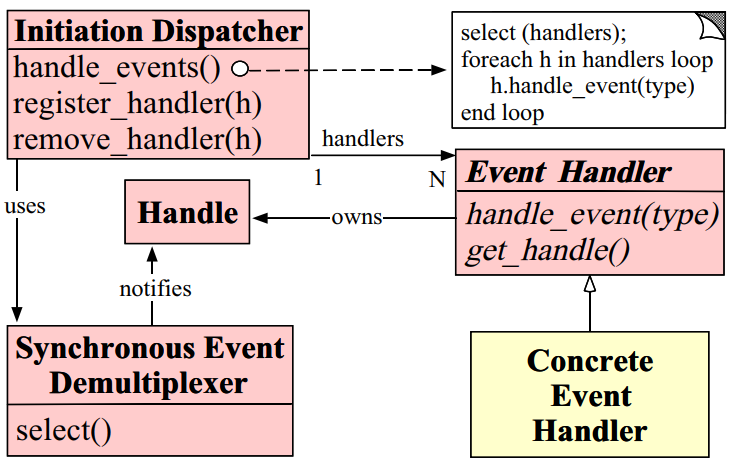
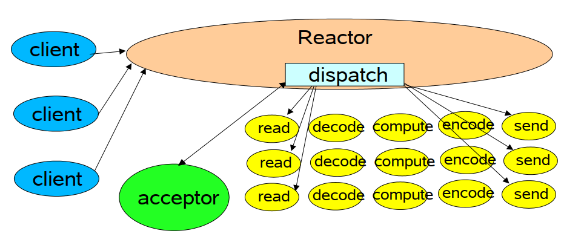
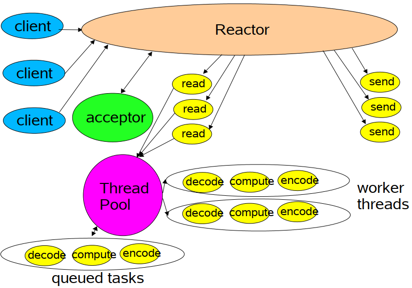
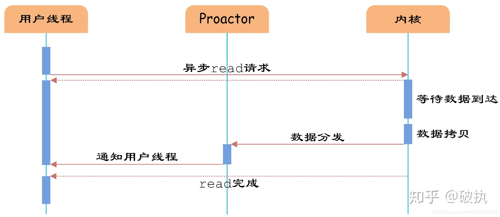

# Reactor

The reactor design pattern is an event handling pattern for handling service requests delivered concurrently to a service handler by one or more inputs. The service handler then **demultiplexes the incoming requests** and **dispatches them synchronously to the associated request handlers**.

## 问题

### Availability

**The server must be available to handle incoming requests even if it is waiting for other requests to arrive**. In particular, a server must not block indefinitely handling any single source of events at the exclusion of other event sources since this may significantly delay the responsiveness to other clients.  

### Efficiency

 A server must minimize latency, maximize throughput, and avoid utilizing the CPU(s) unnecessarily.  

### Programming simplicity

The design of a server should simplify the use of suitable concurrency strategies.

### Adaptability

Integrating new or improved services, such as changing message formats or adding server-side caching, should incur minimal modifications and maintenance costs for existing code. For instance, implementing new application services should not require modifications to the generic event demultiplexing and dispatching mechanisms. 

### Portability

Porting a server to a new OS platform should not require significant effort.

## Handles
Identify resources that are managed by an OS. These resources commonly include network connections, open files, timers, synchronization objects, etc.
Handles are used in the logging server to identify socket endpoints so that a Synchronous Event Demultiplexer can wait for events to occur on
them. The two types of events the logging server is interested in are connection events and read events, which represent incoming client connections and logging data, respectively. The logging server maintains a separate connection for each client. **Every connection is represented in the server by a socket handle.**

## Synchronous Event Demultiplexer

Blocks awaiting events to occur on a set of Handles. It returns when it is possible to initiate an operation on a Handle without blocking. **A common demultiplexer for I/O events is select**, which is an event demultiplexing system call provided by the UNIX and Win32 OS platforms. The **select call** indicates which **Handles can have operations invoked** on them synchronously **without blocking** the application process.  

## Initiation Dispatcher

Defines an interface for registering, removing, and dispatching Event Handlers. Ultimately, the Synchronous Event Demultiplexer is responsible for waiting until new events occur. When it detects new events, it informs the Initiation Dispatcher to call back application-specific event handlers. Common events include **connection acceptance events**, **data input and output events**, and **timeout events**.

## Event Handler
Specifies an interface consisting of a hook method that abstractly represents the dispatching operation for service-specific events. This method must be implemented by application-specific services.
## Concrete Event Handler
Implements the hook method, as well as the methods to process these events in an application-specific manner. Applications register Concrete Event
Handlers with the Initiation Dispatcher to process certain types of events. When these events arrive, the Initiation Dispatcher calls back the hook method of the appropriate Concrete Event Handler. There are two Concrete Event Handlers in the logging server: **Logging Handler** and **Logging Acceptor**. The Logging Handler is responsible for receiving and processing logging records. The Logging Acceptor creates and connects Logging Handlers that process subsequent logging records from clients.

The structure of the participants of the Reactor pattern is illustrated in the following OMT class diagram:  

## Single Thread

Reactor线程是个多面手，负责多路分离套接字，Accept新连接，并分派请求到Handler处理器中。Reactor和Hander 处于一条线程执行。

### 单线程模式的缺点

1、 当其中某个 handler 阻塞时， 会导致其他所有的 client 的 handler 都得不到执行， 并且更严重的是， handler 的阻塞也会导致整个服务不能接收新的 client 请求(因为 acceptor 也被阻塞了)。 因为有这么多的缺陷， 因此单线程Reactor 模型用的比较少。这种单线程模型不能充分利用多核资源，所以实际使用的不多。

2、因此，单线程模型仅仅适用于handler 中业务处理组件能快速完成的场景。

## Multiple Threads

在线程Reactor模式基础上，做如下改进：

（1）将Handler处理器的执行放入线程池，多线程进行业务处理。

（2）而对于Reactor而言，可以仍为单个线程。如果服务器为多核的CPU，为充分利用系统资源，可以将Reactor拆分为两个线程。

上图中，Reactor是一条独立的线程，Hander 处于线程池中执行。如果是多核CPU，Reactor也可以使用线程池处理。

## References

[Reactor_pattern_Wikipedia](https://en.wikipedia.org/wiki/Reactor_pattern)

Scalable IO in Java ------ Doug Lea

[基础篇：netty源码 死磕3传说中神一样的Reactor反应器模式](https://www.cnblogs.com/crazymakercircle/p/9833847.html)

Reactor An Object Behavioral Pattern for Demultiplexing and Dispatching Handles for Synchronous Events  ------ Douglas C. Schmidt  

# Proactor pattern

Proactor is a software design pattern for event handling in which **long running activities are running in an asynchronous part**. **A completion handler is called after the asynchronous part has terminated.** The proactor pattern can be considered to be an asynchronous variant of the synchronous reactor pattern.

流程与Reactor模式类似，区别在于proactor在IO ready事件触发后，完成IO操作再通知应用回调。虽然在linux平台还是基于epoll/select，但是内部实现了异步操作处理器(Asynchronous Operation Processor)以及异步事件分离器(Asynchronous Event Demultiplexer)将IO操作与应用回调隔离。

**Reactor模式是一种被动的处理**，即有事件发生时被动处理。而**Proator模式则是主动发起异步调用**，然后循环检测完成事件。

## Interaction
### Operation specific actors

- The Proactive Initiator starts the asynchronous operation via the Asynchronous Operation Processor and defines the Completion Handler
- Completion Handler is a call at the end of the operation from the Asynchronous Operation Processor
- Asynchronous Operation

## Standardized actors

- The Asynchronous Operation Processor controls the whole asynchronous operation
- The Completion Dispatcher handles the call, depending on the execution environment

## Refrerences

[高性能IO模型分析-Reactor模式和Proactor模式（二）](https://zhuanlan.zhihu.com/p/95662364)

[proactor pattern --- Wikipedia](https://en.wikipedia.org/wiki/Proactor_pattern)